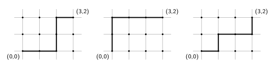
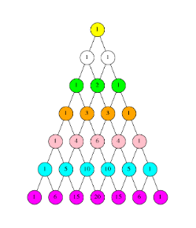
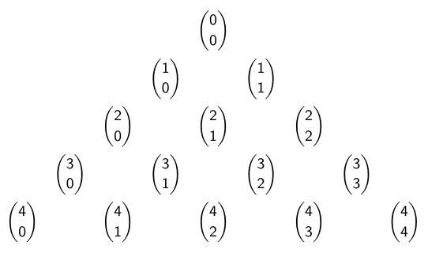

- #[[MA284 - Discrete Mathematics]]
- **Previous Topic:** [[Principle of Inclusion-Exclusion]]
- **Next Topic:** [[Combinatorial Proofs]]
- **Relevant Slides:** 
-
- # Binary Strings & Lattice Paths
	- ## Binary Strings
		- A **bit** is a "binary digit", e.g., 1 or 0.
		- A **bit string** is a string (list) of bits, e.g., 1011010.
		- What is the **length** of a string? #card
		  card-last-interval:: 31.36
		  card-repeats:: 4
		  card-ease-factor:: 2.8
		  card-next-schedule:: 2022-12-16T04:06:32.399Z
		  card-last-reviewed:: 2022-11-14T20:06:32.399Z
		  card-last-score:: 5
			- The **length** of the string is the number of bits.
				- An $n$-bit string has length $n$.
				- The set of all $n$-bit strings (for given $n$) is denoted $B^n$.
		- What is the **weight** of a string? #card
		  card-last-interval:: 33.64
		  card-repeats:: 4
		  card-ease-factor:: 2.9
		  card-next-schedule:: 2022-12-21T00:50:01.239Z
		  card-last-reviewed:: 2022-11-17T09:50:01.240Z
		  card-last-score:: 5
			- The **weight** of the string is the number of 1s.
				- The set of all $n$-bit strings of weight $k$ is denoted $B^n_k$.
	- ## Lattice Paths
		- What is a **lattice**? #card
		  card-last-interval:: 19.01
		  card-repeats:: 4
		  card-ease-factor:: 2.18
		  card-next-schedule:: 2022-12-03T20:05:46.936Z
		  card-last-reviewed:: 2022-11-14T20:05:46.936Z
		  card-last-score:: 3
			- The (integer) **lattice** is the set of all points in the Cartesian plane for which both the $x$ & $y$ coordinates are integers.
		- What is a **lattice path**? #card
		  card-last-interval:: 31.36
		  card-repeats:: 4
		  card-ease-factor:: 2.8
		  card-next-schedule:: 2022-12-16T04:11:02.220Z
		  card-last-reviewed:: 2022-11-14T20:11:02.220Z
		  card-last-score:: 5
			- A **lattice path** is the ^^shortest possible path^^ connecting two points on the lattice, moving only horizontally & vertically.
				- There can be multiple lattice paths, so long as they are of equally short length.
		- 
			- The number of lattice paths from $(0,0)$ to $(3,2)$ is the same as $|B_3^5|$.
			- The number of lattice paths from $(0,0)$ to $(3,2)$ is the same as the number from $(0,0)$ to $(2,2)$, plus the number from $(0,0)$ to $(3,1)$.
-
- # Binomial Coefficients
	- What is the coefficient of say, $x^3y^2$ in $(x+y)^5$?
		- $$(x+y)^0=1
		  \newline
		  (x+y)^1=x+y
		  \newline
		  (x+y)^2=x^2+2xy+y^2
		  \newline
		  (x+y)^3=x^3+3x^2y+3xy^2+y^3
		  \newline
		  (x+y)^4=x^4+4x^3y+6x^2y^2+4xy^3+y^4
		  \newline
		  (x+y)^5=x^5+5x^4y+10x^3y^2+10x^2y^3+5xy^4+y^5
		  $$
		- So, by doing a lot of multiplication, we have worked out that the coefficient of $x^3y^2$ is $10$.
		- But, there is a more systematic way of answering this problem.
		-
		- $$(x+y)^5=(x+y)(x+y)(x+y)(x+y)(x+y)$$
		- We can work out the coefficient of $x^3y^2$ in the expansion of $(x+y)^5$ by counting the number of ways we can **choose** $3$ $x$s & $2$ $y$s in
			- $$(x+y)(x+y)(x+y)(x+y)(x+y)$$
			-
	- The numbers that occurred in all of our examples are called **binomial coefficients**, and are denoted
		- $$\binom{n}{k}$$
	- What are **Binomial Coefficients**? #card
	  card-last-interval:: 9.88
	  card-repeats:: 3
	  card-ease-factor:: 2.32
	  card-next-schedule:: 2022-11-24T13:42:42.079Z
	  card-last-reviewed:: 2022-11-14T16:42:42.079Z
	  card-last-score:: 3
		- For each integer $n \geq 0$, and integer $k$ such that $0 \leq k \leq n$, there is a number $\binom{n}{k}$, read as "$n$ *choose* $k$".
			- $\binom{n}{k} = |B^n_k|$, the number of $n$-bit strings of weight $k$.
			- $\binom{n}{k}$ is the number of subsets of a set of size $n$, each with cardinality $k$.
			- $\binom{n}{k}$ is the number of lattice paths of length $n$ containing $k$ steps to the right.
			- $\binom{n}{k}$ is the coefficient of $x^k y^{n-k}$ in the expansion of $(x+y)^n$.
			- $\binom{n}{k}$ is the number of ways to select $k$ objects from a total of $n$ objects.
	- If we were to skip ahead, we would learn that there is a formula for $\binom{n}{k}$ (that is, "$n$ choose $k$") that is expressed in terms of **factorials**.
		- Recall that the **factorial** of a natural number $n$ is:
			- $$n! = n \times (n-1) \times (n-2) \times (n-4) \times ... \times 2 \times 1$$
		- We will eventually learn that
			- $$\binom{n}{k} = \frac{n!}{k!(n-k)!}$$
		- However, the formula $\displaystyle \binom{n}{k} = \frac{n!}{k!(n-k)!}$ is not very useful in practice.
			-
-
- # Pascal's Triangle
	- 
	- Earlier, we learned that if the set of all $n$-bit strings with weight $k$ is written $B^n_k$, then
		- $$|b^n_k| = |B^{n-1}_{k-1}| + |B^{n-1}_k$$
	- Similarly, we find that:
		- #### Pascal's Identity: A recurrence relation for $\binom{n}{k}$ #card
		  card-last-interval:: -1
		  card-repeats:: 1
		  card-ease-factor:: 2.7
		  card-next-schedule:: 2022-11-18T00:00:00.000Z
		  card-last-reviewed:: 2022-11-17T09:47:25.425Z
		  card-last-score:: 1
			- $$\binom{n}{k} = \binom{n-1}{k-1} + \binom{n-1}{k}$$
		- This is often presented as **Pascal's Triangle**
		- 
		-
-
- # Permutations
	- What is a **permutation**? #card
	  card-last-interval:: 33.64
	  card-repeats:: 4
	  card-ease-factor:: 2.9
	  card-next-schedule:: 2022-12-21T00:50:12.451Z
	  card-last-reviewed:: 2022-11-17T09:50:12.452Z
	  card-last-score:: 5
		- A **permutation** is an arrangement of objects. Changing the order of the objects gives a different permutation.
			- A permutation of a set must have the same cardinality as that set.
			- Important: order matters!
	- ### Number of Permutations
		- How many **permutations** are there of $n$ objects? #card
		  card-last-interval:: 31.36
		  card-repeats:: 4
		  card-ease-factor:: 2.8
		  card-next-schedule:: 2022-12-16T04:21:54.886Z
		  card-last-reviewed:: 2022-11-14T20:21:54.886Z
		  card-last-score:: 5
			- There are $n!$ (i.e., $n$ *factorial*) permutations of $n$ (distinct) objects.
		- How many permutations are there of $k$ objects from $n$? #card
		  card-last-interval:: 31.36
		  card-repeats:: 4
		  card-ease-factor:: 2.8
		  card-next-schedule:: 2022-12-16T04:10:57.897Z
		  card-last-reviewed:: 2022-11-14T20:10:57.897Z
		  card-last-score:: 5
			- The number of permutations of $k$ objects out of $n$, $P(n,k)$ is
				- $$P(n,k) = \binom{n}{k} = n \times (n-1) \times ... \times (n - k + 1) = \frac{n!}{(n-k)!}$$
	- ## The Binomial Coefficient Formula
		- (1) We know that there are $P(n,k)$ permutations of $k$ objects out of $n$.
		- (2) We know that
			- $$P(n,k) = \frac{n!}{(n-k)!}$$
		- (3) Another way of making a permutation of $k$ objects out of $n$ is to
			- (a) Choose $k$ from $n$ without order. There $\binom{n}{k}$ ways of doing this.
			- (b) Then count all the ways of ordering these $k$ objects. There are $k!$ ways of doing this.
			- (c) By the Multiplicative Principle,
				- $$P(n,k) = \binom{n}{k}k!$$
		- (4) So now we know that
			- $$\frac{n!}{(n-k)!} = \binom{n}{k}k!$$
		- (5) This gives the formula
			- $$\binom{n}{k} = \frac{n!}{(n-k)!k!}$$
			-