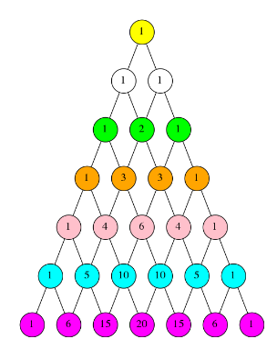

- #[[MA284 - Discrete Mathematics]]
- **Previous Topic:** [[Binomial Coefficients]]
- **Next Topic:** [[Stars & Bars]]
- **Relevant Slides:** 
-
- #  Pascal's Triangle
	- **Pascal's Identity:** A recurrence relation for $\binom{n}{k}$:
		- $$\binom{n}{k} = \binom{n-1}{k-1} + \binom{n-1}{k}$$
	- In the previous topic, we "proved" that $\binom{n}{k} = \frac{n!}{(n-k)!k!}$ by counting $P(n,k)$ in two different ways.
		- This is a classic example of a **Combinatorial Proof**, where we establish a formula by counting something in 2 different ways.
	- 
	- Binomial coefficients have many important properties. Looking at their arrangement in Pascal's Triangle, we can spot some:
		- (i) For all $n$, $\binom{n}{0} = \binom{n}{n} = 1$.
		- (ii) $\displaystyle\sum^{n}_{i=0} \binom{n}{i}= 2^n$
		- (iii) $\binom{n}{k} = \binom{n-1}{k-1} + \binom{n-1}{k}$ (Pascal's Identity).
		- (iv) $\binom{n}{k} = \binom{n}{n-k}$
		-
- # Algebraic & Combinatorial Proofs
	- Proofs of identities involving **Binomial Coefficients** can be classified as:
		- **Algebraic:** If they rely mainly on the formula for binomial coefficients.
			- $$
			  \binom{n}{k} = \frac{n!}{k!(n-k)!}
			  \newline
			  \therefore \binom{n}{k} = \frac{n!}{(n-k)!(n-(n-k))!} = \frac{n!}{(n-k)!k!} = \binom{n}{k}
			  $$
		- **Combinatorial:** If they involve counting a set in two different ways.
			- Let $A$ be a set of size $n$.
			- $\binom{n}{k} =$ number of subsets of $A$ of cardinality $k$, but for each such subset there is a one-to-one correspondence with a subset of size $n-k$.
			- i.e., $\binom{n}{n-k} = \binom{n}{k}$,
	- ## Algebraic Proof of Pascal's Triangle Recurrence Relation
		- $$\binom{n}{k} = \frac{n!}{k!(n-k)!} \newline \newline$$
		- $$\binom{n-1}{k-1} + \binom{n-1}{k} = \frac{(n-1)!}{(k-1)!(n-k)!} + \frac{(n-1)!}{k!(n-k-1)!}$$
		- $$ = \frac{k(n-1)!}{k(k-1)!(n-k)!} + \frac{(n-1)!(n-k)}{k!(n-k-1)!(n-k)} $$
		- $$= \frac{k(n-1)!+(n-k)(n-1)!}{k!(n-k)!}$$
		- $$= \frac{(n-1)!(k+n-k)}{k!(n-k)!} = \frac{n!}{k!(n-k)!} = \binom{n}{k}$$
-
-
- ## Example:
	- Let $A$ be a set with $n$ elements.
	- Then, the total number of subsets of $A$ can be counted as follows:
		- Generic subset: An element is either in it or not
		- For each of $n$ elements, there are 2 choices: in or not in.
		- By Multiplicative principle, 2 \times 2 \times ... \times 2 such subsets [2^n = |P(n)|].
		- Number of subsets with:
			- 0
-
-
-
- # How Combinatorial Proofs Work
	- ## Which are better: Algebraic or Combinatorial proofs?
		- When we first study discrete mathematics, **algebraic** proofs may seem to be the easiest: they rely only using some standard formulae, and don't require any deeper insight. They are also more "familiar".
		- However:
			- Often, algebraic proofs are quite tricky.
			- Usually, algebraic proofs give no insight as to why a fact is true.
	- ## Example
		- We wish to show that:
			- $${\binom{n}{0}}^2 + {\binom{n}{1}}^2 + {\binom{n}{2}}^2 + ... + {\binom{n}{n}}^2 = \binom{2n}{n}$$
		- We note that $\binom{2n}{n}$ is the total number of subsets of size $n$ in a set with $2n$ elements.
		- Let $A$ be a set with $2n$ elements, and label them $A = \{a_1, a_2, ..., a_n, a_{n+1}, ..., a_{2n}\}$.
		- Any subset of $A$ with $n$ elements has $k$ elements from $\{a_1 a_2, ..., a_n\}$ and $n-k$ elements from t $\{a_{n+1}, ..., a_{2n}\}$ where $k$ ranges from $0$ to $n$.
		- There are $\displaystyle \binom{n}{k} \cdot \binom{n}{n-k}$ ways of choosing these $n$ elements by the Multiplicative Principle.
		- So the total number of subsets with $n$ elements is $\displaystyle\sum^n_{k=0} \binom{n}{k} \binom{n}{n-k}$ and noting that $\displaystyle \binom{n}{n-k} = \binom{n}{k}$ and the results follows.
	- ## Example
		- Using a combinatorial argument, or otherwise, prove that
			- $$k\binom{n}{k} = n\binom{n-1}{k-1}$$
		- **Combinatorial Proof**:
			- Suppose we have a panel of $n$ players and we need to choose a team of $k$ player with a distinguished player (e.g., the goalkeeper).
			- We count how many ways we can do this.
			- [A] Pick the team, then pick the goalie.
				- By the Multiplicative Principle, we can pick a team of $k$ from $n$ in $\binom{n}{k}$ ways and have $k$ ways then of choosing a keeper from this.
					- $$= k\binom{n}{k}$$
			- [B] Pick the goalie, then pick the remainder of the team.
				- We have $n$ choices for the goalie. then choose $k-1$ from the $n-1$ remaining players.
				- By the Multiplicative Principle we have $\displaystyle n\binom{n-1}{k-1}$ ways.
				- Result follows.
	- ## What is a "Combinatorial Proof" really? #card
	  card-last-interval:: 9.28
	  card-repeats:: 3
	  card-ease-factor:: 2.32
	  card-next-schedule:: 2022-11-23T22:36:16.354Z
	  card-last-reviewed:: 2022-11-14T16:36:16.354Z
	  card-last-score:: 5
		- [1] These proofs involve finding two different ways to answer the same counting question.
		- [2] Then, we explain why the answer to the problem posed one way is $A$.
		- [3] Next, we explain why the answer to the problem posed the other way is $B$.
		- [4] Since $A$ and $B$ are answers to the same question, we have shown that it must be that $A = B$.
-