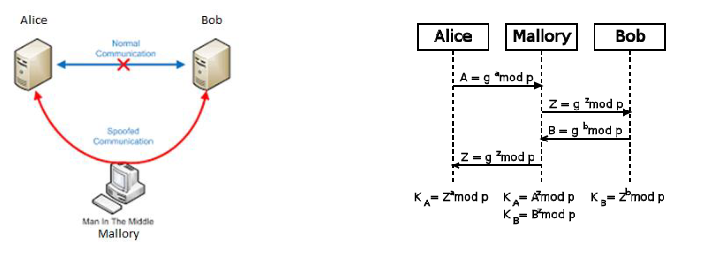

- #[[CT255 - Next Generation Technologies II]]
- **Previous Topic:** [[Social Engineering]]
- **Next Topic:** [[Block Ciphers & Stream Ciphers]]
- **Relevant Slides:** 
-
- # Groups, Rings, & Fields
	- In mathematics,
		- a **group** is a set equipped with a binary operation that is associative, has an identity element, and is such that every element has an inverse, e.g., $(\mathbb{Z}, +)$.
		- a **ring** is a set equipped with two binary operations satisfying properties analogous to those of addition & multiplication of integers, e.g. $(\mathbb{Z}, +, *)$.
		- a **field** is a set on which addition, subtraction, multiplication, & division are defined and behave as the corresponding operations on rational & real numbers do.
-
- # Diffie-Hellman Key Exchange
	- What is the **Diffie-Hellman Key Exchange**? #card
	  card-last-interval:: 3.69
	  card-repeats:: 2
	  card-ease-factor:: 2.46
	  card-next-schedule:: 2022-11-22T10:36:42.441Z
	  card-last-reviewed:: 2022-11-18T18:36:42.441Z
	  card-last-score:: 5
		- **Diffie-Hellman** provides **secure key exchange** between two partners.
			- The negotiated key is subsequently used for private key encryption / authentication.
			- It uses the multiplicative group of integers modulo $n$ $(\mathbb{Z} / n \mathbb{Z})^x$.
			- It is based on the difficulty of computing discrete logarithms over such groups, e.g.:
				- $$6^3 \text{ mod } 17 = 216 \text{ mod } 17 =12 \text{ (easy) }$$
				- $$12 = 6 ^y \text{ mod } 17 ? \text{ hard }$$
		- The core equation for the key exchange is
			- $$K = (A)^B \text{ mod } q$$
	- ## Diffie-Hellman: Global Public Elements
		- Select a prime number $q$ and positive and a positive integer $a$, where $a < q$ and $a$ is a **primitive root** of $q$.
		- What is a **primitive root**? #card
		  card-last-interval:: 2.8
		  card-repeats:: 2
		  card-ease-factor:: 2.6
		  card-next-schedule:: 2022-11-24T08:08:29.696Z
		  card-last-reviewed:: 2022-11-21T13:08:29.697Z
		  card-last-score:: 5
			- $a$ is a **primitive root** of $q$, if numbers $a \text{ mod } q, a^2 \text{ mod } q, \cdots , a^{q-1} \text{ mod } q$ are distinct integer values between $1$ and $(q-1)$ in some permutation, i.e., elements of $(\mathbb{Z} / q \mathbb{Z})^x$.
			- **Example:** $a = 3$ is a primitive root of $(\mathbb{Z} / 5\mathbb{Z})^x$, $a=4$ is not:
			  background-color:: green
	- ## Generation of Secret-Key
		- Both users share a public prime number $q$ and primitive root $a$.
		- User A:
			- 1. Select secret number $XA$ with $XA < q$.
			  2. Calculate public value $YA = a^{XA} \text{ mod } q$ (difficult to reverse).
			  3. $YA$ is sent to User B.
		- User B:
			- 1. Select secret number $XB$ with $XB < q$.
			  2. Calculate public value $YB = a^{XB} \text{ mod } q$ (difficult to reverse).
			  3. $YB$ is sent to User A.
		- User A:
			- User A owns $XA$ and receives $YB$.
			- Generate secret key: $K = (YB)^{XA} \text{ mod } q$.
		- User B:
			- User B owns $XB$ and receives $YA$.
			- Generate secret key: $K = (YA)^{XB} \text{ mod } q$.
		- Both keys are identical.
	- ## Diffie-Hellman in Practice
		- The algorithm is used in tandem with a variety of secure network protocols.
			- Provision of secure end-to-end connection.
			- No endpoint authentication - you can't validate who you are talking to.
			- Modulus $p$ typically has a minimum length of 1024 bits.
	- ## DH & Man-in-the-Middle (MitM) Attacks
		- 
		- Mallory is a MitM attacker and performs message interception & message fabrication.
		- Mallory establishes two individual (secure) connections with Alice & Bob.
		- Neither Alice nor Bob are aware of Mallory's existence (as there is no authentication).
		-