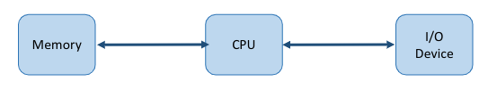
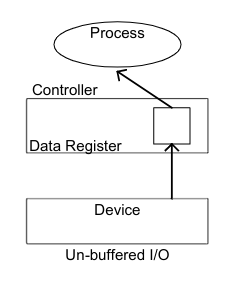
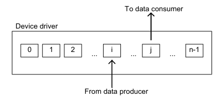

- #[[CT213 - Computer Systems & Organisation]]
- **Previous Topic:** [[Memory Management]]
- **Next Topic:**
- **Relevant Slides:** 
-
- # Device Management
	- What is **Device Management**? #card
	  card-last-interval:: -1
	  card-repeats:: 1
	  card-ease-factor:: 2.5
	  card-next-schedule:: 2022-11-15T00:00:00.000Z
	  card-last-reviewed:: 2022-11-14T16:17:50.052Z
	  card-last-score:: 1
		- **Device Management** is the process of managing the implementation, operation, & maintenance of physical and/or virtual devices.
		- It is a broad term that includes various administrative tools & processes for the maintenance & upkeep of a computing, network, mobile, and/or virtual device.
		- The status of any computing device (internal or external) may be either **free** or **busy**.
			- If a device requested by a process is free at a specific instant of time, the operating system allocates it to the process.
	- How does the Operating System manage devices? #card
	  card-last-interval:: -1
	  card-repeats:: 1
	  card-ease-factor:: 2.5
	  card-next-schedule:: 2022-11-24T00:00:00.000Z
	  card-last-reviewed:: 2022-11-23T12:20:20.630Z
	  card-last-score:: 1
		- The OS manages devices with the help of:
			- **Device Controllers:** Hardware components that contain some buffer registers to store the data temporarily.
			- **Device Drivers:** Software programs that are used by an operating system to control the functioning of various devices in a uniform manner.
	- The device controller used in a device management operation includes three different registers: **command**, **status**, & **data**.
	- The other major responsibility of the device management function is to implement **Application Programming Interfaces (APIs)**.
	- Each device controller is specific to a particular device.
		- The device driver implementation will be device specific.
	- Why?
		- To provide correct commands to the controller.
		- To interpret the Controller Status Register (CSR) correctly.
		- To transfer data to and from device controller data registers as required for correct device operation.
- # Device Communication Approaches
	- A computer must have a way of detecting the arrival of **any type of input**.
	- There are various ways to enable I/O devices to communicate with the processor: #card
	  card-last-interval:: -1
	  card-repeats:: 1
	  card-ease-factor:: 2.5
	  card-next-schedule:: 2022-11-15T00:00:00.000Z
	  card-last-reviewed:: 2022-11-14T16:18:19.796Z
	  card-last-score:: 1
		- ## Polling #card
		  card-last-interval:: -1
		  card-repeats:: 1
		  card-ease-factor:: 2.5
		  card-next-schedule:: 2022-11-15T00:00:00.000Z
		  card-last-reviewed:: 2022-11-14T16:18:45.126Z
		  card-last-score:: 1
			- ### Implementation
				- **Periodically checking status** of the device to see if it is time for the next I/O operation.
				- The I/O device simply puts the information in a Status register, and the processor must come & get the information.
			- ### Efficiency
				- It's the simplest way for an I/O device to communicate with the processor.
				- Most of the time, devices will not require attention and when one does, it will have to wait until it is next interrogated by the polling program.
					- Much of the processor's time is wasted on unnecessary polls.
		- ## Interrupts #card
		  card-last-interval:: 0.98
		  card-repeats:: 1
		  card-ease-factor:: 2.36
		  card-next-schedule:: 2022-11-15T15:20:44.422Z
		  card-last-reviewed:: 2022-11-14T16:20:44.423Z
		  card-last-score:: 3
			- ### Implementation
				- A device controller puts out an **interrupt signal** when it needs the CPU's attention.
				- When the CPU receives an interrupt, it **saves its current state** and invokes the appropriate interrupt handler using the interrupt vector (addresses of OS routines to handle various events).
				- When the interrupting device has been dealt with, the CPU continues with its original task, as if it had never been interrupted.
			- ### Efficiency
				- Interrupts allow the processor to deal with events that can happen at any time.
				- Interrupts remove the need for the CPU to constantly check the Controller Status Register.
		- ## Direct I/O #card
		  card-last-interval:: -1
		  card-repeats:: 1
		  card-ease-factor:: 2.5
		  card-next-schedule:: 2022-11-24T00:00:00.000Z
		  card-last-reviewed:: 2022-11-23T12:20:09.419Z
		  card-last-score:: 1
			- ### Implementation
				- Uses software which explicitly transfers data to/from the **controller's data registers**.
					- Separate I/O & memory address spaces.
					- The control indicates whether address information is for memory or I/O.
				- 
			- ### Efficiency
				- Reduced CPU utilisation (no caches or buffers).
		- ## Memory Mapped I/O
			- ### Implementation
				- Direct connection between I/O device and certain main memory locations so that I/O device can **transfer blocks of data** to/from the memory without going through the CPU.
				- OS allocates buffer in memory to the I/O device to send data to the CPU.
					- I/O device operates **asynchronously** with CPU.
					- Interrupts CPU when finished.
			- ### Efficiency
				- Memory mapped I/O is ideal for most high-speed I/O devices like disks, communcation interfaces, etc.
		-
- # Buffering
	- ## Design Objectives
		- ### Efficiency
			- Most I/O devices are extremely slow compared to the processor and main memory.
				- Buffering is one way to deal with this issue.
		- ### Generality
			- It is desirable to handle all devices in a uniform & consistent manner.
				- in the way user processes see the devices.
				- In the way the OS manages the I/O devices & operations.
	- What is **Buffering**? #card
	  card-last-interval:: -1
	  card-repeats:: 1
	  card-ease-factor:: 2.5
	  card-next-schedule:: 2022-11-15T00:00:00.000Z
	  card-last-reviewed:: 2022-11-14T16:15:10.546Z
	  card-last-score:: 1
		- **Buffering** is the technique by which the device manager can keep slower I/O devices busy during times when a process is not requiring I/O operations.
	- What is **Input Buffering**? #card
	  card-last-interval:: -1
	  card-repeats:: 1
	  card-ease-factor:: 2.5
	  card-next-schedule:: 2022-11-15T00:00:00.000Z
	  card-last-reviewed:: 2022-11-14T16:16:35.294Z
	  card-last-score:: 1
		- **Input Buffering** involves having the input device read information into the primary memory before the process requests it.
	- What is **Output Buffering**? #card
	  card-last-interval:: -1
	  card-repeats:: 1
	  card-ease-factor:: 2.5
	  card-next-schedule:: 2022-11-15T00:00:00.000Z
	  card-last-reviewed:: 2022-11-14T16:18:11.922Z
	  card-last-score:: 1
		- **Output Buffering** involves saving information in memory and then writing it to the device while the process continues execution.
	- ## Hardware Level Buffering #card
	  card-last-interval:: -1
	  card-repeats:: 1
	  card-ease-factor:: 2.5
	  card-next-schedule:: 2022-11-15T00:00:00.000Z
	  card-last-reviewed:: 2022-11-14T16:19:51.036Z
	  card-last-score:: 1
		- Consider a simple character device controller that reads a single byte from a router for each input operation.
		- ### Normal Operation
			- 1. Read occurs.
			  2. The driver passes a read command to the controller.
			  3. The controller instructs the device to put the next character into one-byte data controller's register.
			  4. The process calling for the byte **waits** operation to complete, and then retrieves the character from the data register.
			- {:height 257, :width 174}
		- ### Buffered Operation
			- The next character to be read by the process has already been placed into the data register, even though the next process has not yet been called for the read operation.
			- Adding a hardware buffer to the controller **decreases** the amount of time the process has to wait.
		- ### Driver-Level Buffering #card
		  card-last-interval:: -1
		  card-repeats:: 1
		  card-ease-factor:: 2.5
		  card-next-schedule:: 2022-11-15T00:00:00.000Z
		  card-last-reviewed:: 2022-11-14T15:51:53.356Z
		  card-last-score:: 1
			- This is generally called **double buffering**.
				- One buffer is for the driver to store the data while waiting for the higher layers to read it.
				- The other buffer is to store data from the lower-level modules.
			- {:height 371, :width 217}
		- ### Using Multiple Buffers #card
		  card-last-interval:: -1
		  card-repeats:: 1
		  card-ease-factor:: 2.5
		  card-next-schedule:: 2022-11-24T00:00:00.000Z
		  card-last-reviewed:: 2022-11-23T12:16:44.978Z
		  card-last-score:: 1
			- The number of buffers is extended from 2 to $n$.
			- The data producer writes into the buffer $i$ while the data consumer is reading from the buffer $j$.
				- In this configuration:
					- If $i<j$: buffers $[j+1, n-1]$ & $[0, i-1]$ are full.
					- If $j<i$: buffers $[j_1, i-1]$ are full.
			- This is known as **circular buffering**.
			- 