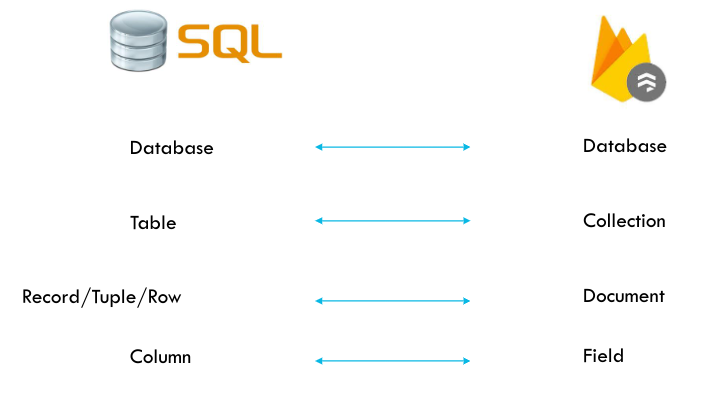

- #[[CT216 - Software Engineering I]]
- **Previous Topic:** [[Firebase Functions]]
- **Next Topic:**
- **Relevant Slides:** 
-
- # Firestore
	- What is **Firestore**? #card
	  card-last-interval:: 2.8
	  card-repeats:: 1
	  card-ease-factor:: 2.6
	  card-next-schedule:: 2022-11-20T14:34:59.639Z
	  card-last-reviewed:: 2022-11-17T19:34:59.640Z
	  card-last-score:: 5
		- **Firestore** is a Document Driven Database.
		- Documents follow a `property:value` format - JSON.
		- Scalable, highly performant, and document oriented.
		- The databases tend to scale more easily horizontally.
	- ## Concepts
		- Records in Firestore are known as "Documents".
			- These documents are just JSON data.
		- Documents are grouped into "Collections" which are equivalent to tables in relational databases.
		- Queries are still queries, however there is no SQL.
		- {:height 343, :width 489}
	-