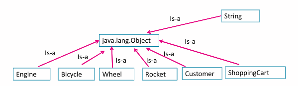

- #[[CT2106 - Object-Oriented Programming]]
- **Previous Topic:** [[OOP Modelling]]
- **Next Topic:** [[Coding Up Inheritance]]
- **Relevant Slides:**  
-
- # Object Equality #card
  card-last-interval:: 11.2
  card-repeats:: 3
  card-ease-factor:: 2.8
  card-next-schedule:: 2022-11-26T00:11:36.263Z
  card-last-reviewed:: 2022-11-14T20:11:36.264Z
  card-last-score:: 5
	- When you use `==` with reference variables, you are checking if the variables **point** to the same object.
		- So, using `==` on strings will only return true if the Strings are references to the same object. It will return to false even if the strings contain the same data.
		- The value of a string variable is the **memory location** where its String object is stored.
	- When checking for equality between objects, you must use the `equals` method.
		- The `equals` method is an instance method that ^^all objects of built-in classes have.^^
			- However, for any class that you define, you will have to write your own equals method.
				- All equals methods must have the following method signature:
					- ```java
					  public boolean equals(Object object)
					  ```
		- Its specific purpose is to define equality between objects.
		- It returns a **boolean** value.
		- It is **commutative**.
			- `str1.equals(str4)` returns the same value as `str4.equals(str1)`.
		- Example:
			- ```java
			  String str1 = "Java";
			  String str2 = "Ja";
			  String str3 = "va";
			  String str4 = str2 + str3;
			  
			  str1.equals(str4) ? System.out.println("true") : System.out.println("false");
			  
			  ```
- # `instanceof` #card
  card-last-interval:: -1
  card-repeats:: 1
  card-ease-factor:: 2.6
  card-next-schedule:: 2022-11-15T00:00:00.000Z
  card-last-reviewed:: 2022-11-14T16:42:22.854Z
  card-last-score:: 1
	- `instanceof` is an operator that is used to determine if a variable is pointing to an object with a particular type.
		- ```java
		  System.out.println(bike2 instanceof Bicycle ? "true" : "false");
		  ```
- # Object
  collapsed:: true
	- What is the type of `Object obj`? #card
	  card-last-interval:: 4
	  card-repeats:: 2
	  card-ease-factor:: 2.7
	  card-next-schedule:: 2022-11-18T16:42:30.590Z
	  card-last-reviewed:: 2022-11-14T16:42:30.590Z
	  card-last-score:: 5
		- `obj` is a variable whose type is `java.lang.Object`.
	- What is `java.lang.Object`? #card
	  card-last-interval:: 4
	  card-repeats:: 2
	  card-ease-factor:: 2.7
	  card-next-schedule:: 2022-11-18T16:42:35.503Z
	  card-last-reviewed:: 2022-11-14T16:42:35.504Z
	  card-last-score:: 5
		- `java.lang.Object` is a class that provides the ^^most generic definition^^ of an object in Java.
		- It is the **parent class** of every class in Java.
		- For example. A `Bicycle` object is a `Bicycle` object **and** a `java.lang.Object` object.
		-
- # Casting
	- ```java
	  Bicycle bike1 = (Bicycle) myObject;
	  String str1 = (String) obj;
	  ```
		- Here, we can **cast** (convert) a variable from a higher type (`Object`), to a lower type (`Bicycle`).
			- This is allowed, as `anObject` point to a Bicycle object - we can check this using `instanceof`.
			- `obj` points to a String object - we can check this using `instanceof`.
	- Note that the variable type being converted is ^^not the object.^^
- # Class Hierarchy
	- ## Is-a Relationships
		- Java organises all its classes in a class hierarchy.
			- For example, a car is a type of vehicle, which is a type of object.
		- These relationships can be described as "is-a" relationships.
			- A car **is-a** vehicle; a vehicle **is-a**(n) object.
		- We refer the higher-up types as **parents** and the lower types as **children**.
			- Car *is-a child* of Vehicle.
			- Vehicle *is-a parent* of Car.
			- Object *is the parent* of Vehicle & Car.
	- ## Key Ideas in Class Hierarchy
		- The top of the hierarchy represents the ^^most **generic** attributes & behaviours.^^
		- The bottom (sometimes referred to as "leaves") represent the ^^most **specific** attributes & behaviours.^^
		- Each level inherits and customises the attributes & behaviours from the level above it.
		- `java.lang.Object` is *the* **superclass**, the parent of all classes in Java.
		- Every class in Java has the `java.lang.Object` as its superclass (parent).
		- 
			- All the classes shown above **inherit** (receive) methods from the superclass `java.lang.Object`.
				- What is **OOP Inheritance**? #card
				  card-last-interval:: 5.52
				  card-repeats:: 3
				  card-ease-factor:: 2.46
				  card-next-schedule:: 2022-11-20T04:38:03.406Z
				  card-last-reviewed:: 2022-11-14T16:38:03.406Z
				  card-last-score:: 5
					- **Inheritance** is the means by which objects automatically receive features (fields) & behaviours (methods) from their **superclass**.
			- The methods of this superclass are available to all objects of this Class, even though these methods may not be shown in the Class code.
				- For example: `.equals()`.
				- ### Generic Methods
					- All the methods provided by the `java.lang.Object` are *generic*.
						- They only relate to `java.lang.Object` classes, not the subclasses.
						- When a subclass inherits these methods, it needs to customise them.
							- This is why we had to override `.equals()` with our own version  for the example Bicycle class.
	- ### Overriding
		- What is **overriding**? #card
		  card-last-interval:: 29.99
		  card-repeats:: 4
		  card-ease-factor:: 2.56
		  card-next-schedule:: 2022-12-14T19:04:47.436Z
		  card-last-reviewed:: 2022-11-14T20:04:47.437Z
		  card-last-score:: 5
			- **Overriding** is when you write your own version of a method that you have inherited from a superclass.
				- It is creating a specific version of a method inherited from a parent (superclass) class.
			- When overriding a method, you must keep every part of the method signature the same - You can only change the code in the method body.
				- Its name, its parameter types & order, its access level (e.g., public, protected), and its return type.
		- #### Annotation
			- It is good practice to **annotate** your overridden methods using `@Override`.
				- You code will compile & run without it, but it is considered good practice to annotate the methods that are overridden inherited from the superclass.
			- ```java
			  @Override
			  public boolean equals(Object obj)
			  {
			    obj == null ? return false;
			    
			    if (obj instanceof Bicycle)
			    {
			      Bicycle bike = (Bicycle) obj;
			      if (this.speed == bike.getSpeed() && this.gear == bike.getGear())
			      {
			        return true;
			      }
			    }
			    return false;
			  }
			  ```