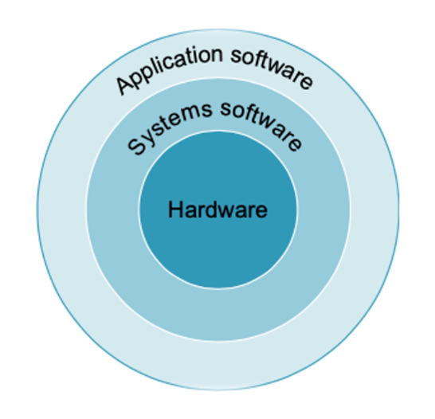
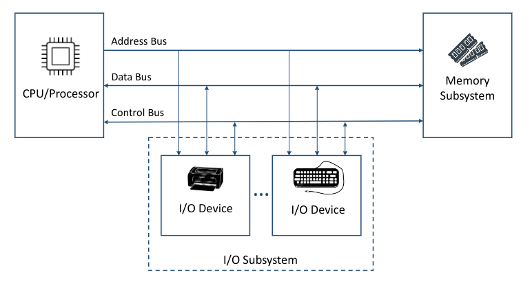
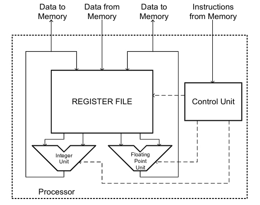
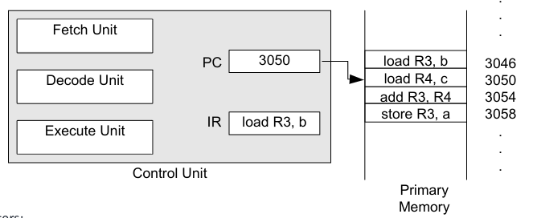

- #[[CT213 - Computer Systems & Organisation]]
- No previous topic.
- **Relevant Slides:** 
-
- ## Traditional Classes of Computer Systems
  collapsed:: true
	- What is a **Personal Computer (PC)**? 
	  card-last-score:: 5
	  card-repeats:: 2
	  card-next-schedule:: 2022-09-23T18:28:00.836Z
	  card-last-interval:: 4
	  card-ease-factor:: 2.7
	  card-last-reviewed:: 2022-09-19T18:28:00.836Z
		- A **Personal Computer** is a computer designed for use by an individual, usually incorporating a graphics display, a keyboard, and a mouse.
	- What is a **Server**? #card
	  card-last-interval:: 41.44
	  card-repeats:: 5
	  card-ease-factor:: 2.18
	  card-next-schedule:: 2022-12-22T21:33:20.708Z
	  card-last-reviewed:: 2022-11-11T11:33:20.709Z
	  card-last-score:: 5
		- A **server** is a computer used for running larger programs for multiple users, often simultaneously, and typically accessed only via a network.
	- What is a **Supercomputer**?
	  card-last-interval:: 11.2
	  card-repeats:: 3
	  card-ease-factor:: 2.8
	  card-next-schedule:: 2022-10-14T15:37:52.646Z
	  card-last-reviewed:: 2022-10-03T11:37:52.647Z
	  card-last-score:: 5
		- A **supercomputer** is a member of a class of computers with the highest performance (and cost). They are configured as servers and typically cost tens to hundreds of millions of dollars.
	- What is an **Embedded Computer**? #card
	  card-last-interval:: 33.64
	  card-repeats:: 4
	  card-ease-factor:: 2.9
	  card-next-schedule:: 2022-12-18T07:45:01.338Z
	  card-last-reviewed:: 2022-11-14T16:45:01.338Z
	  card-last-score:: 5
		- An **embedded computer** is a computer inside another device, used for running one predetermined application or collection of software.
	- What are **Personal Mobile Devices**?
	  card-last-interval:: 11.2
	  card-repeats:: 3
	  card-ease-factor:: 2.8
	  card-next-schedule:: 2022-10-12T21:31:08.211Z
	  card-last-reviewed:: 2022-10-01T17:31:08.211Z
	  card-last-score:: 5
		- **Personal Mobile Devices** are small, wireless devices that connect to the internet.
		- They rely on batteries for power, and software is installed by downloading apps.
		- Conventional examples include smartphones and tablets.
	- What is **Cloud Computing**? #card
	  card-last-interval:: 29.26
	  card-repeats:: 4
	  card-ease-factor:: 2.66
	  card-next-schedule:: 2022-12-13T22:41:13.223Z
	  card-last-reviewed:: 2022-11-14T16:41:13.223Z
	  card-last-score:: 5
		- **Cloud Computing** refers to large collections of servers that provide services over the internet.
		- Some providers rent dynamically varying number of servers as a utility.
	- What is **Software as a Service**? #card
	  card-last-interval:: 29.26
	  card-repeats:: 4
	  card-ease-factor:: 2.66
	  card-next-schedule:: 2022-12-13T22:47:42.790Z
	  card-last-reviewed:: 2022-11-14T16:47:42.790Z
	  card-last-score:: 5
		- **Software as a Service** delivers software & data as a service over the internet, usually via a thing program, such as a browser.
		- Examples include web search & email.
	-
- ## Computer Systems
	- {:height 410, :width 414}
	- What is **Application Software**? #card
	  card-last-interval:: 33.64
	  card-repeats:: 4
	  card-ease-factor:: 2.9
	  card-next-schedule:: 2022-12-18T07:45:07.567Z
	  card-last-reviewed:: 2022-11-14T16:45:07.567Z
	  card-last-score:: 5
		- **Application Software** consists of user-installed applications & programs.
		- Application Software provides services to the user that are commonly useful.
	- What is the purpose of the **Operating System**? #card
	  card-last-interval:: 49.07
	  card-repeats:: 5
	  card-ease-factor:: 2.28
	  card-next-schedule:: 2023-01-02T21:21:34.885Z
	  card-last-reviewed:: 2022-11-14T20:21:34.886Z
	  card-last-score:: 3
		- The **Operating System** interfaces between a user's program and the hardware, provides a variety of services, and performs supervisory functions.
	- What is the purpose of the **Hardware**?
		- The **Hardware** performs the tasks.
	-
- ## Seven Great Ideas in Computer Organisation
	- ### 1. Use **Abstraction** to Simplify Design #card
	  card-last-interval:: 33.64
	  card-repeats:: 4
	  card-ease-factor:: 2.9
	  card-next-schedule:: 2022-12-18T10:59:55.160Z
	  card-last-reviewed:: 2022-11-14T19:59:55.163Z
	  card-last-score:: 5
		- A major productivity technique for hardware & software is to use **abstractions** to characterise the design at different levels of representation
		- Lower-level details are hidden to offer a simpler model at higher levels.
	- ### 2. Make the **Common Case** Fast #card
	  card-last-interval:: 29.26
	  card-repeats:: 4
	  card-ease-factor:: 2.66
	  card-next-schedule:: 2022-12-13T22:41:18.214Z
	  card-last-reviewed:: 2022-11-14T16:41:18.214Z
	  card-last-score:: 5
		- Making the **common case fast** will tend to enhance performance better than optimising the rare case.
		- The common case is often simpler than the rare case, and hence is usually easier to enhance.
	- ### 3. Performance via **Parallelism** #card
	  card-last-interval:: 28.3
	  card-repeats:: 4
	  card-ease-factor:: 2.66
	  card-next-schedule:: 2022-11-17T15:35:06.365Z
	  card-last-reviewed:: 2022-10-20T08:35:06.365Z
	  card-last-score:: 5
		- Involves speeding up performance by using designs that compute operations in **parallel**.
	- ### 4. Performance via **Pipelining** #card
	  card-last-interval:: 27.13
	  card-repeats:: 4
	  card-ease-factor:: 2.56
	  card-next-schedule:: 2022-12-11T19:29:57.240Z
	  card-last-reviewed:: 2022-11-14T16:29:57.241Z
	  card-last-score:: 3
		- **Performance via Pipelining** is a particular pattern of **parallelism** that is so prevalent in computer architecture that it merits its own name.
	- ### 5. Performance via **Prediction** #card
	  card-last-interval:: 33.64
	  card-repeats:: 4
	  card-ease-factor:: 2.9
	  card-next-schedule:: 2022-12-15T02:32:12.139Z
	  card-last-reviewed:: 2022-11-11T11:32:12.139Z
	  card-last-score:: 5
		- In some cases, it can be ^^faster on average to guess and start working^^ that to wait until you know for sure (assuming that the mechanism to recover from a misprediction is not too expensive, and your prediction is relatively accurate).
	- ### 6. Hierarchy of Memories #card
	  card-last-interval:: 29.26
	  card-repeats:: 4
	  card-ease-factor:: 2.66
	  card-next-schedule:: 2022-12-13T22:42:13.815Z
	  card-last-reviewed:: 2022-11-14T16:42:13.816Z
	  card-last-score:: 5
		- Computer Architects have found that they can address conflicting demands with a **hierarchy of memories**.
			- The ^^fastest, smallest, & most expensive memory per bit^^ is at the top of the hierarchy.
			- The ^^slowest, largest, & cheapest per bit^^ is at the bottom of the hierarchy.
	- ### 7. Dependability via **Redundancy** #card
	  card-last-interval:: 29.26
	  card-repeats:: 4
	  card-ease-factor:: 2.66
	  card-next-schedule:: 2022-12-13T22:42:16.723Z
	  card-last-reviewed:: 2022-11-14T16:42:16.723Z
	  card-last-score:: 5
		- Since any physical device can fail, we make systems **dependable** by including ^^redundant components^^ that can take over when a failure occurs *and* help detect failures.
		-
- ## Hardware Organisation
	- What does basic computer organisation look like? #card
	  card-last-interval:: 33.64
	  card-repeats:: 4
	  card-ease-factor:: 2.9
	  card-next-schedule:: 2022-11-22T23:24:24.522Z
	  card-last-reviewed:: 2022-10-20T08:24:24.523Z
	  card-last-score:: 5
		- 
	- What is an **integrated circuit**?
	  card-last-interval:: 31.36
	  card-repeats:: 4
	  card-ease-factor:: 2.8
	  card-next-schedule:: 2022-11-04T20:17:29.178Z
	  card-last-reviewed:: 2022-10-04T12:17:29.178Z
	  card-last-score:: 5
	  collapsed:: true
		- An **integrated circuit**, also called a **chip**, is a device combining dozens to millions of transistors.
	- ### The CPU
		- What is a **CPU**? #card
		  card-last-interval:: 29.26
		  card-repeats:: 4
		  card-ease-factor:: 2.66
		  card-next-schedule:: 2022-12-13T22:47:19.225Z
		  card-last-reviewed:: 2022-11-14T16:47:19.226Z
		  card-last-score:: 5
			- The **Central Processing Unit (CPU)**, also called the **processor**, is the ^^active part of the computer^^, which contains the datapath & control, and which adds numbers, tests numbers, signals I/O devices to activate, and so on.
			- The CPU is ^^responsible for executing programs.^^
		- What are the steps that the CPU takes to process programs? #card
		  card-last-interval:: 64.01
		  card-repeats:: 5
		  card-ease-factor:: 2.52
		  card-next-schedule:: 2023-01-17T20:21:39.209Z
		  card-last-reviewed:: 2022-11-14T20:21:39.209Z
		  card-last-score:: 5
			- **1. Fetch:** Retrieve an instruction from ^^program memory.^^
			- **2. Decode:** Break down the instruction into parts that have significance to specific sections of the CPU.
			- **3. Execute:** Various portions of the CPU are connected to perform the desired operation.
			- **4. Write Back:** Simply "writes back" the results of the execute step ^^if necessary.^^
		- ### CPU Organisation
			- What does the **organisation** of the CPU look like? #card
			  card-last-interval:: -1
			  card-repeats:: 1
			  card-ease-factor:: 1.94
			  card-next-schedule:: 2022-11-15T00:00:00.000Z
			  card-last-reviewed:: 2022-11-14T20:12:31.318Z
			  card-last-score:: 1
				- Processors are made up of:
					- A **Control Unit**
					- **Execution Unit(s)**
					- A **Register File**
				- {:height 339, :width 418}
				-
			- #### Control Unit
				- What does the **Control Unit** do? #card
				  card-last-interval:: -1
				  card-repeats:: 1
				  card-ease-factor:: 2.56
				  card-next-schedule:: 2022-11-15T00:00:00.000Z
				  card-last-reviewed:: 2022-11-14T16:48:27.996Z
				  card-last-score:: 1
					- The **Control Unit** ^^controls the execution^^ of the instructions stored in main memory.
						- It ^^retrieves & executes^^ them.
				- What is the architecture of the control unit? #card
				  card-last-interval:: -1
				  card-repeats:: 1
				  card-ease-factor:: 2.08
				  card-next-schedule:: 2022-11-15T00:00:00.000Z
				  card-last-reviewed:: 2022-11-14T20:18:27.653Z
				  card-last-score:: 1
					- The control unit contains a **fetch unit**, a **decode unit**, and an **execute unit**.
					- It also contains two special registers:
						- **Program Counter (PC):** keeps the address of the next instruction
						- **Instruction Register (IR):** keeps the instruction being executed
					- {:height 266, :width 550}
					-
	- ### The Memory Subsystem
	  collapsed:: true
		- How is the memory divided into storage locations? #card
		  card-last-interval:: 29.26
		  card-repeats:: 4
		  card-ease-factor:: 2.66
		  card-next-schedule:: 2022-12-13T22:41:41.185Z
		  card-last-reviewed:: 2022-11-14T16:41:41.185Z
		  card-last-score:: 5
			- Memory is divided into a set of storage location which can hold data.
				- Locations are numbered.
				- Addresses are used to tell the memory which location the processor wants to access.
		- What are the two hierarchies of memory? #card
		  card-last-interval:: 10.97
		  card-repeats:: 3
		  card-ease-factor:: 2.56
		  card-next-schedule:: 2022-11-25T15:41:01.018Z
		  card-last-reviewed:: 2022-11-14T16:41:01.018Z
		  card-last-score:: 5
			- **1. Nonvolatile / ROM (Read Only Memory):** Read only memory.
				- Used to store the BIOS and / or a *bootstrap* or *bootloader* program.
			- **2. Volatile / RAM (Random Access Memory):** Read / Write memory.
				- Also called **Primary Memory**.
				- Used to hold the programs, operating system, and data required by the computer.
		- #### Primary Memory
			- How is primary memory connected to the CPU? #card
			  card-last-interval:: 33.64
			  card-repeats:: 4
			  card-ease-factor:: 2.9
			  card-next-schedule:: 2022-12-15T02:38:12.876Z
			  card-last-reviewed:: 2022-11-11T11:38:12.876Z
			  card-last-score:: 5
				- **Primary Memory** is directly connected to the Central Processing Unit of the computer.
					- It must be present for the CPU to function correctly.
			- What are the three types of Primary Storage? #card
			  card-last-interval:: -1
			  card-repeats:: 1
			  card-ease-factor:: 2.08
			  card-next-schedule:: 2022-11-15T00:00:00.000Z
			  card-last-reviewed:: 2022-11-14T16:35:22.469Z
			  card-last-score:: 1
				- **1. Processor Register:**
					- Contains information that the CPU needs to carry out the current instruction.
				- **2. Cache Memory:**
					- A special type of internal memory used by many CPUs to increase their **throughput**.
				- **3. Main Memory:**
					- Contains the programs that are currently being run and the data that the programs are operating on.
		- What is the **address width**? #card
		  card-last-interval:: 47.41
		  card-repeats:: 5
		  card-ease-factor:: 2.28
		  card-next-schedule:: 2023-01-07T22:09:51.569Z
		  card-last-reviewed:: 2022-11-21T13:09:51.569Z
		  card-last-score:: 3
			- The **address width** is the number of bits used to represent an address in memory.
			- The **width** limits the amount of memory that a computer can access.
				- Most computers use a **64 bit address**, which means that the maximum number of locations is 2^{64} \approx 16 billion gigabytes.
		- What operations does the memory subsystem support? #card
		  card-last-interval:: 28.3
		  card-repeats:: 4
		  card-ease-factor:: 2.66
		  card-next-schedule:: 2022-12-12T23:44:58.031Z
		  card-last-reviewed:: 2022-11-14T16:44:58.031Z
		  card-last-score:: 3
			- The memory subsystem supports two operations:
				- **Load** (or read) + the address of the data location to be read.
				- **Store** (or write) + the address of the location & the data to be written.
		- How many bytes may the memory system read or write at a time? #card
		  card-last-interval:: 29.26
		  card-repeats:: 4
		  card-ease-factor:: 2.66
		  card-next-schedule:: 2022-12-13T22:41:30.763Z
		  card-last-reviewed:: 2022-11-14T16:41:30.764Z
		  card-last-score:: 5
			- Read & Write operations ^^operate at the width of the system's data bus^^, usually 32 bit or 64 bit.
		- How is a section of memory addressed? #card
		  card-last-interval:: -1
		  card-repeats:: 1
		  card-ease-factor:: 2.8
		  card-next-schedule:: 2022-11-15T00:00:00.000Z
		  card-last-reviewed:: 2022-11-14T16:43:58.787Z
		  card-last-score:: 1
			- The address ^^contains only the address of the lowest byte^^, and a number of bytes to be read is specified, e.g., 4 bytes.
		- #### Memory Alignment & Words of Data
			- When the computer's **word size** is 4 bytes, the data to be read should be at a memory address which is ^^some multiple of four.^^
			- When this is not the case, e.g., the data starts at address 14 instead of 16, then the computer has to read two or more 4 byte chunks and do some calculation before the requested data has been read, or it may generate ^^an alignment fault.^^
			- Even though the previous data structure end is at, for example, address 13, the next data structure should start at address 16. Two **padding bytes** are inserted between the two data structures at addresses 14 & 15 to align the next data structure at address 16.
	- ### The I/O Subsystem
		- What are **input devices**? #card
		  collapsed:: true
		  card-last-interval:: 33.64
		  card-repeats:: 4
		  card-ease-factor:: 2.9
		  card-next-schedule:: 2022-12-18T07:38:20.415Z
		  card-last-reviewed:: 2022-11-14T16:38:20.415Z
		  card-last-score:: 5
			- Anything that feeds data into the computer.
		- What are **output devices**? #card
		  collapsed:: true
		  card-last-interval:: 33.64
		  card-repeats:: 4
		  card-ease-factor:: 2.9
		  card-next-schedule:: 2022-12-18T07:38:27.684Z
		  card-last-reviewed:: 2022-11-14T16:38:27.684Z
		  card-last-score:: 5
			- Display / transmit information back to the user.
		- What does the **I/O Subsystem** contain? #card
		  collapsed:: true
		  card-last-interval:: 33.64
		  card-repeats:: 4
		  card-ease-factor:: 2.9
		  card-next-schedule:: 2022-12-18T07:38:17.443Z
		  card-last-reviewed:: 2022-11-14T16:38:17.443Z
		  card-last-score:: 5
			- The **I/O Subsystem** contains the devices that the computer uses to communicate with the outside world and to store data.
		- How do I/O devices communicate with the processor? #card
		  collapsed:: true
		  card-last-interval:: 10.24
		  card-repeats:: 3
		  card-ease-factor:: 2.32
		  card-next-schedule:: 2022-11-24T21:49:01.266Z
		  card-last-reviewed:: 2022-11-14T16:49:01.266Z
		  card-last-score:: 3
			- I/O devices usually communicate with the processor using the **I/O Bus**.
				- PCs use the **PCI Express (Peripheral Component Interconnect Express)** bus for their I/O bus.
				- The Operating System needs a **device driver** to access a given I/O device.
					- What is a **device driver**? #card
					  card-last-interval:: 33.64
					  card-repeats:: 4
					  card-ease-factor:: 2.9
					  card-next-schedule:: 2022-12-18T07:43:53.294Z
					  card-last-reviewed:: 2022-11-14T16:43:53.295Z
					  card-last-score:: 5
						- A **device driver** is a program that allows the OS to control an I/O device.
	- #### I/O Read / Write Operations
		- The I/O read & write operations are similar to the memory read & write operations.
		- How does the processor address I/O devices? #card
		  card-last-interval:: 12.96
		  card-repeats:: 4
		  card-ease-factor:: 1.8
		  card-next-schedule:: 2022-11-27T19:18:57.241Z
		  card-last-reviewed:: 2022-11-14T20:18:57.241Z
		  card-last-score:: 3
			- A processor may use:
				- **Memory-Mapped I/O:** when the address of the I/O device is in the **direct memory space**, and the ^^sequences to read/write data in the device are the same as the memory read/write sequences.^^
				- **Isolated I/O:** similar process to Memory-Mapped I/O, but the processor has a ^^second set of control signals to distinguish between a **memory access** and am **I/O access**.^^
			- What is **IO/M**? #card
			  card-last-interval:: 19.01
			  card-repeats:: 4
			  card-ease-factor:: 2.18
			  card-next-schedule:: 2022-12-03T20:02:23.177Z
			  card-last-reviewed:: 2022-11-14T20:02:23.177Z
			  card-last-score:: 3
				- **IO/M** is a **status signal** in **Isolated I/O** that denotes whether the read/write operation pertains to the memory or to the I/O subsystem.
					- When the **signal is low** (IO/M = 0), i.e., IO/M is `true`, it denotes **memory-related operations**.
					- When the **signal is high**, (IO/M = 1), i.e., IO/M is `false`, it denotes an **I/O operation**.
	-
	-
	-
- ## Programs
	- What are programs? #card
	  card-last-interval:: 23.43
	  card-repeats:: 4
	  card-ease-factor:: 2.42
	  card-next-schedule:: 2022-12-08T02:39:39.879Z
	  card-last-reviewed:: 2022-11-14T16:39:39.879Z
	  card-last-score:: 3
		- Programs are ^^sequences of instructions^^ that tell the computer what to do.
		- To the computer, a program is made out of a ^^sequence of numbers that represent individual operations.^^
			- These operations are known as **machine instructions** or just **instructions**.
			- A set of instructions that a processor can execute is known as an **instruction set**.
	- ### Program Development Tools
	  collapsed:: true
		- What is a **high-level programming language**? #card
		  card-last-interval:: 33.64
		  card-repeats:: 4
		  card-ease-factor:: 2.9
		  card-next-schedule:: 2022-12-18T07:43:16.217Z
		  card-last-reviewed:: 2022-11-14T16:43:16.218Z
		  card-last-score:: 5
			- A **high-level programming language** is a ^^portable language^^ such as C that is ^^composed of words & algebraic notation^^ that can be translated by a compiler into **assembly language**.
		- What is a **compiler**? #card
		  card-last-interval:: 33.64
		  card-repeats:: 4
		  card-ease-factor:: 2.9
		  card-next-schedule:: 2022-12-18T07:38:38.718Z
		  card-last-reviewed:: 2022-11-14T16:38:38.719Z
		  card-last-score:: 5
			- A **compiler** is a program that translates statements in a given high-level language into assembly language statements.
		- What is an **assembler**? #card
		  card-last-interval:: 33.64
		  card-repeats:: 4
		  card-ease-factor:: 2.9
		  card-next-schedule:: 2022-12-18T07:43:18.677Z
		  card-last-reviewed:: 2022-11-14T16:43:18.677Z
		  card-last-score:: 5
			- An **assembler** is a program that translates symbolic, assembly language versions of instructions into the ^^binary version.^^
		- What is **Assembly Language**? #card
		  card-last-interval:: 108
		  card-repeats:: 5
		  card-ease-factor:: 3
		  card-next-schedule:: 2023-03-02T20:22:13.316Z
		  card-last-reviewed:: 2022-11-14T20:22:13.317Z
		  card-last-score:: 5
			- **Assembly Language** is a ^^symbolic representation^^ of **machine instructions**.
		- What is **Machine Language**? #card
		  card-last-interval:: 19.01
		  card-repeats:: 4
		  card-ease-factor:: 2.18
		  card-next-schedule:: 2022-12-03T20:02:29.114Z
		  card-last-reviewed:: 2022-11-14T20:02:29.114Z
		  card-last-score:: 3
			- **Machine Language** is a ^^binary representation^^ of **machine instructions**.
		- What is an **instruction**? #card
		  card-last-interval:: 28.3
		  card-repeats:: 4
		  card-ease-factor:: 2.66
		  card-next-schedule:: 2022-12-12T23:49:56.176Z
		  card-last-reviewed:: 2022-11-14T16:49:56.176Z
		  card-last-score:: 3
			- An **instruction** is a command that the computer hardware understands & obeys.
			-
- ## Operating Systems
	- What is an **Operating System**? #card
	  card-last-interval:: 9.68
	  card-repeats:: 3
	  card-ease-factor:: 2.42
	  card-next-schedule:: 2022-11-24T08:36:28.473Z
	  card-last-reviewed:: 2022-11-14T16:36:28.474Z
	  card-last-score:: 5
		- Possible definition: a program that runs on the computer that ^^knows about all the hardware^^ and usually ^^runs in privileged mode^^, having ^^access to physical resources that user programs can't control^^, and has the ^^ability to start & stop user programs.^^
		- The OS is responsible for managing the physical resources of complex systems, such as PCs, workstations, mainframe computers, etc.
		- It is also responsible for ^^loading & executing programs^^ and ^^interfacing with the users.^^
	- Usually, there is no operating system for **small embedded systems**.
		- Computers designed for one specific task.
		-
	- ### Multiprogramming
		- What is **Multiprogramming**? #card
		  card-last-interval:: 28.3
		  card-repeats:: 4
		  card-ease-factor:: 2.66
		  card-next-schedule:: 2022-11-17T15:33:42.952Z
		  card-last-reviewed:: 2022-10-20T08:33:42.952Z
		  card-last-score:: 5
			- **Multiprogramming** is a technique that allows the system to ^^present the illusion that multiple programs are running on the computer simultaneously.^^
		- Many multiprogrammed computers are **multiuser**.
			- They allow multiple users to be logged in at a time.
		- How is multiprogramming achieved? #card
		  card-last-interval:: 28.3
		  card-repeats:: 4
		  card-ease-factor:: 2.66
		  card-next-schedule:: 2022-12-12T23:46:17.294Z
		  card-last-reviewed:: 2022-11-14T16:46:17.294Z
		  card-last-score:: 3
			- Multiprogramming is achieved by ^^switching rapidly between programs.^^
		- How does the processor decide which process to execute next? #card
		  card-last-interval:: 23.43
		  card-repeats:: 4
		  card-ease-factor:: 2.42
		  card-next-schedule:: 2022-12-08T02:44:23.286Z
		  card-last-reviewed:: 2022-11-14T16:44:23.287Z
		  card-last-score:: 5
			- **FCFS - First Come, First Served:** processes are moved to the CPU in the order in which they arrive.
			- **SJN - Shortest Job Next:** looks at all processes in the **ready state** and dispatches the one with the smallest service time.
			- **Round Robin:** distributes the processing time equitably among all ready processes.
		- ### Context Switching
			- What is a **Context Switch**? #card
			  card-last-interval:: 64.01
			  card-repeats:: 5
			  card-ease-factor:: 2.52
			  card-next-schedule:: 2023-01-24T13:09:58.962Z
			  card-last-reviewed:: 2022-11-21T13:09:58.962Z
			  card-last-score:: 5
				- When a program timeslice ends, the OS stops it, removes it, and gives another program control over the processor.
					- This is a **context switch**.
			- How does the OS go about a Context Switch? #card
			  card-last-interval:: 15.05
			  card-repeats:: 4
			  card-ease-factor:: 1.94
			  card-next-schedule:: 2022-11-29T17:40:02.859Z
			  card-last-reviewed:: 2022-11-14T16:40:02.859Z
			  card-last-score:: 3
				- copies the current program register file into memory
				- restores the contents of the next program's register file into the processor
				- starts executing the next program
			- From the program point of view, ^^no program can tell that a context switch has been performed.^^
		- ### Protection
			- Three rules of Protection in multiprogrammed computers: #card
			  card-last-interval:: 29.21
			  card-repeats:: 5
			  card-ease-factor:: 1.94
			  card-next-schedule:: 2022-12-17T00:35:54.999Z
			  card-last-reviewed:: 2022-11-17T19:35:55.000Z
			  card-last-score:: 3
				- 1. The result of any program running on the multiprogram computer ^^must be the same as if the program was the only program running on the computer.^^
				- 2. Programs ^^must not be able to access other programs' data^^ and must be confident that their data will not be modified by other programs (for security and privacy).
				- 3. Programs ^^must not interfere with other programs' use of I/O devices.^^
			- How is protection achieved? #card
			  card-last-interval:: 15.05
			  card-repeats:: 4
			  card-ease-factor:: 1.94
			  card-next-schedule:: 2022-11-29T21:01:17.902Z
			  card-last-reviewed:: 2022-11-14T20:01:17.902Z
			  card-last-score:: 3
				- Protection is achieved by the ^^operating system having full control over the resources of the system (processor, memory, and I/O devices)^^ through:
					- **Privileged Mode:** the operating system is the only one that can control the physical resources it executes in privileged mode.
						- User programs execute in **user mode**.
					- **Virtual Memory:** each program operates as if it were the only program on the computer, occupying a full set of the address space in its virtual space.
						- The OS is *translating* memory addresses that the program references into physical addresses used by the memory system.
			-
-
- **Next Topic:** [[Programming Models]]