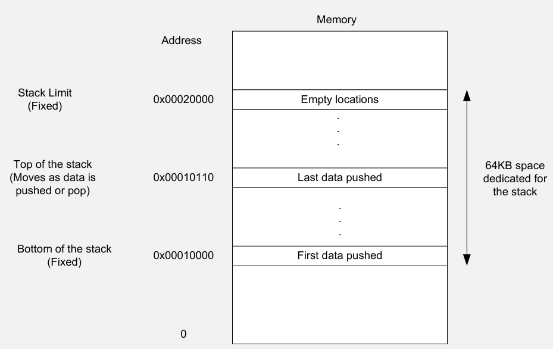
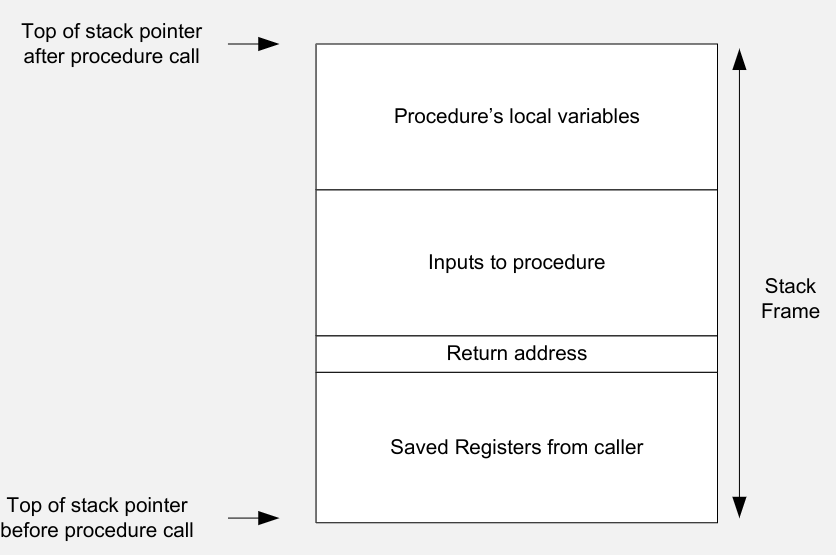
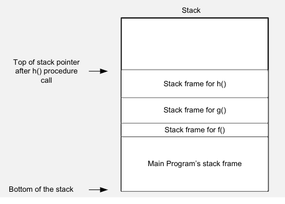
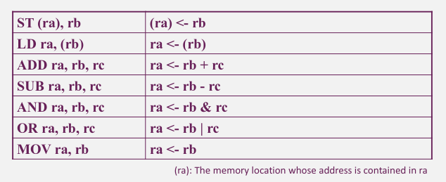

- #[[CT213 - Computer Systems & Organisation]]
- **Previous Topic:** [[Overview of Computer Systems]]
- **Relevant Slides:** 
-
- What is a **Processor Programming Model**? #card
  card-last-interval:: -1
  card-repeats:: 1
  card-ease-factor:: 2.46
  card-next-schedule:: 2022-11-15T00:00:00.000Z
  card-last-reviewed:: 2022-11-14T16:46:41.751Z
  card-last-score:: 1
	- A **Processor Programming Model** defines ^^how instructions access their operands and how instructions are described in the processor's assembly language.^^
	- Processors with different programming models can offer similar sets of operations but may require very different approaches to programming.
-
- ## Instructions
	- What is the **Instruction Cycle**? #card
	  card-last-interval:: 33.64
	  card-repeats:: 4
	  card-ease-factor:: 2.9
	  card-next-schedule:: 2022-12-18T07:51:49.011Z
	  card-last-reviewed:: 2022-11-14T16:51:49.012Z
	  card-last-score:: 5
		- The **Instruction Cycle** is the ^^procedure of processing an instruction^^ by the microprocessor.
			- **Fetch:** read the instructions from memory
			- **Decode:** Determine what is to be done
			- **Execute:** Perform the operation
		- Each of the functions fetch -> decode -> execute consist of a sequence of one or more operations inside the CPU (and interaction with the subsystems).
	- ### Types of Instructions
		- #### Data Transfer Instructions
			- What are **Data Transfer Instructions**? #card
			  card-last-interval:: 33.64
			  card-repeats:: 4
			  card-ease-factor:: 2.9
			  card-next-schedule:: 2022-12-18T07:51:37.887Z
			  card-last-reviewed:: 2022-11-14T16:51:37.888Z
			  card-last-score:: 5
				- Operations that ^^move data^^ from one place to another.
				- These instructions ^^don't modify^^ the data, they just copy it to the destination.
			- What operations can data transfer instructions do? #card
			  card-last-interval:: -1
			  card-repeats:: 1
			  card-ease-factor:: 2.46
			  card-next-schedule:: 2022-11-15T00:00:00.000Z
			  card-last-reviewed:: 2022-11-14T16:33:36.553Z
			  card-last-score:: 1
				- card-last-interval:: -1
				  card-repeats:: 1
				  card-ease-factor:: 2.7
				  card-next-schedule:: 2022-11-15T00:00:00.000Z
				  card-last-reviewed:: 2022-11-14T16:40:37.309Z
				  card-last-score:: 1
				  1. **Load data** from memory into the microprocessor. #card
					- These instructions copy data from memory into microprocessor registers (i.e., LD).
				- card-last-interval:: 29.26
				  card-repeats:: 4
				  card-ease-factor:: 2.66
				  card-next-schedule:: 2022-12-13T22:48:21.927Z
				  card-last-reviewed:: 2022-11-14T16:48:21.927Z
				  card-last-score:: 5
				  2. **Store data** from the microprocessor into the memory. #card
					- Similar to load data, except that the data is copied in the opposite direction (i.e., ST).
					- Data is saved from internal microprocessor registers into the memory
				- card-last-interval:: 11.2
				  card-repeats:: 3
				  card-ease-factor:: 2.8
				  card-next-schedule:: 2022-10-14T18:29:32.655Z
				  card-last-reviewed:: 2022-10-03T14:29:32.655Z
				  card-last-score:: 5
				  3. **Move data** within the microprocessor.
					- These instructions move data from one microprocessor register to another (i.e., MOV)
				- card-last-interval:: 4
				  card-repeats:: 2
				  card-ease-factor:: 2.7
				  card-next-schedule:: 2022-09-23T17:44:07.730Z
				  card-last-reviewed:: 2022-09-19T17:44:07.731Z
				  card-last-score:: 5
				  4. **Input data** into the microprocessor.
					- A microprocessor may need to input data from the outside world.
						- These are the instructions that input data from the input device into the microprocessor.
				- card-last-interval:: 4
				  card-repeats:: 2
				  card-ease-factor:: 2.7
				  card-next-schedule:: 2022-09-23T17:47:33.165Z
				  card-last-reviewed:: 2022-09-19T17:47:33.165Z
				  card-last-score:: 5
				  5. **Output data** from the microprocessor.
					- The microprocessor copies data from one of its internal registers to an output device.
					- Example: the microprocessor may want to show the content of an internal register on a display (the key has been pressed) (i.e., IOWR).
		- #### Data Operation Instructions #card
		  card-last-interval:: -1
		  card-repeats:: 1
		  card-ease-factor:: 2.56
		  card-next-schedule:: 2022-11-15T00:00:00.000Z
		  card-last-reviewed:: 2022-11-14T16:47:54.439Z
		  card-last-score:: 1
			- Instructions that *do* modify their data values.
			- They typically perform some operation (e.g., +, -, *) using one or two data values (operands) and store the result.
			- What operations can data operation instructions do? #card
			  card-last-interval:: 30.47
			  card-repeats:: 4
			  card-ease-factor:: 2.76
			  card-next-schedule:: 2022-12-15T07:20:59.244Z
			  card-last-reviewed:: 2022-11-14T20:20:59.245Z
			  card-last-score:: 5
				- **Arithmetic Instructions** #card
				  card-last-interval:: 4
				  card-repeats:: 2
				  card-ease-factor:: 2.9
				  card-next-schedule:: 2022-11-27T12:19:15.119Z
				  card-last-reviewed:: 2022-11-23T12:19:15.119Z
				  card-last-score:: 5
					- add, subtract, multiply, or divide
						- ADD, SUB, MUL, DIV
					- Instructions that increment or decrement one from a value
						- INC, DEC
					- Floating point instructions that operate on floating point values
						- FADD, FSUB, FMUL, FDIV
				- **Logic Instructions**
				  card-last-interval:: 11.2
				  card-repeats:: 3
				  card-ease-factor:: 2.8
				  card-next-schedule:: 2022-10-14T15:43:49.421Z
				  card-last-reviewed:: 2022-10-03T11:43:49.421Z
				  card-last-score:: 5
					- AND, OR, XOR, NOT, etc.
				- **Shift Instructions**
				  card-last-interval:: 10.92
				  card-repeats:: 3
				  card-ease-factor:: 2.46
				  card-next-schedule:: 2022-10-11T06:45:44.876Z
				  card-last-reviewed:: 2022-09-30T08:45:44.877Z
				  card-last-score:: 5
					- SR, SL, RR, RL, etc.
		- #### Program Control Instructions #card
		  card-last-interval:: 31.36
		  card-repeats:: 4
		  card-ease-factor:: 2.8
		  card-next-schedule:: 2022-12-16T00:29:50.214Z
		  card-last-reviewed:: 2022-11-14T16:29:50.214Z
		  card-last-score:: 5
			- **Jump** or **branch** instructions are used to ^^go to another part of the program^^; Jumps can be **absolute** or **conditional**.
				- e.g., if, then, else.
			- Instructions that can generate **interrupts**.
				- Software interrupts.
			- **Jump & branch instructions** (conditional or unconditional)
			  card-last-interval:: 11.2
			  card-repeats:: 3
			  card-ease-factor:: 2.8
			  card-next-schedule:: 2022-10-14T18:27:30.317Z
			  card-last-reviewed:: 2022-10-03T14:27:30.317Z
			  card-last-score:: 5
				- **JZ:** Jump if the zero flag is set.
				- **JNZ:** Jump if the zero flag is **not** set.
				- **JMP:** Unconditional jump - flags are ignored.
				- etc.
			- **Comparison Instructions** #card
			  card-last-interval:: 28.3
			  card-repeats:: 4
			  card-ease-factor:: 2.66
			  card-next-schedule:: 2022-12-09T18:30:16.818Z
			  card-last-reviewed:: 2022-11-11T11:30:16.819Z
			  card-last-score:: 5
				- TEST: logical BITWISE AND
			- **Calls & Returns** a / from a routine (conditional or unconditional) #card
			  card-last-interval:: 4
			  card-repeats:: 2
			  card-ease-factor:: 2.66
			  card-next-schedule:: 2022-11-18T20:24:48.750Z
			  card-last-reviewed:: 2022-11-14T20:24:48.750Z
			  card-last-score:: 5
				- **Call:** call a subroutine at a certain line.
				- **RET:** return from a subroutine.
				- **IRET:** interrupt & return.
			- **Software Interrupts** #card
			  card-last-interval:: 33.64
			  card-repeats:: 4
			  card-ease-factor:: 2.9
			  card-next-schedule:: 2022-12-18T10:59:57.740Z
			  card-last-reviewed:: 2022-11-14T19:59:57.740Z
			  card-last-score:: 5
				- Generated by devices outside of a microprocessor (not part of the instruction set).
				- INT
			- **Exceptions & Traps** #card
			  card-last-interval:: 11.2
			  card-repeats:: 3
			  card-ease-factor:: 2.8
			  card-next-schedule:: 2022-11-26T00:12:13.565Z
			  card-last-reviewed:: 2022-11-14T20:12:13.565Z
			  card-last-score:: 5
				- Triggered when valid instructions perform invalid operations.
					- e.g., dividing by zero.
			- **Halt Instructions** #card
			  card-last-interval:: 33.64
			  card-repeats:: 4
			  card-ease-factor:: 2.9
			  card-next-schedule:: 2022-12-18T07:49:58.118Z
			  card-last-reviewed:: 2022-11-14T16:49:58.118Z
			  card-last-score:: 5
				- Causes the processor to stop executions.
					- e.g., at the end of the program.
				- HALT
-
- ## Stack Architectures
	- ### The Stack
		- **Last In First Out (LIFO)** data structure.
		- Consists of **locations**, each of which can hold a **word of data**.
			- It can be used to explicitly **save / restore** data.
		- What operations does the stack support? #card
		  card-last-interval:: 33.64
		  card-repeats:: 4
		  card-ease-factor:: 2.9
		  card-next-schedule:: 2022-12-18T11:00:04.531Z
		  card-last-reviewed:: 2022-11-14T20:00:04.532Z
		  card-last-score:: 5
			- The stack supports ^^two operations.^^
				- **PUSH:** takes one argument and places the value of the argument at the top of the stack.
				- **POP:** removes one element from the stack, saving it into a predefined register of the processor.
		- The stack is ^^used implicitly by procedure call instructions.^^
			- (if available in the data set).
		- When new data is added to the stack, it is placed at the top of the stack, and all of the contents of the stack are pushed down one location.
	- ### Implementing Stacks
		- What are the two ways to implement a stack? #card
		  card-last-interval:: 41.44
		  card-repeats:: 5
		  card-ease-factor:: 2.18
		  card-next-schedule:: 2022-12-20T22:45:42.001Z
		  card-last-reviewed:: 2022-11-09T12:45:42.002Z
		  card-last-score:: 3
			- card-last-interval:: 7.76
			  card-repeats:: 3
			  card-ease-factor:: 1.94
			  card-next-schedule:: 2022-11-22T10:43:10.114Z
			  card-last-reviewed:: 2022-11-14T16:43:10.114Z
			  card-last-score:: 3
			  1. **Dedicated Hardware Stack** #card
				- Has a ^^hardware limitation^^ (limited number of locations).
				- Very fast.
			- card-last-interval:: 28.3
			  card-repeats:: 4
			  card-ease-factor:: 2.66
			  card-next-schedule:: 2022-12-12T23:52:10.829Z
			  card-last-reviewed:: 2022-11-14T16:52:10.829Z
			  card-last-score:: 3
			  2. **Memory Implemented Stack** #card
				- Limited by the ^^physical memory of the system.^^
				- Slow compared with hardware stacks, since extra memory addressing has to take place for each stack operation.
				- {:height 405, :width 638}
				- Every **push operation** will ^^increment the top of the **stack pointer**^^ with the word size of the machine.
				- Every **pop operation** will ^^decrement the top of the stack pointer^^ (with the word size of the machine).
		- **Stack overflows** can occur in both stack implementations
			- What is a **stack overflow**? #card
			  card-last-interval:: 97.56
			  card-repeats:: 5
			  card-ease-factor:: 2.9
			  card-next-schedule:: 2023-02-20T09:22:00.580Z
			  card-last-reviewed:: 2022-11-14T20:22:00.581Z
			  card-last-score:: 5
				- A **stack overflow** occurs when the amount of data in the stack exceeds the amount of space allocated to the stack (or the hardware limit of the stack).
	- ### Instructions in Stack-Based Architecture #card
	  card-last-interval:: 33.96
	  card-repeats:: 5
	  card-ease-factor:: 2.04
	  card-next-schedule:: 2022-12-18T19:21:47.052Z
	  card-last-reviewed:: 2022-11-14T20:21:47.052Z
	  card-last-score:: 5
		- Instructions in a stack-base architecture get their operands from the stack and write their results to the stack.
		- The advantage of this is that ^^program code takes little memory - there is no need to specify the address of the operands or registers.^^
			- PUSH is one exception, because it needs the operand to be specified (either as a constant or as an address).
	- ### Programs in a Stack-Based Architecture
		- Writing programs for stack-based architecture is not easy.
			- Stack-based architectures are better suited for **postfix** notation rather than **infix** notation.
		- What is **infix notation**? #card
		  card-last-interval:: 33.64
		  card-repeats:: 4
		  card-ease-factor:: 2.9
		  card-next-schedule:: 2022-12-18T07:51:56.638Z
		  card-last-reviewed:: 2022-11-14T16:51:56.639Z
		  card-last-score:: 5
			- **Infix notation** is the traditional way of representing mathematical expressions, with ^^operations placed **between** the operands.^^
				- e.g., a + b
		- What is **postfix notation**? #card
		  card-last-interval:: 33.64
		  card-repeats:: 4
		  card-ease-factor:: 2.9
		  card-next-schedule:: 2022-12-18T07:50:12.717Z
		  card-last-reviewed:: 2022-11-14T16:50:12.718Z
		  card-last-score:: 5
			- In **postfix notation**, ^^the operation is placed **after** the operands.^^
				- e.g., a b +
			- Stack-based architectures are better suited for **postfix notation**.
				- Once an expression has been converted into postfix notation, implementing it in programs is easy.
	- ### Using Stacks to Implement Procedure Calls
		- Programs need a way to **pass inputs to the procedures** that they call and to receive outputs back from them.
		- Procedures need to be able to **allocate space in memory for local variables** without overriding any data used by their calling program.
		- It is impossible to determine which registers may be used safely by the procedure (especially if the procedure is located in a library).
			- So, a mechanism to **save / restore registers** of the calling program has to be in place.
		- Procedures need a way to figure out where they were called from.
			- So, the execution can **return to the calling program** where the procedure completes (they need to restore the program counter).
		- How are procedure calls implemented in Stacks? #card
		  card-last-interval:: 19.01
		  card-repeats:: 4
		  card-ease-factor:: 2.18
		  card-next-schedule:: 2022-12-03T20:06:14.181Z
		  card-last-reviewed:: 2022-11-14T20:06:14.181Z
		  card-last-score:: 3
			- 
			- When a procedure is called,^^a block of memory in the stack called a **stack frame** is allocated.^^
				- The top of the **stack pointer** is incremented by the number of locations in the stack frame.
				- When a procedure finishes, it jumps to the **return address** of the stack and the execution of the calling program resumes.
		- How are nested procedure calls implemented in the stack? #card
		  card-last-interval:: 47.41
		  card-repeats:: 5
		  card-ease-factor:: 2.28
		  card-next-schedule:: 2023-01-01T05:23:12.594Z
		  card-last-reviewed:: 2022-11-14T20:23:12.594Z
		  card-last-score:: 5
			- 
			- main program calls function f(),
			- function f() calls function g(),
			- function g() calls function h()
- ## General-Purpose Register Architectures
	- ### General-Purpose Register File
		- In GPR Architectures, instructions read their operands and write their results to a **random access register file**.
		- The general-purpose register file allows the ^^access of **any** register in **any** order^^ by specifying the number (register ID) of the register.
		- What is the main difference between a GPR & a stack? #card
		  card-last-interval:: 23.43
		  card-repeats:: 4
		  card-ease-factor:: 2.42
		  card-next-schedule:: 2022-12-08T02:44:31.512Z
		  card-last-reviewed:: 2022-11-14T16:44:31.512Z
		  card-last-score:: 5
			- The main difference between a GPR and a stack is that repeatedly reading a register will produce the same result and **will not** modify the state of the register file.
				- Popping an item from a LIFO structure (stack) **will** modify the contents of the stack,
		- Many GPR architectures assign special values to some registers in the register file to make programming easier.
			- e.g., sometimes, register 0 is hardwired with value 0 to generate this most common constant.
	- ### Instructions in GPR Architecture
		- What do GPR instructions need to specify? #card
		  card-last-interval:: 41.44
		  card-repeats:: 5
		  card-ease-factor:: 2.18
		  card-next-schedule:: 2022-12-30T04:36:58.493Z
		  card-last-reviewed:: 2022-11-18T18:36:58.494Z
		  card-last-score:: 3
			- GPR instructions need to specify:
				- **the register** that holds their **input operands**
				- the register that will hole the **result**
		- What is the most common GPR instruction format? #card
		  card-last-interval:: -1
		  card-repeats:: 1
		  card-ease-factor:: 2.56
		  card-next-schedule:: 2022-11-15T00:00:00.000Z
		  card-last-reviewed:: 2022-11-14T20:01:45.936Z
		  card-last-score:: 1
			- The most common GPR instruction format is the **three operands instruction format**.
				- e.g., "ADD r1, r2, r3" instructs the processor to read the contents of r2 and r3, add them together, and write the results in r1.
			- Instructions that only have one or two inputs are also present in GPR architecture.
		- Which architecture allows **caching**? #card
		  card-last-interval:: 33.64
		  card-repeats:: 4
		  card-ease-factor:: 2.9
		  card-next-schedule:: 2022-12-18T07:38:25.742Z
		  card-last-reviewed:: 2022-11-14T16:38:25.742Z
		  card-last-score:: 5
			- In GPR Architecture, ^^programs can choose which values should be stored in the register file at any given time^^, allowing them to **cache** the most accessed data.
			- In stack-based architectures, once the data has been used, it's gone.
			- From this point of view, ^^GPR architectures have **better performance**^^, at the expense of needing **more storage space** for the program.
				- larger instructions are needed to encode the addresses of the operands.
		- #### Simple GPR Instruction Set
			- 
			-
	- ### Programs in a GPR Architecure #card
	  card-last-interval:: 28.3
	  card-repeats:: 4
	  card-ease-factor:: 2.66
	  card-next-schedule:: 2022-12-15T16:48:41.651Z
	  card-last-reviewed:: 2022-11-17T09:48:41.652Z
	  card-last-score:: 5
		- Programming a GPR architecture processor is **less structured** than programming a stack-based architecture processor.
			- There are **fewer restrictions on the order** in which operations can be executed.
				- In stack-based architectures, instructions must execute in the order that would leave the operands for the next instructions on the top of the stack.
				- In GPR, any order that places the operands for the next instruction in the register file before the instruction executes is valid.
				- Operations that access different registers can be **reordered** without making the program invalid.
	-
- ## Stack-Bases vs GPR Architectures
	- Stack-based architectures are still attractive for certain embedded systems.
	- GPR architectures are used by modern computers.
	- ## Stack-Based Architectures #card
	  card-last-interval:: 24.2
	  card-repeats:: 4
	  card-ease-factor:: 2.42
	  card-next-schedule:: 2022-12-11T13:48:46.669Z
	  card-last-reviewed:: 2022-11-17T09:48:46.669Z
	  card-last-score:: 3
		- Instructions take **fewer bits** to encode.
		- **Reduced amount of memory** taken up by programs.
		- Manages the **use of registers automatically** (no need for programmer intervention).
		- The instruction set **does not change** if the size of the register file has changed.
	- ## GPR Architectures
		- With the evolution of technology, the amount of space taken up by a program is less important.
		- Compilers for GPR architecture achieve **better performance** with a given number of general-purpose registers than those on stack-based architectures with the same number of registers.
			- The compiler can choose which values to keep (**cache**) in the register file at any time.