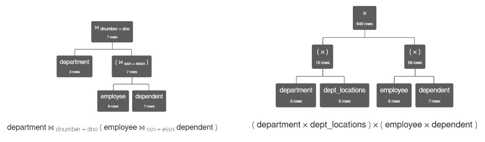

- #[[CT230 - Database Systems I]]
- **Previous Topic:** [[Query Processing: Relational Algebra]]
- **Next Topic:** [[File Organsiation]]
- **Relevant Slides:** 
-
- # Trees
	- What is a **tree**? #card
	  card-last-interval:: 14.2
	  card-repeats:: 3
	  card-ease-factor:: 2.7
	  card-next-schedule:: 2022-12-05T17:09:17.855Z
	  card-last-reviewed:: 2022-11-21T13:09:17.855Z
	  card-last-score:: 5
		- A **tree** is a collection of data arranged as a finite set of elements called **nodes**, such that the tree is empty or the tree contains a distinguished node, called the **root node**, and all other nodes are arranged in subtrees such that each node has a parent node.
		- Nodes typically contain *data* and some pointers to other nodes.
	- Nodes may be: #card
	  card-last-interval:: -1
	  card-repeats:: 1
	  card-ease-factor:: 2.5
	  card-next-schedule:: 2022-11-15T00:00:00.000Z
	  card-last-reviewed:: 2022-11-14T16:15:58.945Z
	  card-last-score:: 1
		- **Root:** No node points to it.
		- **Inner:** Has parent & child nodes.
		- **Leaves:** Has no child nodes.
	- What is a **binary tree**? #card
	  card-last-interval:: 2.8
	  card-repeats:: 1
	  card-ease-factor:: 2.6
	  card-next-schedule:: 2022-11-17T11:23:05.626Z
	  card-last-reviewed:: 2022-11-14T16:23:05.627Z
	  card-last-score:: 5
		- Tree data structures (a grouping of data) are used frequently in computing allowing data to be stored in a non-linear (non-list) way.
		- They are often called **binary trees** where each node can have at most two child nodes.
	- ## SQL -> Relational Algebra
		- How to translate SQL to Relational Algebra? #card
		  card-last-interval:: -1
		  card-repeats:: 1
		  card-ease-factor:: 2.5
		  card-next-schedule:: 2022-11-24T00:00:00.000Z
		  card-last-reviewed:: 2022-11-23T12:19:36.426Z
		  card-last-score:: 1
			- `SELECT` *attributes* corresponds to $\pi$.
			- `JOIN`s correspond to relational algebra **joins** $\Join$ with ==any join conditions specified as part of the join.==
			- Any condition in a `WHERE` clause corresponds to a **sigma** $\sigma$ relational algebra operator with associated conditions.
			- In addition, we have rules for aggregate functions (`SUM`, `AVG`, `COUNT`, etc.), `GROUP BY` & `HAVING`, and subqueries.
	- ## Query Tree
		- What is a **query tree**? #card
		  card-last-interval:: -1
		  card-repeats:: 1
		  card-ease-factor:: 2.5
		  card-next-schedule:: 2022-11-15T00:00:00.000Z
		  card-last-reviewed:: 2022-11-14T15:51:22.389Z
		  card-last-score:: 1
			- A **query tree** is a binary tree that corresponds to a relational algebra expression where:
				- (**Input**) Tables are the leaf nodes.
				- Relational algebra operators are at internal nodes.
				- (**Output / Result**) The root of the tree returns the result (often with one final relational algebra operator).
			- The sequence of operations is directed from ^^leaves to root^^ and from ^^left to right^^.
				- i.e., the bottom-most, left-most side of the tree is executed first.
		- ### Materialisation Evaluation #card
		  card-last-interval:: -1
		  card-repeats:: 1
		  card-ease-factor:: 2.5
		  card-next-schedule:: 2022-11-15T00:00:00.000Z
		  card-last-reviewed:: 2022-11-14T20:24:42.937Z
		  card-last-score:: 1
			- One approach to executing a query represented by a query tree is **Materialisation Evaluation**.
				- Traverse the tree from bottom to top, left to right. At each stage:
					- 1. Execute internal node operation whenever data for its child nodes are available.
					  2. Replace the internal node operation (and all child nodes) by the table resulting from executing the operation.
			- **Note:** The results of operations are saved as temporary tables and are used as inputs to other operators.
		- ### How to Draw a Query Tree #card
		  card-last-interval:: -1
		  card-repeats:: 1
		  card-ease-factor:: 2.5
		  card-next-schedule:: 2022-11-19T00:00:00.000Z
		  card-last-reviewed:: 2022-11-18T18:35:40.054Z
		  card-last-score:: 1
			- We must remember the order of execution - from bottom to top, completing each level, and then left to right. Therefore:
				- The first operations - **fetching tables** - should be at the leaves of the tree.
				- The last operator - often $\pi$ or aggregate functions - should be at the root of the tree.
				- Joins must be applied to tables (two at a time) and should be at internal nodes.
				- Any other operators should be at one or more internal nodes.
			- **Important:** When joining or multiplying more than two tables, operators can only be applied to two operands at a time.
			- 
		- ### Annotating Tree
			- Each relational algebra operation can be evaluated using one of several different algorithms and Seach relational algebra expression can be evaluated in many ways.
			- What is an **evaluation plan**? #card
			  card-last-interval:: -1
			  card-repeats:: 1
			  card-ease-factor:: 2.5
			  card-next-schedule:: 2022-11-15T00:00:00.000Z
			  card-last-reviewed:: 2022-11-14T15:52:56.044Z
			  card-last-score:: 1
				- An **evaluation plan** is an annotated expression / query tree specifying the execution strategy for a query.
		- ### Issues to Consider with Query Trees #card
		  card-last-interval:: -1
		  card-repeats:: 1
		  card-ease-factor:: 2.5
		  card-next-schedule:: 2022-11-24T00:00:00.000Z
		  card-last-reviewed:: 2022-11-23T12:19:19.197Z
		  card-last-score:: 1
			- Size of temporary tables.
			- Algorithms used for execution plan.
- # Optimisation
	- Different query trees for a given query can have different *costs*.
	- Different evaluation plans for a given query can have different costs.
	- **Optimisation techniques** attempt to choose the best among a number of potential query trees.
	- ## Cost Estimates
		- How to calculate cost estimates? #card
		  card-last-interval:: -1
		  card-repeats:: 1
		  card-ease-factor:: 2.5
		  card-next-schedule:: 2022-11-22T00:00:00.000Z
		  card-last-reviewed:: 2022-11-21T13:05:07.723Z
		  card-last-score:: 1
			- Cost factors include CPU speed, disk access time, network communication time, etc.
			- Disk access is typically the predominant cost and can be measured by the number of blocks read / number of blocks written per query.
		- What is the main cost estimate used? #card
		  card-last-interval:: -1
		  card-repeats:: 1
		  card-ease-factor:: 2.5
		  card-next-schedule:: 2022-11-15T00:00:00.000Z
		  card-last-reviewed:: 2022-11-14T15:52:39.027Z
		  card-last-score:: 1
			- The main cost estimate used is the number of block transfers where each block contains a number of records.
				- The number of blocks transferred from disk depends on:
					- The size of the buffer in main memory - having more memory reduces the need for more disk accesses.
					- Indexing structures used (primary, secondary, etc.).
					- Whether or not all blocks of a file must be transferred.
						- e.g., if a search can be done on the primary key of the index file or on the secondary index, then only retrieve blocks that satisfy the search condition.
			- As in typical in Computing, often we use **worst case estimates**, knowing that any *actual* cost cannot exceed a worst case estimate.
		- #### DBMS Catalog #card
		  card-last-interval:: -1
		  card-repeats:: 1
		  card-ease-factor:: 2.5
		  card-next-schedule:: 2022-11-15T00:00:00.000Z
		  card-last-reviewed:: 2022-11-14T20:24:53.519Z
		  card-last-score:: 1
			- The **DBMS Catalog** stores ==statistical information about each table== such as table sizes, indexes & their depths, etc.
				- The statistical information on the tables & attributes used in a query can be found in the DBMS catalog and these are used to calculate estimates also.
			- In the DBMS catalog, for each table $R$, information is stored on:
				- The number of tuples / records in $R$.
				- The number of blocks containing tuples of table $R$.
				- The size of a record in bytes.
				- The blocking factor.
				- Information on the number of distinct values per attribute and the number of values that would satisfy a set of equality operations on that attribute (by having averages, min, max, etc.).
				- Information on indices (index type, index field values, etc.).
	- ## Optimisation Approach 1: Compare Cost Estimates Across Different Solutions #card
	  card-last-interval:: -1
	  card-repeats:: 1
	  card-ease-factor:: 2.5
	  card-next-schedule:: 2022-11-15T00:00:00.000Z
	  card-last-reviewed:: 2022-11-14T15:52:10.705Z
	  card-last-score:: 1
		- Cost is usually measured as the **total elapsed time** for answering a query.
		- One approach to optimisation is to calculate cost estimates for each possible query tree.
		- The query tree with the lowest **cost estimate** should then be chosen.
		- ### Steps
			- 1. Generate query trees & evaluation plans (maybe not all).
			  2. For each query tree, get cost estimates using the DBMS catalog.
			- This results in a set of cost estimates such that the best can be chosen and the query tree with the lowest cost estimate can then be picked as the single best query tree & evaluation plan.
			- Therefore, to choose among plans, the optimiser has to estimate the cost of each evaluation plan.
				- There are two aspects to this. For each node of the tree, estimate the cost of performing associated operation, and estimate the size of the result and if it is sorted.
		- ### Summary
			- While cost-based optimisation is good, it is expensive.
			- As query complexity increases, so does the number of different query trees & plans possible, and each query tree requires its own cost estimates.
			- **NB:** It is important that the amount of time an optimiser spends on calculating the best solution is not longer than the amount of time which would elapse if executing a solution picked at random.
	- ## Optimisation Approach 2: Heuristic Optimisation #card
	  card-last-interval:: -1
	  card-repeats:: 1
	  card-ease-factor:: 2.5
	  card-next-schedule:: 2022-11-15T00:00:00.000Z
	  card-last-reviewed:: 2022-11-14T20:24:24.658Z
	  card-last-score:: 1
		- Optimisers often use **heuristics** to reduce the number of choices that must be made in a cost-based fashion.
		- Heuristic Optimisation transforms the query tree by ==using a set of rules that typically (but not always) improve execution performance.==
		- Some cost-based estimation is also performed as part of the heuristic optimisation and to choose between a reduced set of trees and/or evaluation plans.
		- ### Steps
			- 1. Create a **canonical query tree**.
			  2. Apply a **set of heuristics** to the tree to create a more efficient query tree.
			  3. If appropriate, create cost estimates of this query tree to ensure the best evaluation plan.
		- ### Canonical Query Trees
			- What is a **canonical query tree**? #card
			  card-last-interval:: -1
			  card-repeats:: 1
			  card-ease-factor:: 2.5
			  card-next-schedule:: 2022-11-15T00:00:00.000Z
			  card-last-reviewed:: 2022-11-14T16:22:12.535Z
			  card-last-score:: 1
				- A **canonical query tree** is an *inefficient* query tree representing relational algebra expressions which can be created **directly** from the SQL solution following a sequence of quick & easy steps.
				- A canonical query tree:
					- Uses **Cartesian Product** instead of **Joins**.
					- Keeps all conditions ($\sigma$) together in one internal node.
					- $\pi$ become the root node.
			- #### Steps to create a Canonical Query Tree with `SELECT`/`WHERE`/`FROM` clauses and no sub-queries:
				- 1. All relations in the `FROM` clause become leaves of the tree.
					- They should be combined with a **Cartesian Product** ($\times$) of the relations.
						- **Note:** Only two relations can be involved in a Cartesian Product at a time (binary tree).
				- 2. All conditions in the `WHERE` clause and any `JOIN` conditions in `WHERE` or `FROM` clauses become a sequence of relational algebra in **one** inner node of the tree (with inputs from the previous step).
				  3. All conditions from the `SELECT` clause become a relational algebra expression in the root node.
		- Heuristic Optimisation **must** transform this canonical query tree into a final query tree that is efficient to execute.
			- In general, heuristic optimisation tries to ==apply the most restrictive operators as early as possible== in the tree and to ==reduce the size of the temporary tables / results== created that move "up" the tree.
			- Heuristic Optimisation must include rules for equivalence among relational algebra expressions that can be applied to the initial tree.
		- ### Heuristic Optimisation Algorithm #card
		  card-last-interval:: -1
		  card-repeats:: 1
		  card-ease-factor:: 2.5
		  card-next-schedule:: 2022-11-15T00:00:00.000Z
		  card-last-reviewed:: 2022-11-14T16:25:04.590Z
		  card-last-score:: 1
			- **Input:** A canonical query tree.
			- **Process:**
				- 1. Decompose any $\sigma$ with AND conditions into an individual $\sigma$.
				  2. Move each $\sigma$ operator as far down the query tree as possible, thus eliminating unwanted tuples.
					- Heuristic 1 tries to reduce the size of the tables to be combined as much as possible.
						- Therefore, if a selection operator ($\sigma$) occurs *after* a Cartesian product or a join, check to see if it could occur *before* these operations.
				- 3. Rearrange the leaf nodes so that the most restrictive $\sigma$ can be applied first (using information from the DBMS catalog) and so that future JOINS are possible.
					- **Note:** "Most restrictive" means those operators that result in relations with the fewest tuples or with the smallest absolute size.
						- These operations should happen first, i.e., on the left-hand side of the lowest level of the tree.
					- If we don't have any information from the DBMS catalog, we might leave nodes as they are, use the database schema (# of columns) to make a good estimate, or use sample data (# of rows) & database schema (# of columns) to make a good estimate.
				- 4. Combine Cartesian Product operators with $\sigma$ to form JOIN operators where appropriate (replacing all $\times$).
					- Must first ensure that the leaf nodes are ordered such that this can occur. If not, re-order the leaf nodes and ensure to keep any select operators with the appropriate leaf node.
				- 5. Decompose $\pi$ and move each $\pi$ as far down the tree as possible, possibly creating new $\pi$ operators in the process to eliminate unwanted columns.
					- This heuristic ensure that the size of the tables to be joined are as small as possible.
					- Therefore, for each $\pi$ check if that $\pi$ can be carried out before the join. For each table, check if additional $\pi$s can be introduced (these may not be stated explicitly in the query).
					- **Note:** Must ensure that all needed columns further up the tree are retained (even if they are not immediately necessary).
				- 6. Identify subtrees that represent groups of operations that can be executed by a single algorithm.
				  7. Add an evaluation plan.
			- **Output:** An efficient query tree.
		-