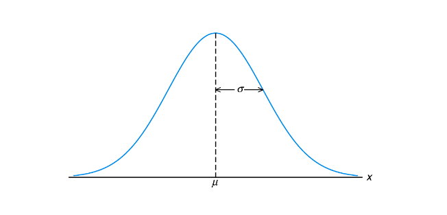
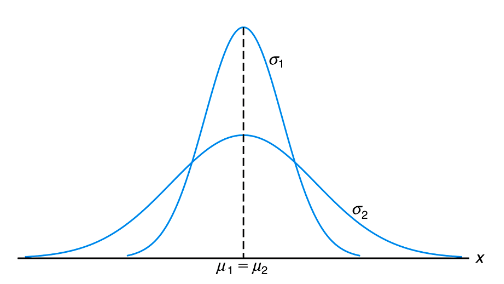
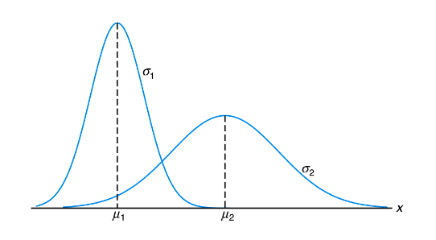
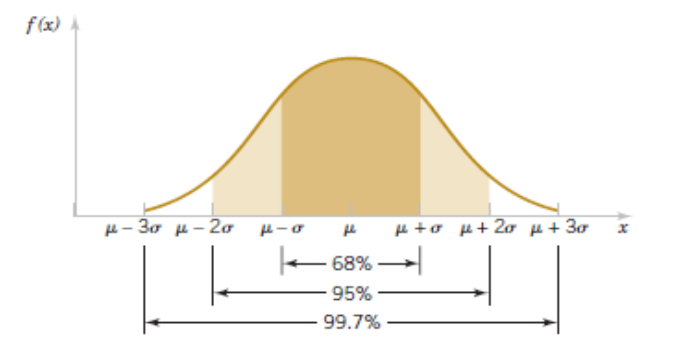
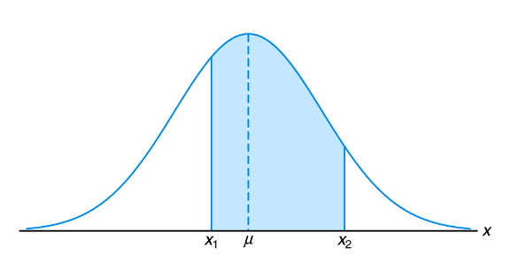

- #[[ST2001 - Statistics in Data Science I]]
- **Previous Topic:** [[Discrete Probability Distributions: Binomial & Poisson]]
- **Next Topic:** [[Sampling Distributions & Confidence Intervals]]
- **Relevant Slides:** 
-
- What is a **Normal Distribution**? #card
  card-last-interval:: -1
  card-repeats:: 1
  card-ease-factor:: 2.5
  card-next-schedule:: 2022-11-15T00:00:00.000Z
  card-last-reviewed:: 2022-11-14T20:07:27.457Z
  card-last-score:: 1
  id:: 63510f7d-d646-41b8-82d7-8634c840892e
	- A random variable $X$ with probability distribution function
		- $$f(x) = \frac{1}{\sqrt{2\pi\sigma^2}}e^{\frac{(x - \mu)^2}{2 \sigma^2}} -\infty < x < \infty$$
		- is a **normal random variable** with parameters $\mu$ & $\sigma$ (where $\infty < \mu < \infty$ and $\sigma > 0$) where $\mu$ is the mean and $\sigma$ is the standard deviation.
	- Write $X \sim N(\mu, \sigma^2)$.
	- 
- # Features of the Normal Distribution #card
  card-last-interval:: -1
  card-repeats:: 1
  card-ease-factor:: 2.5
  card-next-schedule:: 2022-11-15T00:00:00.000Z
  card-last-reviewed:: 2022-11-14T20:09:00.438Z
  card-last-score:: 1
	- Also called the **Gaussian Distribution**.
	- The **pdf** (probability density function) is a **bell-shaped curve**.
	- The distribution of many types of observations can be approximated by a Normal Distribution.
	- Single mode.
	- Symettric.
	- Model for continuous measurements.
- # Examples of Normal Distributions
  collapsed:: true
	- ## Normal Curves with $\mu_i = \mu_2$ and $\sigma_1 < \sigma_2$
		- 
	- ## Normal Curves with $\mu_1 < \mu_2$ and $\sigma_1 < \sigma_2$
		- 
		-
- # Empirical Rule for a Normal Distribution #card
  card-last-interval:: -1
  card-repeats:: 1
  card-ease-factor:: 2.5
  card-next-schedule:: 2022-11-15T00:00:00.000Z
  card-last-reviewed:: 2022-11-14T20:08:32.008Z
  card-last-score:: 1
	- For any normal random variable:
		- $$P(\mu - \sigma < X < \mu + \sigma) = 0.6827$$
		- $$P(\mu - 2\sigma < X < \mu + 2\sigma) = 0.9545$$
		- $$P(\mu - 3\sigma < X < \mu + 3\sigma) = 0.9973$$
		- {:height 251, :width 426}
	- ## The 68-95-99.7 Rule
		- Normal models give us an idea of how extreme a value is by telling us how likely it is to find one that far from the mean.
		- In a normal model:
			- About 68% of the values within **one standard deviation** from the mean.
			- About 95% of the values fall within **two standard deviations** of the mean.
			- About 99.7% of the values fall within **three standard deviations** of the mean.
			-
- # Areas Under a Normal Curve #card
  card-last-interval:: -1
  card-repeats:: 1
  card-ease-factor:: 2.5
  card-next-schedule:: 2022-11-15T00:00:00.000Z
  card-last-reviewed:: 2022-11-14T20:05:26.550Z
  card-last-score:: 1
	- To calculate a probability in a range under a normal distribution.
		- $$P(x_1 < X < x_2) = \int_{x_1}^{x_2} \frac{1}{\sqrt{2\pi\sigma^2}}e^{\frac{(x - \mu)^2)}{2\sigma^2}}dx$$
	- For example. $P(x_1 < X < x_2) =$ area of the shaded region.
		- {:height 225, :width 444}
	-
- # z-scores
	- What is a **z-score**? #card
	  card-last-interval:: -1
	  card-repeats:: 1
	  card-ease-factor:: 2.5
	  card-next-schedule:: 2022-11-16T00:00:00.000Z
	  card-last-reviewed:: 2022-11-15T18:42:43.077Z
	  card-last-score:: 1
		- A **z-score** reports the number of standard deviations from the mean.
		- For example, a z-score of 2 indicates that the observation is two standard deviations above the mean.
	- ## Converting to z-scores #card
	  card-last-interval:: -1
	  card-repeats:: 1
	  card-ease-factor:: 2.5
	  card-next-schedule:: 2022-11-15T00:00:00.000Z
	  card-last-reviewed:: 2022-11-14T20:08:12.257Z
	  card-last-score:: 1
		- To convert a random variable $X$ which follows a $N(\mu, \sigma^2)$ to a random variable $Z$ that follows a standard normal $N(0,1)$, calculate $Z$ as:
			- $$Z = \frac{X - \mu}{\sigma}$$
		- Convert $X \sim N(100,100)$ to a random variable $Z$ such that $Z \sim N(0,1)$.
	-
- # Cumulative Distribution Functions
  collapsed:: true
	- How is the **cumulative distribution function** of a standard normal random variable denoted? #card
	  card-last-interval:: -1
	  card-repeats:: 1
	  card-ease-factor:: 2.5
	  card-next-schedule:: 2022-11-19T00:00:00.000Z
	  card-last-reviewed:: 2022-11-18T18:34:54.021Z
	  card-last-score:: 1
		- The **cumulative distribution function** of a standard normal random variable is denoted as $\Phi(z) = P(Z \leq z)$
	-
- # Normal Approximation to the Poisson
	- If $X$ is a Poisson random variable with $E(X) + \lambda$ and $V(X) = \lambda$,
		- $$Z = \frac{X-\lambda}{\sqrt{\lambda}}$$
	- The approximation is good for $\lambda \geq 5$.
	-
- # Continuity Correction
	- Using the Normal Distribution to approximate a discrete distribution (e.g., Binomial) we need to take into account the fact that the Normal Distribution is **continuous**.
		- | $\textbf{Discrete}$ | | $\textbf{Continuous}$ |
		  | $P(X > k)$ | $\rightarrow$ | $P(X > k + \frac 1 2)$ |
		  | $P(X \geq k)$ | $\rightarrow$ | $P(X > k - \frac 1 2)$ |
		  | $P(X < k)$ | $\rightarrow$ | $P(X < k - \frac 1 2)$ |
		  | $P(X \leq k)$ | $\rightarrow$ | $P(X < k + \frac 1 2)$ |
		  | $P(k_1 < X < k_2$ | $\rightarrow$ | $P(k_1 + \frac 1 2 < X < k_2 - \frac 1 2)$ |
		  | $P(k_1 \leq X \leq k_2)$ | $\rightarrow$ | $k_1 - \frac 1 2 < X < k_2 + \frac 1 2$ |