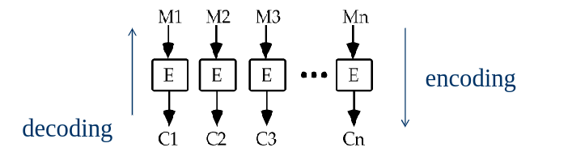
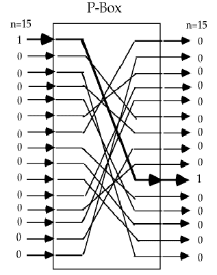
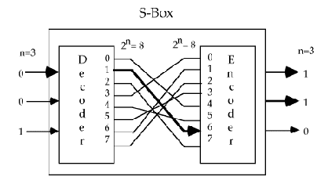
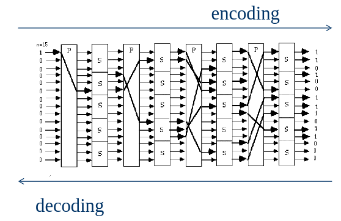
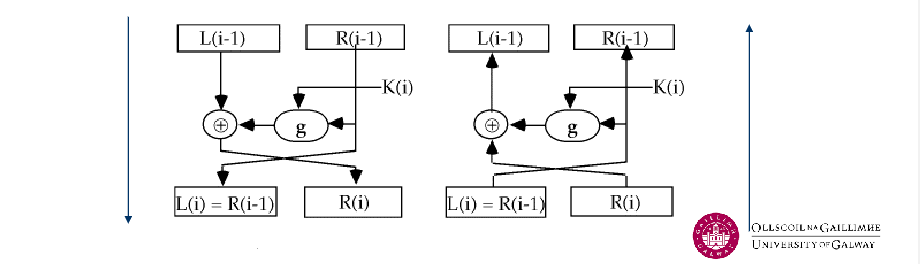
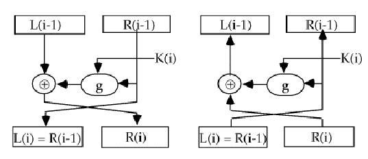

- #[[CT255 - Next Generation Technologies II]]
- **Previous Topic:** [[DIffie-Hellman Key Exchange]]
- **Next Topic:** [[Message Authentication]]
- **Relevant Slides:** 
-
- # Block Ciphers
	- ## Encryption Algorithms Based on Block Ciphers
	  collapsed:: true
		- In a **block cipher**, the message is broken into blocks $M1$, $M2$, etc., of $K$ bits length, each of which is then encrypted.
			- 
			- Most ciphers that we saw before process blocks of just one character.
		- Claude Shannon suggested to use the two primitive cryptographic operations as building blocks for such ciphers:
			- **Substitution**.
			- **Permutation**.
		- ### The Permutation Operation
			- A binary word (i.e., block) has its bits re-ordered (permuted).
				- The re-ordering forms the key.
				- The Operation is represented by a **P-box**.
			- 
				- The example allows for 15! combinations.
				- The key describes the combinations used.
		- ### The Substitution Operation
			- A binary word is replaced by another binary word.
			- The whole substitution function forms the key.
			- The operation is represented by an **S-box**.
			- The box below allows for 8! combinations.
				- 
			- The key describes the combination used.
		- ### Substitution-Permutation Network
			- The key describes the internal wiring of all S-boxes & P-boxes.
				- The same key can be used for encoding & decoding, hence it is a **private key encryption algorithm**.
			- The direction of the process determines encoding / decoding.
			- 
			-
	- ## Confusion & Diffusion
		- A cipher needs to completely obscure the statistical properties of the original message.
		- Shannon introduced two terms to describe this:
			- **Diffusion** seeks to make the statistical relationship between the plaintext & ciphertext as complex as possible.
			- **Confusion** seeks to make the relationship between the statistics of the ciphertext and the value of the encryption key as complex as possible.
		- Both thwart attempts to deduce the key used via a cryptanalysis.
	- ## Reversible Transformation
		- An important block cipher principle is **Reversible Transformation** - transformations must be reversible or non-singular.
		- There must be a 1:1 association between an $n$-bit plaintext and an $n$-bit ciphertext, otherwise mapping is irreversible.
	- ## Features of Private-Key Cryptography
		- Traditional private/secret/single key cryptography uses one key, shared by only the sender and the receiver.
		- The algorithm/cipher itself is public, i.e., not a secret.
		- If the key is disclosed, communications are compromised.
		- The key is also **symettric**, parties are equal.
			- Hence, methods doe do not protect the sender from receiver forging .
		- Examples include DES and AES.
	- ## AES
		- The **Advanced Encryption Standard (AES)** is the successor of DES.
		- It is a modern block cipher with 128 bits block length.
		- Uses 128, 192, or 256 bit long keys.
		- The de-facto standard for secure encryption.
		- Widely used for file/data encryption, and secure network communication.
	- ## Why does Block & Key length matter?
		- Cryptographic algorithms with short block length can be tackled easily.
		- Large keys & long blocks prevent brute force attacks
		- The DES cipher used 56-bit keys - The generally accepted minimum key length today is 128-bit.
		- ### Brute Force Attacks
			- Always possible to simply try every key.
			- Most basic attack, effort proportional to key size.
			- Assume that you either know or recognise plaintext.
	- ## The Feistel Cipher
		- In practice, we need to be able to decrypt messages as well as encrypt them. Hence we either need to define inverses for each of the S & P-boxes (but this doubles the code / hardware needed) or define a structure that is easy to reverse, so you can use basically the same code or hardware for both encryption & decryption.
		- A **Feistel Cipher** is such a structure that is easy to reverse.
			- It is based on the concept of the **invertible product cipher**.
			- Most symmetric block ciphers are based on a Feistel Cipher structure.
		- Feistel invented a suitable structure which adapted Shannon's S-P network into an easily invertible structure.
			- Essentially, the same hardware or software is used for both encryption & decryption, with just a slight change in how the keys are used.
		- ### A Single Round
		  collapsed:: true
			- The idea is to partition the input block into two halves, $L(i-1)$ & $R(i-1)$, and use only $R(i-1)$ in the $i^{\text{th}}$ round (part) of the cipher.
			- The function $g$ incorporates one stage of the S-P network, controlled by part of the key $K(i)$ known as the $i^{\text{th}}$ subkey.
			- 
			- A round of a Feistel Cipher can be described functionally as:
				- $$L(i) = R(i-1)$$
				- $$R(i) = L(i-1) \text{ EXOR } g(K(i), R(i-1))$$
				- 
			-
		- ### A Feistel Network
			- Perform multiple transformation (single rounds) sequentially, whereby the output of the $i$^{th} round becomes the input of the $(i+1)$^{th} round.
			- Every round gets its own subkey, which is derived from the master key.
			- The decryption process goes from bottom to top.
		- ### Feistel Cipher Design Elements
			- Block size.
			- Key size.
			- Number of rounds.
			- Subkey generation algorithm.
			- Round function.
			- Fast software encryption / decryption.
		-