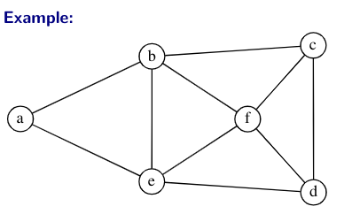
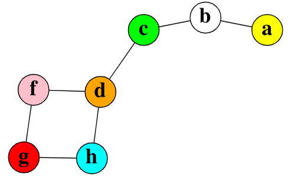

- #[[MA284 - Discrete Mathematics]]
- **Previous Topic:** [[Convex Polyhedra]]
- **Next Topic:** [[Trees]]
- **Relevant Slides:** 
-
- # Vertex Colouring
	- There are maps that can be coloured with a single colour, two colours, three colours, or four colours.
	- For all maps, no matter how complicated, at most four colours is sufficient.
- # Colouring Graphs
	- If we think of a map as a way of showing which regions share borders, then we can represent it as a **graph**, where:
		- A vertex in the graph corresponds to a region in the map.
		- There is an edge between two vertices in the graph if the corresponding regions share a border.
	- Colouring regions of a map corresponds to colouring vertices of the graph. Since neighbouring regions in the map must have different colours, so too must adjacent vertices.
	- More precisely:
		- **Vertex Colouring:** An assignment of colours to the vertices of a graph.
		- **Proper Colouring:** If the vertex colouring has the property that adjacent vertices are coloured differently, then the colouring is called **proper**.
		- **Minimal Colouring:** A proper colouring that is done with the fewest possible number of colours.
	- Lots of different proper colourings are possible. If the graph has $v$ vertices, then clearly at most $v$ colours are needed. However, usually, we need far fewer.
	- ## Chromatic Numbers
		- What is the **chromatic number** of a graph? #card
		  card-last-interval:: 2.8
		  card-repeats:: 1
		  card-ease-factor:: 2.6
		  card-next-schedule:: 2022-11-17T10:50:36.778Z
		  card-last-reviewed:: 2022-11-14T15:50:36.779Z
		  card-last-score:: 5
			- The **chromatic number** of the graph, written $\chi(G)$ is the smallest number of colours needed to get a proper vertex colouring of a graph $G$.
		- ### Example
			- Determine the **chromatic number** of the graphs $C_2$, $C_3$, $C_4$, & $C_5$.
			  background-color:: green
				- $$\chi(C_2) = 2$$
				- $$\chi(C_3) = 3$$
				- $$\chi(C_4) = 2$$
				- $$\chi(C_3) = 5$$
			- Determine the **chromatic number** of the $K_n$ & $K_{p,q}$ for any $n$, $p$, $q$.
			  background-color:: green
				- $$\chi(K_4) = 4$$
				- $$\chi(K_n) = n$$
				- $$\chi(K_{3,3}) = 2$$
				- $$\chi(K_{p,q}) = 2$$
		- In general, calculating $\chi(G)$ is not easy, but there are some ideas that can help. For example, it is clearly true that if a graph has $v$ vertices, then
			- $$1 \leq \chi(G) \leq v$$
		- ### Cliques
			- If the graph happens to be **complete**, then $\chi(G) = v$. If it is **not** complete, then we can look at ***cliques*** in the graph.
				- What is a **clique** of a graph? #card
				  card-last-interval:: -1
				  card-repeats:: 1
				  card-ease-factor:: 2.5
				  card-next-schedule:: 2022-11-15T00:00:00.000Z
				  card-last-reviewed:: 2022-11-14T16:14:53.505Z
				  card-last-score:: 1
					- A **clique** is a subgraph of a graph, all of whose vertices are connected to each other.
				- (Clique numbers will not be on the exam).
				- What is the **clique number** of a graph? #card
				  card-last-interval:: -1
				  card-repeats:: 1
				  card-ease-factor:: 2.5
				  card-next-schedule:: 2022-11-23T00:00:00.000Z
				  card-last-reviewed:: 2022-11-22T13:37:29.890Z
				  card-last-score:: 1
					- The **clique number** of a graph, $G$, is the number of vertices in the largest clique in $G$.
				- **Lower Bound:** The chromatic number of a graph is *at least* its clique number.
				- **Upper Bound:** $\chi(G) \leq \Delta(G) + 1$, where  $\Delta(G)$ denotes the largest degree of any vertex in the graph $G$.
- # Algorithms for $\chi(G)$
	- In general, finding a proper colouring for a graph is hard. There are some algorithms that are efficient, but not optimal. We'll look at two:
		- The **Greedy Algorithm**.
		- The **Welsh-Powell Algorithm**.
	- The **Greedy Algorithm** is simple & efficient, but the result can depend on the ordering of the vertices.
	- The **Welsh-Powell Algorithm** is slightly more complicated, but can give better colourings.
	- ## Greedy Algorithm #card
	  card-last-interval:: -1
	  card-repeats:: 1
	  card-ease-factor:: 2.5
	  card-next-schedule:: 2022-11-15T00:00:00.000Z
	  card-last-reviewed:: 2022-11-14T16:22:55.701Z
	  card-last-score:: 1
		- 1. Number all the vertices. Number your colours.
		  2. Give a colour to vertex 1.
		  3. Take the remaining vertices in order. Assign each one the lowest numbered colours that is different from the colours of its neighbours.
	- ## Welsh-Powell Algorithm #card
	  card-last-interval:: -1
	  card-repeats:: 1
	  card-ease-factor:: 2.5
	  card-next-schedule:: 2022-11-15T00:00:00.000Z
	  card-last-reviewed:: 2022-11-14T15:51:29.529Z
	  card-last-score:: 1
		- 1. List all vertices in decreasing order of their degree (i.e., largest degree first). If two or more share the same degree, list them in any way you want.
		  2. Colour the first listed vertex (with the first unused colour).
		  3. Work down the list, giving that colour to all vertices **not** conencted to one previously coloured.
		  4. Cross (verb.) coloured vertices of the list, and return to the start of the list.
- # Eulerian Paths & Circuits
	- Recall that a **path** is a sequence of adjacent vertices in a graph.
	- What is a **Eulerian Path**? #card
	  card-last-interval:: -1
	  card-repeats:: 1
	  card-ease-factor:: 2.5
	  card-next-schedule:: 2022-11-15T00:00:00.000Z
	  card-last-reviewed:: 2022-11-14T16:18:26.028Z
	  card-last-score:: 1
		- A **Eulerian Path** (also called an *Euler Path* and an *Eulerian trail*) in a graph is path which uses every edge exactly once.
		- 
	- Recall that a **circuit** is a path that begins & ends at that same vertex, and no edge is repeated.
	- What is an **Eulerian Circuit**? #card
	  card-last-interval:: -1
	  card-repeats:: 1
	  card-ease-factor:: 2.5
	  card-next-schedule:: 2022-11-15T00:00:00.000Z
	  card-last-reviewed:: 2022-11-14T16:21:29.522Z
	  card-last-score:: 1
		- An **Eulerian Circuit** (also called an *Eulerian Cycle*) is an *Eulerian path* that that starts & finishes on at the same vertex.
		- If a graph has such a circuit, we say that it is *Eulerian*.
	- It is possible to come up with a condition that guarantees that a graph has an Eulerian Path, and, additionally, one that ensures that ensures that it has an Eulerian Circuit.
		- To begin with, we'll reason that the following graph could *not* have an Eulerian circuit, although it *does* have an Eulerian path.
			- 
		- Suppose, first, that we have a graph that ==**does** have an Eulerian circuit.== Then, for every edge in the circuit that "exits" a vertex, there is another that "enters" that vertex. So, every vertex must have even degree.
			- A graph has an **Eulerian Circuit** if and only if every vertex has even degree.
		- Next, suppose that a graph==does **not** have an Eulerian circuit==, but does have an **Eulerian path**. Then, the degree at the "start" & "end" verticwes must be odd, and every other vertex has even degree.
			- A graph has an **Eulerian Path** if and only if it has either **zero** or **two** vertices with odd degree.
- # Hamiltonian Paths & Cycles
	- What is a **Hamiltonian Path**? #card
	  card-last-interval:: 2.8
	  card-repeats:: 2
	  card-ease-factor:: 2.6
	  card-next-schedule:: 2022-11-24T08:06:13.770Z
	  card-last-reviewed:: 2022-11-21T13:06:13.770Z
	  card-last-score:: 5
		- A **Hamiltonian Path** is a graph that visits every vertex exactly once.
	- What is a **Hamiltonian Cycle**? #card
	  card-last-interval:: -1
	  card-repeats:: 1
	  card-ease-factor:: 2.5
	  card-next-schedule:: 2022-11-15T00:00:00.000Z
	  card-last-reviewed:: 2022-11-14T16:23:21.600Z
	  card-last-score:: 1
		- A **Hamiltonian Cycle** is a cycle which visits the start / end vertex twice, and every other vertex exactly once.
		- A graph that has a Hamiltonian Cycle is called a **Hamiltonian Graph**.
			- Important examples of Hamiltonian Graphs include cycle graphs, complete graphs, & graphs of the platonic solids.
	- In general, the problem of finding a Hamiltonian path or cycle in a large graph is hard - it is known to be NP-complete. However, there are two relatively simple *sufficient conditions* to testing if a graph is Hamiltonian:
		- ## Ore's Theorem #card
		  card-last-interval:: -1
		  card-repeats:: 1
		  card-ease-factor:: 2.5
		  card-next-schedule:: 2022-11-15T00:00:00.000Z
		  card-last-reviewed:: 2022-11-14T15:50:30.834Z
		  card-last-score:: 1
			- A graph with $v$ vertices, where $v \geq 3$, is **Hamiltonian** if, for every pair of non-adjacent vertices, the sum of their degrees is $\geq v$.
		- ## Dirac's Theorem #card
		  card-last-interval:: -1
		  card-repeats:: 1
		  card-ease-factor:: 2.5
		  card-next-schedule:: 2022-11-15T00:00:00.000Z
		  card-last-reviewed:: 2022-11-14T16:15:37.739Z
		  card-last-score:: 1
			- A simple graph with $v$ vertices, where $v \geq 3$, is **Hamiltonian** if every vertex has degree $\geq  v / 2$.
			-
-