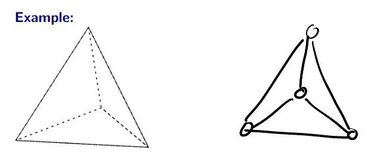
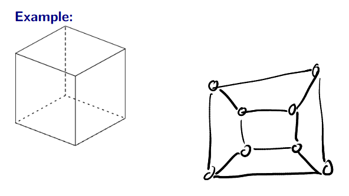
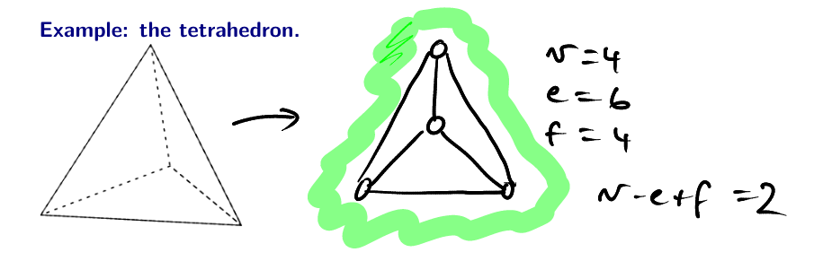

- #[[MA284 - Discrete Mathematics]]
- **Previous Topic:** [[Definitions & Planar Graphs]]
- **Next Topic:** [[Colouring Graphs; Eulerian & Hamiltonian Graphs]]
- **Relevant Slides:** 
-
- # Non-Planar Graphs
	- Most graphs do not have a planar representation, however, it takes some work to *prove* that a graph is non-planar.
		- To do this, we can use **Euler's formula for planar graphs** to *prove* that they are not planar.
	- ## Theorem: $K_{5}$ is not planar (Theorem 4.3.1 in Textbook)
		- The proof is by **contradiction**.
		- So assume that $K_5$ is **planar**. Then, the graph must satisfy Euler's formula for planar graphs.
			- $K_5$ has 5 vertices & 10 edges, so we get $5-10 + f =2$, which says that if the graph is drawn without any edges crossing, there would be $f = 7$ faces.
		- Now consider how many edges surround each face. Each face must be surrounded by *at least* 3 edges.
			- Let $B$ be the total number of *boundaries* around all the faces in the graph.
				- Thus, we have that $3f \leq B$, but also $B = 2e$, as each edge is used as a boundary exactly twice.
					- Putting this together, we get $3f \leq B$, but this is impossible, since we have already determined that $f = 7$ and $e = 10$, and $21 \nleq 20$.
						- This is a contradiction, so $K_5$ is **not planar**.
		- Q.E.D.
	- ## Theorem: $K_{3,3}$ is not planar (Theorem 4.2.2 in Textbook)
		- Please read the proof in the textbook (or edit this later).
		- The proof for $K_{3,3}$ is somewhat similar to $K_5$, but it also uses the fact that a bipartite graph has no 3-edge cycles.
	- To understand the importance of $K_5$ & $K_{3,3}$, we first need that the concept of **homeomorphic** graphs.
		- Recall that a graph $G_1$ is a **subgraph** of $G$ if it can be obtained by deleting some vertices and / or edges of $G$.
	- ## Homeomorphic Graphs
		- What is a **subdivision** of an **edge**? #card
		  card-last-interval:: -1
		  card-repeats:: 1
		  card-ease-factor:: 2.5
		  card-next-schedule:: 2022-11-15T00:00:00.000Z
		  card-last-reviewed:: 2022-11-14T16:15:33.031Z
		  card-last-score:: 1
			- A **subdivision** of an **edge** is obtained by "adding" a new vertex of degree 2 to the middle of the edge.
		- What is a **subdivision** of a **graph**? #card
		  card-last-interval:: -1
		  card-repeats:: 1
		  card-ease-factor:: 2.5
		  card-next-schedule:: 2022-11-15T00:00:00.000Z
		  card-last-reviewed:: 2022-11-14T15:52:43.154Z
		  card-last-score:: 1
			- A **subdivision** of a **graph** is obtained by subdividing one or more of its edges.
		- What is the **smoothing** of a pair of edges? #card
		  card-last-interval:: -1
		  card-repeats:: 1
		  card-ease-factor:: 2.5
		  card-next-schedule:: 2022-11-15T00:00:00.000Z
		  card-last-reviewed:: 2022-11-14T15:52:16.893Z
		  card-last-score:: 1
			- The **smoothing** of the pair of edges $\{a,b\}$ & $\{b,c\}$, where $b$ is a vertex of degree 2, means to remove these two edges, and add $\{a,c\}$.
		- What does it mean if two graphs are **homeomorphic**? #card
		  card-last-interval:: -1
		  card-repeats:: 1
		  card-ease-factor:: 2.5
		  card-next-schedule:: 2022-11-15T00:00:00.000Z
		  card-last-reviewed:: 2022-11-14T20:25:55.182Z
		  card-last-score:: 1
			- Two graphs $G_1$, $G_2$ are **homeomorphic** if there is some subdivision of $G_1$ that is isomorphic to some subdivision of $G_2$.
		- ### Kuratowski's Theorem #card
		  card-last-interval:: -1
		  card-repeats:: 1
		  card-ease-factor:: 2.5
		  card-next-schedule:: 2022-11-15T00:00:00.000Z
		  card-last-reviewed:: 2022-11-14T20:26:18.688Z
		  card-last-score:: 1
			- What is **Kuratowski's Theorem**? #card
			  card-last-interval:: 3.69
			  card-repeats:: 2
			  card-ease-factor:: 2.46
			  card-next-schedule:: 2022-11-22T10:36:43.656Z
			  card-last-reviewed:: 2022-11-18T18:36:43.657Z
			  card-last-score:: 5
				- A graph is planar if and only if it does not contain a subgraph that is **homeomorphic** to $K_5$ or $K_{3,3}$.
			- What this really means is that **every** non-planar graph has some smoothing that contains a copy of $K_5$ or $K_{3,3}$ somewhere inside it.
			-
- # Polyhedra
	- What is a **polyhedron**? #card
	  card-last-interval:: -1
	  card-repeats:: 1
	  card-ease-factor:: 2.5
	  card-next-schedule:: 2022-11-15T00:00:00.000Z
	  card-last-reviewed:: 2022-11-14T16:25:09.000Z
	  card-last-score:: 1
		- A **polyhedron** is a geometric solid made up of flat polygonal faces joined at edges & vertices.
	- What is a **convex polyhedron**? #card
	  card-last-interval:: -1
	  card-repeats:: 1
	  card-ease-factor:: 2.5
	  card-next-schedule:: 2022-11-15T00:00:00.000Z
	  card-last-reviewed:: 2022-11-14T16:22:24.900Z
	  card-last-score:: 1
		- A **convex polyhedron** is one where any line segment connecting two points on the interior of the polyhedron must be entirely contained inside the polyhedron.
	- A remarkable, and important fact, is that *every* convex polyhedron can be porjected onto the plane without edges crossing.
		- 
		- 
	- Now that we know that every convex polyhedron can be represented as a planar graph, we can apply Euler's formula.
		- ## Euler's Formula for Polyhedra #card
		  card-last-interval:: -1
		  card-repeats:: 1
		  card-ease-factor:: 2.5
		  card-next-schedule:: 2022-11-15T00:00:00.000Z
		  card-last-reviewed:: 2022-11-14T16:17:27.666Z
		  card-last-score:: 1
			- If a convex polyhedron has $v$ vertices, $e$ edges, & $f$ faces, then
				- $$v - e+ f =2$$
			- 
		- ## The Handshaking Lemma #card
		  card-last-interval:: -1
		  card-repeats:: 1
		  card-ease-factor:: 2.5
		  card-next-schedule:: 2022-11-15T00:00:00.000Z
		  card-last-reviewed:: 2022-11-14T16:22:43.283Z
		  card-last-score:: 1
			- The sum of the vertex degrees is $2|E|$:
				- Let $G = (V,E)$ be a graph, with vertices $V = v_1, v_2, \cdots, v_n$.
				- Let $\text{deg}(v_i)$ be the "degree of $v+i$". Then
					- $$\text{deg}(v_1) + \text{deg}(v_2) + \cdots + \text{deg}(v_n) = 2|E|$$
			-
	- ## Example
		- Show that there is no convex polyhedron with 11 vertices, all of degree 3.
		  background-color:: green
		- If such a convex polyhedron existed, we could draw its graph.
			- Each vertex has degree 3, so
				- $$2|E| = \sum d(v_i) = 3 \times 11$$
				- $$\therefore |E| = \frac{33}{2} \text{, which is impossible}$$
- # The Platonic Solids
	- What is a **Regular Polyhedron**? #card
	  card-last-interval:: -1
	  card-repeats:: 1
	  card-ease-factor:: 2.5
	  card-next-schedule:: 2022-11-15T00:00:00.000Z
	  card-last-reviewed:: 2022-11-14T20:25:24.689Z
	  card-last-score:: 1
		- A polyhedron is called **regular** if:
			- All its faces are identical, regular polygons.
			- All its vertices have the same degree.
	- What are the **Platonic Solids**? #card
	  card-last-interval:: -1
	  card-repeats:: 1
	  card-ease-factor:: 2.5
	  card-next-schedule:: 2022-11-15T00:00:00.000Z
	  card-last-reviewed:: 2022-11-14T16:16:02.569Z
	  card-last-score:: 1
		- The convex regular polyhedra are also called the **Platonic Solids**.
	- There are exactly 5 regular polyhedra. This fact can be proven using Euler's formula.
		- For full details, see the proof in the textbook.
		- Here is the basic idea:
			- Consider a regular polyhedron with $f$ **triangular** faces.
				- So $2e - 3f$.
			- Suppose that every vertex has degree $k$.
				- So $2e - vk$. Also, $v - e +f =2$. So
					- $$e = \frac{3f}{2}, v = \frac{3f}{k}, \Rightarrow \frac{3f}{k} - \frac{3f}{2} + f =2$$
					- and thus
						- $$f = \frac{4k}{6-k}$$
						- $f$ is defined for any $k < 6$, but undefined for $k = 6$ , and if $k > 6$ then $f < 0$ - no solutions.
-
-