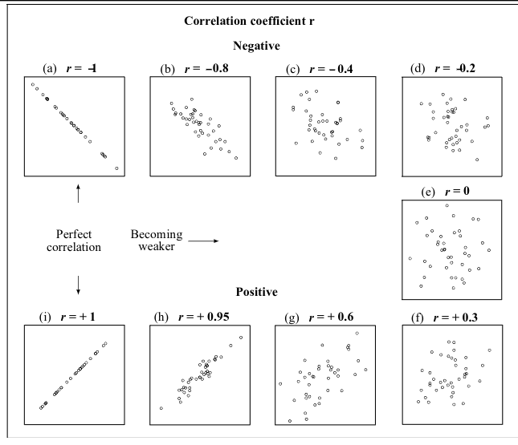
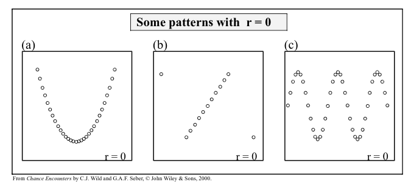
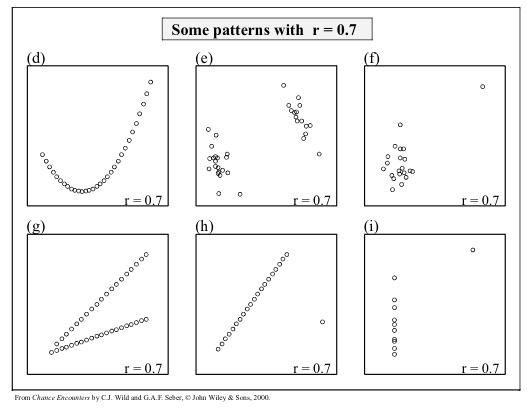
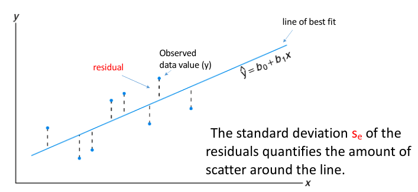

- #[[ST2001 - Statistics in Data Science I]]
- **Previous Topic:** [[Hypothesis Testing]]
- **Next Topic:** No next topic.
- **Relevant Slides:** _1668682885675_0.pdf)
-
- # Modelling Relationships
	- In may applications, we want to know if there is a **relationship** between variables.
	- What is **Regression**? #card
	  card-last-interval:: -1
	  card-repeats:: 1
	  card-ease-factor:: 2.5
	  card-next-schedule:: 2022-11-18T00:00:00.000Z
	  card-last-reviewed:: 2022-11-17T19:35:13.517Z
	  card-last-score:: 1
		- **Regression** is a set of statistical methods for estimating the relationship between a **response variable** & **one or more explanatory variables**.
		- Regression may have the aim of **explanation** (describing & quantifying relationships between variables) or **prediction** (how well can we predict a response variable from explanatory variables).
- # Correlation Coefficients
	- What is the **Sample Correlation Coefficient**? #card
	  card-last-interval:: -1
	  card-repeats:: 1
	  card-ease-factor:: 2.5
	  card-next-schedule:: 2022-11-18T00:00:00.000Z
	  card-last-reviewed:: 2022-11-17T19:35:19.270Z
	  card-last-score:: 1
		- The **Sample Correlation Coefficient** $r$ gives a numerical measurement of the strength of the linear relationship between the explanatory & response variables.
		- $$r = \frac{\sum (x_i = \bar x)(y_i - \bar y)}{\sqrt{\sum (x_i - \bar x)^2 \sum (y_i - \bar y)^2}}$$
	- **Note:** $\rho$ is the **population** correlation coefficient, while $r$ is the **sample** correlation coefficient.
	- $\rho = +1$ means a **perfect, linear direct** relationship between $X$ & $Y$.
	- $\rho = 0$ means **no linear** relationship between $X$ & $Y$.
	- $\rho = -1$ means a **perfect, inverse linear relationship** between $X$ & $Y$.
		- 
		- {:height 305, :width 645}
		- {:height 524, :width 645}
	- Correlation treats $x$ & $y$ symmetrically - the correlation of $x$ with $y$ is the same as the correlation of $y$ with $x$.
	- Correlation has no units.
	- Correlation is not affected by changes in the centre or scale of either variable.
	- The correlation coefficient only measures linear association.
	- The correlation coefficient can be misleading when outliers are present.
	- ## Correlation $\neq$ Causation
		- Correlation does not imply causation.
			- Scatterplots & correlation coefficients **never** prove causation.
		- A hidden variable that stands behind a relationship & determines it by simultaneously affecting the other two variables is called a **lurking** or **confounding** variable.
		- Don't say "correlation" when you mean "association".
			- More often than not, people say "correlation" when they mean "association".
			- The word "correlation" should be reserved for measuring the strength & direction of the linear relationships between two quantitative variables.
	- ## Summary
		- Scatterplots are useful graphical tools for asserting *direction*, *form*, *strength*, & *unusual features* between two variables.
		- Although not every relationship is linear, when the scatterplot is straight enough, the *correlation coefficient* is a useful numerical summary.
			- The sign of the correlation tells us the direction of the association.
			- The magnitude of the correlation tells us the *strength* of a linear association.
			- Correlation has no units, so shifting or scaling the data, standardising, or swapping the variables has no effect on the numerical value.
- # Simple Linear Regression
	- What is **Simple Linear Regression**? #card
	  card-last-interval:: -1
	  card-repeats:: 1
	  card-ease-factor:: 2.5
	  card-next-schedule:: 2022-11-18T00:00:00.000Z
	  card-last-reviewed:: 2022-11-17T19:34:38.355Z
	  card-last-score:: 1
		- **Simple Linear Regression** is the name given to the statistical technique that is used to model the dependency of a response variable on a **single** explanatory variable.
			- The word "simple" refers to the fact that a single explanatory variable is available.
		- Simple Linear Regression is appropriate if the **average** value of the response variable is a **linear** function of the explanatory, i..e, the underlying dependency of the response on the explanatory appears linear.
	- ## Strategy
		- 1. Propose a model
		  2. Check the assumptions.
		  3. Make some predictions.
			- The predicted value is often referred to as $\hat y$.
		- 4. Assess how useful it is.
		  5. Improve it.
	- ## Interpreting the Slope & Intercept #card
	  card-last-interval:: -1
	  card-repeats:: 1
	  card-ease-factor:: 2.5
	  card-next-schedule:: 2022-11-18T00:00:00.000Z
	  card-last-reviewed:: 2022-11-17T19:34:57.106Z
	  card-last-score:: 1
		- $b_1$ is the **slope**, which tells us how rapidly $\hat y$ changes with respect to $x$.
			- e.g., what is the change in the mean current per unit increase in wind speed.
		- $b_0$ is the **y-intercept**, which tells us where the line intercepts the $y$-axis when $x$ is 0.
			- e.g., what is the mean current when the wind speed is 0.
		- ### The Residual Standard Deviation ($s_e$) #card
		  card-last-interval:: -1
		  card-repeats:: 1
		  card-ease-factor:: 2.5
		  card-next-schedule:: 2022-11-18T00:00:00.000Z
		  card-last-reviewed:: 2022-11-17T19:35:04.870Z
		  card-last-score:: 1
			- The standard deviation of the residuals $s_e$ (also known as the residual standard error) measures how much the points spread around the regression line.
			- You can interpret $s_e$ in the context of the data set -it is the typical error in the predictions made by the regression line.
		- The **line of best fit** is the line for which the sum of the squared **residuals** is the *smallest*, the **least squares** line.
			- Some residuals are positive, others are negative, and on average, they cancel each other out.
			- You can't assess how well the line fits by adding up all the residuals.
			- ()
	- ## Simple Linear Regression Model
		- $$Y_i = \beta_0 + \beta_1 x_i + \epsilon_i \text{ for } i =1, \cdots, n \text{ assuming } \epsilon_i \sim N(0, \sigma_e)$$
		- ### Features of this Model
			- $\beta_o£ (intercept) and $\beta_1$ (slope) are the population parameters of the model & must be estimated from the data as $b_0$ (**sample intercept**) and $b_1$ (**sample slope**).
-
-