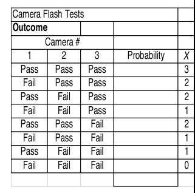
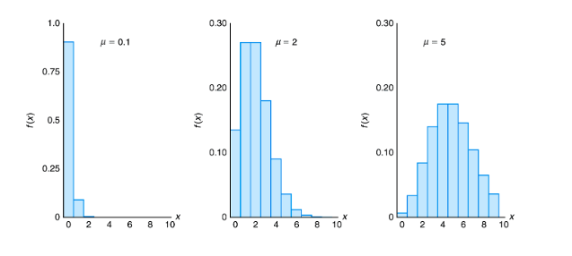

- #[[ST2001 - Statistics in Data Science I]]
- **Previous Topic:** [[Random Variables]]
- **Next Topic:** [[The Normal Distribution]]
- **Relevant Slides:** 
-
- Often, the observations generated by different statistical experiments have the same type of behaviour.
	- In general, only a handful of important probability distributions are needed to describe many of the discrete random variables encountered in practice.
	-
- # Bernoulli Trials
  collapsed:: true
	- What is a **Bernoulli Trial**? #card
	  card-last-interval:: -1
	  card-repeats:: 1
	  card-ease-factor:: 2.5
	  card-next-schedule:: 2022-11-15T00:00:00.000Z
	  card-last-reviewed:: 2022-11-14T20:08:48.931Z
	  card-last-score:: 1
		- A **Bernoulli Trial** is a random experiment with just two outcomes - success / failure.
		- For a single trial, random variable:
			- $$X = \begin{cases}1, & \text{success,} \\0, & \text{failure.}\end{cases}$$
			- $P(X = 1) = p$ and $P(X=0) = 1 -p$, where $p$ is the success probability, or more compactly:
				- $$P(X = x) = p^x{(1-p)^{1-x}} \ \ \ \ \  x = 0,1$$
	- What is the **expected value** of a Bernoulli Trial? #card
	  card-last-interval:: -1
	  card-repeats:: 1
	  card-ease-factor:: 2.5
	  card-next-schedule:: 2022-11-15T00:00:00.000Z
	  card-last-reviewed:: 2022-11-14T16:20:53.147Z
	  card-last-score:: 1
		- $$E[X] = (0)(1-p)+(1)p = p$$
	- What is the **variance** of a Bernoulli Trial? #card
	  card-last-interval:: -1
	  card-repeats:: 1
	  card-ease-factor:: 2.5
	  card-next-schedule:: 2022-11-15T00:00:00.000Z
	  card-last-reviewed:: 2022-11-14T16:24:49.061Z
	  card-last-score:: 1
		- $$Var(X) = p(1-p)$$
	- ## Bernoulli Trial Assumptions #card
	  card-last-interval:: -1
	  card-repeats:: 1
	  card-ease-factor:: 2.5
	  card-next-schedule:: 2022-11-15T00:00:00.000Z
	  card-last-reviewed:: 2022-11-14T16:24:43.818Z
	  card-last-score:: 1
		- The outcomes of the trials are mutually **independent**.
		- The probability of success $p$ is **constant** over trials.
		- Note that these assumptions may not always be appropriate assumptions.
	- ## Example: Camera Flash Tests
	  id:: 6368f276-bc7e-4d91-b7fb-c5b34c4c6feb
		- The time to recharge the flash is tested in three mobile phone cameras. The probability that a camera passes the test is 0.8, and the cameras perform independently.
		  background-color:: green
		- The random variable $X$ denotes the number of cameras that pass the test. The last column of the tables shows the values of $X$ assigned to each outcome of the experiment.
		  background-color:: green
		- What is the probability that the first & second cameras pass the test, and the third one fails?
		  background-color:: green
			- 
			- Each camera test can be treated as a **Bernoulli Trial**.
				- $$P(PPF) = (0.8)(0.8)(0.2) = 0.128$$
		- What is the probability that two cameras pass the test in three trials?
		  background-color:: green
			- How many ways can this event happen?
				- $$\binom{n}{r} = \frac{n!}{r!(n-r)!} = \frac{3!}{2!(3-2)!} = 3$$
			- What is the probability of this event?
				- 0.128 for each of the three ways.
				- Probability = $3(0.128) = 0.383$.
			- This is an example of the **Binomial Distribution**.
		-
- # The Binomial Distribution
	- What is a **binomial random variable**? #card
	  card-last-interval:: -1
	  card-repeats:: 1
	  card-ease-factor:: 2.5
	  card-next-schedule:: 2022-11-15T00:00:00.000Z
	  card-last-reviewed:: 2022-11-14T20:25:45.051Z
	  card-last-score:: 1
		- A random experiment consists of $n$ Bernoulli trials such that:
			- 1. The trials are independent.
			  2. Each trial results in only two possible outcomes, labelled as "success" & "failure".
			  3. The probability of a success in each trial, denotes as $p$, remains constant.
		- The random variable $X$ that equals the number of trials that result in a success has a **binomial random variable** with parameters $0 < p < 1$ and $n = 1, 2, \cdots$.
		- The **probability mass function** of $X$ is
			- $$f(x) = \binom{n}{x}p^x (1-p)^{n-x} \ \ \ \ \ x = 0,1,\cdots, n$$
	- ## Example: Camera Flash Tests
		- See ((6368f276-bc7e-4d91-b7fb-c5b34c4c6feb)) for whole question.
		  background-color:: green
		- Calculate the probability of 2 passes in 3 tests.
		  background-color:: green
			- We are given that $n = 3$ and $p = 0.8$.
			- Use the Binomial Distribution formula where $X$ is the number of passes:
				- $$P(X = 2) = \binom{3}{2}(0.8)^2(0.2)^1 = 3(0.128) = 0.384$$
	- ## Example: Organic Pollution
	  id:: 6368f570-83e7-4642-a881-7ccd40bb0399
		- Each sample of water has a 10% chance of containing a particular organic pollutant. Assume that the sample are independent with regard to the presence of the pollutant.
		  background-color:: green
		- Find the probability that, in the next 18 samples, exactly 2 contain the pollutant.
		  background-color:: green
			- Let $X$ denote the number of samples that contain the pollutant in the next 18 samples analysed. Then $X$ is a binomial random variable with $p = 0.1$ and $n = 18$.
			- $$P(X = 2) = \binom{18}{2}(0.1)^2(0.9)^{18-2} = 153(0.1)^2(0.9)^16 = 0.2835$$
		- Determine the probability that $3 \leq X < 7$.
		  background-color:: green
			- $$X = 3,4,5,6$$
			- $$P(3 \leq X < 7) = P(X=3) + P(X=4) + P(X=5) + P(X=6)$$
			- $$ \text{or}$$
			- $$P(3 \leq X < 7) = \sum^6_{x=3} \binom{18}{x}(0.1)^x(0.9)^{18-x}$$
			- $$ = 0.168 + 0.070 + 0.022 + 0.005 = 0.265$$
	- ## Binomial Distributions in R
	  card-last-interval:: -1
	  card-repeats:: 1
	  card-ease-factor:: 2.5
	  card-next-schedule:: 2022-11-15T00:00:00.000Z
	  card-last-reviewed:: 2022-11-14T16:21:52.419Z
	  card-last-score:: 1
		- `dbinom(x, size, prob)`, where `x` is the number of events required, `size` is the total number of trials, & `prob` is the probability of the event occurring.
		- ### Example: Organic Pollution
			- In ((6368f570-83e7-4642-a881-7ccd40bb0399)), `x=2`, `size=18`, & `p=0.10`.
			  background-color:: green
				- ```R
				  dbinom(x=2, size=18, prob=0.1)
				  [1] 0.2835121
				  ```
	- ## Binomial Mean & Variance #card
	  card-last-interval:: -1
	  card-repeats:: 1
	  card-ease-factor:: 2.5
	  card-next-schedule:: 2022-11-22T00:00:00.000Z
	  card-last-reviewed:: 2022-11-21T13:08:26.634Z
	  card-last-score:: 1
		- If $X$ is a **binomial random variable** with parameters $p$ & $n$:
			- The **mean** & **variance** of the binomial distribution $b(x; n,p)$ are
				- $$\mu = np \text{ and } \sigma^2 = npq \text{, where } q = 1-p$$
	- ## Chebyshev's Inequality
		- What is **Chebyshev's Inequality**? #card
		  card-last-interval:: -1
		  card-repeats:: 1
		  card-ease-factor:: 2.5
		  card-next-schedule:: 2022-11-15T00:00:00.000Z
		  card-last-reviewed:: 2022-11-14T16:23:31.513Z
		  card-last-score:: 1
			- **Chebyshev's Inequality** provides an estimate as to where a certain percentage of observations will lie relative to the mean once the **standard deviation** is known.
			- For example, at least 75% of values will lie within two standard deviations of the mean.
		-
- # Poisson Distribution
	- What are **Poisson Experiments**? #card
	  card-last-interval:: -1
	  card-repeats:: 1
	  card-ease-factor:: 2.5
	  card-next-schedule:: 2022-11-22T00:00:00.000Z
	  card-last-reviewed:: 2022-11-21T13:05:40.034Z
	  card-last-score:: 1
		- Experiments yielding numerical values of a random variable $X$, the number of outcomes occurring during a given time interval or in a specified region, are called **Poisson Experiments**.
		- The given time interval may be of any length, such as a minute, a day, a week, a month, or even a year.
		- A Poisson Experiment is derived from the **Poisson Process** and possesses the following properties:
			- The number of outcomes occurring one time interval or specified region of space is **independent** of the number that occur in any other disjoint time interval or region. In this sense, we say that the Poisson Process "has no memory".
			- The probability that a single outcome will occur during a very short time interval or in a small region is **proportional** to the **length** of the time interval or the size of the region, and does not depend on the number of outcomes occurring outside this time interval or region.
			- The probability that more than one outcome will occur in such a short time interval or fall in such a small region is **negligible**.
	- What is the **Poisson Distribution**? #card
	  card-last-interval:: -1
	  card-repeats:: 1
	  card-ease-factor:: 2.5
	  card-next-schedule:: 2022-11-22T00:00:00.000Z
	  card-last-reviewed:: 2022-11-21T13:06:55.129Z
	  card-last-score:: 1
		- The random variable $X$ that equals the number of events in a Poisson Process is a **Poisson Random Variable** with parameter $\lambda > 0$, and the probability density function is
			- $$f(x) = \frac{e^{-\lambda}\lambda^x}{x!} \text{ for } x = 0,1,2,3,\cdots$$
	- ## Mean & Variance of Poisson Distribution
		- If $\lambda$ is the average number of successes occurring in a given time interval or region in the Poisson Distribution, then the **mean** & the **variance** of the Poisson distribution are both equal to $\lambda$.
			- Mean = $\lambda$, variance = $\lambda$.
		- A one parameter distribution.
	- ## Poisson Density Functions for Different Means
		- 
		- If the variance is much greater than the mean, then the Poisson Distribution would not be a good model for the distribution of the random variable.
	- ## Poisson Example: Calculations for Wire Flaws
		- Suppose that the number of flaws on a thin copper wire follows a Poisson Distribution with a mean of 2.3 flaws per millimetre.
		  background-color:: green
		- Find the probability of exactly 2 flaws in 1mm of wire.
		  background-color:: green
			- $$P(X = 2) = \frac{e^{-2.3}2.3{2}}{2!} = 0.265$$
	- ## Poisson Example: Car Park
		- A car park has 3 entrances, $A$, $B$, & $C$. The number of cars per hour entering through each of these is Poisson-distributed with mean $\lambda_A = 1.5$, $\lambda_B = 1.0$, and $\lambda_C = 2.5$. Arrivals at each entrance are **independent**.
		  background-color:: green
			- $T$ is the total number of cars entering in an hour.
			- $$T \sim \text{ Poisson}(\lambda_A + \lambda_B + \lambda_C) \equiv \text{Poisson}(1.5 + 1.0 + 2.5) \equiv \text{Poisson}(5)$$
			- $$P(T = 4) = \frac{e^{-5} 5^4}{4!} = 0.1755$$
	- ## Sum of Independent Poisson Random Variables #card
	  card-last-interval:: -1
	  card-repeats:: 1
	  card-ease-factor:: 2.5
	  card-next-schedule:: 2022-11-15T00:00:00.000Z
	  card-last-reviewed:: 2022-11-14T15:54:18.796Z
	  card-last-score:: 1
		- If $X_1, X_2, \cdots, X_n$ are independently Poisson distributed with parameters $\lambda_1, \lambda_2, \cdots, \lambda_n$ then
			- $$T = X_1 + X_2 + \cdots + X_n \text{ is Poisson}(\lambda_1 + \lambda_2 + \cdots + \lambda_n)$$
		- and
			- $$E[T] = \lambda_1 + \lambda_2 + \cdots + \lambda_n$$
		- and
			- $$\text{Var}(T) = \lambda_1 + \lambda_2 + \cdots + \lambda_n$$
		-