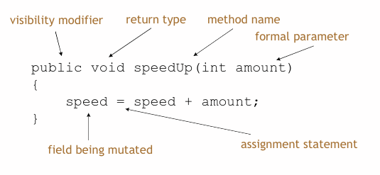
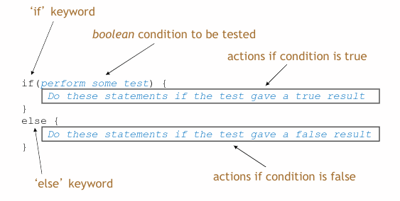

- #[[CT2106 - Object-Oriented Programming]]
- **Previous Topic:** [[Introduction to Java]]
- **Next Topic:** [[More Java Code]]
- **Relevant Slides:** 
-
- What is the **structure of a class**? #card
  card-last-interval:: 21.53
  card-repeats:: 4
  card-ease-factor:: 2.32
  card-next-schedule:: 2022-12-01T00:46:31.046Z
  card-last-reviewed:: 2022-11-09T12:46:31.046Z
  card-last-score:: 3
	- Every class has the following structure:
		- ```java
		  public class ClassName 
		  {
		    Fields
		    Constructors
		    Methods
		  }
		  ```
- ## Fields
	- What are **Fields**? #card
	  card-last-interval:: 86.42
	  card-repeats:: 5
	  card-ease-factor:: 2.66
	  card-next-schedule:: 2023-02-09T06:22:08.706Z
	  card-last-reviewed:: 2022-11-14T20:22:08.706Z
	  card-last-score:: 5
		- **Fields**, also known as **instance variables**, store values for an object.
		- Fields define the state of an object.
		- In BlueJ, use *Inspect* to view the state.
		- Some values change frequently, others rarely, or not at all.
- ## Encapsulation
	- What is **Encapsulation**? #card
	  card-last-interval:: 9.68
	  card-repeats:: 3
	  card-ease-factor:: 2.42
	  card-next-schedule:: 2022-11-24T08:35:40.664Z
	  card-last-reviewed:: 2022-11-14T16:35:40.665Z
	  card-last-score:: 5
		- In **encapsulation**, the ^^variables of a class will be hidden from other classes^^ and can only be accessed through the methods of their current class.
		- This is also known as **data hiding**.
	- Why use encapsulation? #card
	  card-last-interval:: 22.66
	  card-repeats:: 4
	  card-ease-factor:: 2.38
	  card-next-schedule:: 2022-12-07T11:20:26.959Z
	  card-last-reviewed:: 2022-11-14T20:20:26.960Z
	  card-last-score:: 5
		- In OOP, ^^each object is responsible for its own data.^^
			- This allows an object to have greater control over which data is available to be viewed externally, and how external objects can mutate the object's state.
	- ### Encapsulation Type: Private
		- What is the effect of making a field **private**? #card
		  card-last-interval:: 28.3
		  card-repeats:: 4
		  card-ease-factor:: 2.66
		  card-next-schedule:: 2022-11-17T15:33:20.443Z
		  card-last-reviewed:: 2022-10-20T08:33:20.443Z
		  card-last-score:: 5
			- Making a field **private** encapsulates their values inside their object.
			- No external class or object can access a private field.
-
- ## Constructors
	- What are **constructors**? #card
	  card-last-interval:: 25.4
	  card-repeats:: 4
	  card-ease-factor:: 2.32
	  card-next-schedule:: 2022-12-10T01:49:12.088Z
	  card-last-reviewed:: 2022-11-14T16:49:12.088Z
	  card-last-score:: 3
		- Constructors:
			- Initialise an object.
			- Have the same name as their class.
			- Have a close association with the fields:
				- They contain the initial values stored in the fields.
				- They contain the parameter values often used for these.
	- What is the point of the keyword `this`? #card
	  card-last-score:: 5
	  card-repeats:: 4
	  card-next-schedule:: 2022-12-18T07:50:05.102Z
	  card-last-interval:: 33.64
	  card-ease-factor:: 2.9
	  card-last-reviewed:: 2022-11-14T16:50:05.103Z
		- The `this` keyword refers to the current object in a method or constructor.
		- The most common use of `this` is to distinguish between class attributes & parameters of the same name.
		- If the input parameter variables in your constructor have the **same name** as your fields, you must use the `this` keyword to distinguish between the two.
		- `this` = "belonging to this object".
		- E.g.,
			- ```java
			  public Bicycle(int speed, int gear, int cadence)
			  {
			    this.speed = speed;
			    this.gear = gear;
			    this.cadence = cadence;
			  }
			  ```
-
- ## Methods
	- What are **methods**? #card
	  card-last-score:: 5
	  card-repeats:: 5
	  card-next-schedule:: 2022-12-18T19:12:15.540Z
	  card-last-interval:: 33.96
	  card-ease-factor:: 2.04
	  card-last-reviewed:: 2022-11-14T20:12:15.540Z
		- **Methods** implement the *behaviour* of an object.
		- They have a consistent structure comprised of a *header* and a *body*.
	- ### Accessor Methods
		- What are **accessor** methods? #card
		  card-last-interval:: 28.3
		  card-repeats:: 4
		  card-ease-factor:: 2.66
		  card-next-schedule:: 2022-12-09T18:39:30.677Z
		  card-last-reviewed:: 2022-11-11T11:39:30.678Z
		  card-last-score:: 5
			- **Accessor** methods provide information about the state of an object.
			- An accessor method always returns a type that is **not** `void`.
			- An accessor method returns a value (*result*) of the type given in the **header**.
			- The method will contain a **return** statement to return the value.
	- ### Mutator Methods
		- What are **mutator** methods? #card
		  card-last-interval:: 29.26
		  card-repeats:: 4
		  card-ease-factor:: 2.66
		  card-next-schedule:: 2022-12-13T22:48:10.566Z
		  card-last-reviewed:: 2022-11-14T16:48:10.566Z
		  card-last-score:: 5
			- **Mutator** methods alter (*mutate*) the state of an object.
			- Achieved through changing the value of one or more fields.
				- They typically contain one or more *assignment* statements.
				- Often receive parameters.
			- 
		- ### Mutator Methods: Set
			- Each field may have a dedicated **set** mutator method.
			- These have a simple, distinctive form:
				- **void** return type
				- method name related to the field name
				- a single formal parameter, with the same type as the type of the field
				- a single assignment statement
			- A typical "set" method:
				- ```java
				  public void setGear (int number)
				  {
				    gear = number;
				  }
				  ```
		- ### Protector Mutators
			- A set method does not always have to assign unconditionally to the field.
				- The parameter may be checked for validity and rejected if innappropriate.
			- Mutators thereby protect fields.
			- Mutators also support *encapsulation*.
			- #### Protecting a Field
				- ```java
				  public void setGear (int gearing)
				  {
				    // this conditional statement prevents innapropriate action.
				    // if protects the "gear" field from values that are too large or too small.
				    if (gearing >= 1 && gearing <= 18)
				    {
				      gear = gearing;
				    }
				    else
				    {
				      System.out.println("Exceeds maximum gear ratio. Gear not set");
				    }
				  }
				  ```
	- ### Method Structure
		- The **header**:
			- The head tells us:
				- the *visibility* of the method to objects of other class.
				- whether or not the method *returns a result*.
				- the *name* of the method.
				- whether or not the method takes *parameters*.
			- E.g.,
				- ```java
				  public int getSpeed()
				  ```
		- The **body** encloses the method's *statements*.
-
- ## C vs Java
	- Unlike C, an OOP program will **not** have a pool of global variables that each method can access.
	- Instead, ^^each object has its own data^^, and other objects rely on the *accessor* methods of the object to access the data.
-
- ## Conditional Statements
	- Conditional statements in Java have the same format as in C.
	- ```java
	  if (condition) {
	    do something;
	  }
	  else {
	    do somethingElse;
	  }
	  ```
	- 