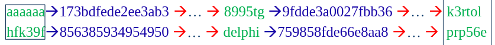

- #[[CT255 - Next Generation Technologies II]]
- **Previous Topic:** [[Human Security & Passwords]]
- **Next Topic:** [[Social Engineering]]
- **Relevant Slides:** 
-
- # Hash Cracking
	- Reverse-engineering a password involves reversing a one-way function, so it is not possible.
		- But hash functions are public.
	- ## Dictionary-Based Brute Force Search #card
	  card-last-interval:: 4
	  card-repeats:: 2
	  card-ease-factor:: 2.7
	  card-next-schedule:: 2022-11-18T20:09:33.480Z
	  card-last-reviewed:: 2022-11-14T20:09:33.481Z
	  card-last-score:: 5
		- Dictionary searches can be used to systematically identify a match for a given hash value.
			- To do this, the underlying hash function must be known.
		- Dictionaries are based on large word, phrase, or password collections.
		- ### Pros
			- Straightforward process.
		- ### Cons
			- Significant computational effort to find a match.
			- No guaranteed result.
	- ## Lookup Table Based Attacks #card
	  card-last-interval:: 2.8
	  card-repeats:: 2
	  card-ease-factor:: 2.6
	  card-next-schedule:: 2022-11-17T15:07:31.246Z
	  card-last-reviewed:: 2022-11-14T20:07:31.246Z
	  card-last-score:: 5
		- For a given hash function & dictionary:
			- 1. Calculate the hash value for all dictionary entries.
			  2. Add both values to a table (i.e., one line per entry).
			  3. Sort the table (e.g., in ascending order of hash values).
				- This table is also called a **lookup table**.
			- The matching password for a given hash value can be recovered by systematically searching for it in a dictionary.
		- ### Pros
			- Such a table can be generated offline.
			- The lookup process itself is fast (approx. $O(log_2(N))$) with **binary search**.
				- A table containing 1.8E19 entries would require just 64 guesses to find (or not) the correct password for a given hash value.
		- ### Cons
			- Huge table, with no guaranteed result.
			- Different table required for every hash function.
	- ## Rainbow Tables
		- Uses less computer processing time but more storage than a brute force attack.
		- Uses more processing time but less storage than a simple lookup table.
		- #### Pre-Computed Hash Chains
			- Calculate long chains of hash values (using a hash value "->" and a reduction function 
			  " <ins>-></ins> ", e.g:
				- aaaaaa -> 173bdfede2ee3ab3 <ins>-></ins> jdjkuo -> 9fdde3a0027fbb36 <ins>-></ins> ... <ins>-></ins> k3rtol
					- In this example, wes only consider passwords that are 6 characters long.
					- Each chain starts with a random password & has a fixed length, e.g. 10,000 segments.
					- Here, " <ins>-></ins> " converts the 64-bit hash value into an arbitrary 6 byte long string.
						- It is **not** an inverted hash function.
		- We only store the first and the last value (starting point & end point).
		- ### Chain Lookup
			- Assume that we have a table with just 2 chains (with start & end values), and a hash value `759858fde66e8aa8` that we'd like to crack.
				- 
			- We apply consecutively " <ins>-></ins> " and "->" until we either:
				- hit a known end value, or
				- have repeated the operation $n$ times, where $n$ is the length of the chain.
			- If we hit the known end value `prp56e`, we repeat the transformation starting with its start value, until we hit the `hfk39f` again.
			- The password `delphi` that led to this hash is the solution.
			- #### Chain Lookup Pseudocode
				- 1. Input: Hash value $H$.
				  2. Reduce $H$ into another plaintext $H$.
				  3. Look for the plaintext $P$ in the list of final plaintexts (i.e., end values), if it is there, break out of the loop & go to step 6.
				  4. If it isn't there, calculate the hash $H$ of the plaintext $P$.
				  5. Go to step 2, unless you've done the maximum number of iterations.
				  6. If $P$ matches one of the final plaintexts, you've got a matching chain; in this case, walk through the chain again starting with the corresponding start value, until you find the text that translates into $H$.
		- ### Chain Collisions
			- Consider the following scenario:
				- 
			- Two chains merge because either:
				- the reduction function translates two different hashes into the same password, or
				- the hash function translates two different passwords into the same hash (which should not happen)
			- Because of collisions, there is no guarantee that you chains will ever cover all possible passwords.
		- **Rainbow Tables** effectively solve the problem of collisions with ordinary hash chains by replacing the single reduction function $R$ with a sequence of related reductions functions $R$ through $R_k$ (one reduction function per column).
			- In this way, for two chains to collide & merge they must hit the same value on the same iteration, which is rather unlikely.
		- ### Perfect & Imperfect Rainbow Tables
			-