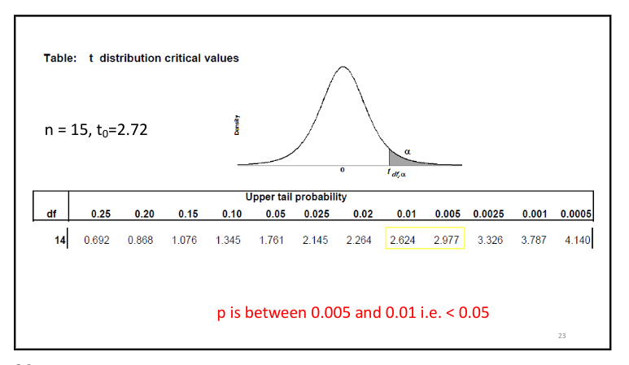

- #[[ST2001 - Statistics in Data Science I]]
- **Previous Topic:** [[Sampling Distributions & Confidence Intervals]]
- **Next Topic:** [[Correlation & Linear Regression]]
- **Relevant Slides:** _1667837679625_0.pdf)
-
- What is a **hypothesis test**? #card
  card-last-interval:: -1
  card-repeats:: 1
  card-ease-factor:: 2.5
  card-next-schedule:: 2022-11-15T00:00:00.000Z
  card-last-reviewed:: 2022-11-14T16:21:16.988Z
  card-last-score:: 1
	- A **hypothesis test** is intended to assess whether a population **parameter** of interest is equal to some specified value of direct interest to the researcher.
	- Hypothesis tests are structured in a very specific manner.
	- The CLT and t-distribution provide the framework for assessing if the sample mean is not the same as the proposed parameter mean.
- # Null & Alternative Hypotheses #card
  card-last-interval:: 2.8
  card-repeats:: 1
  card-ease-factor:: 2.6
  card-next-schedule:: 2022-11-17T11:15:25.890Z
  card-last-reviewed:: 2022-11-14T16:15:25.891Z
  card-last-score:: 5
	- The **null hypothesis** is a claim to be tested - often the sceptical claim of "no effect", i.e.:
		- $$H_0 : \mu = \mu_0$$
	- The **alternative hypothesis** is an alternative claim under consideration, often represented by a range of parameter values, i.e.:
		- $$H_1 : \mu \neq \mu_0$$
	- We only reject the null in favour of the alternative if there is strong supporting evidence.
	- We decide *a priori* how much evidence is "strong" enough to reject the null.
- # Stages in Hypothesis Testing #card
  card-last-interval:: -1
  card-repeats:: 1
  card-ease-factor:: 2.5
  card-next-schedule:: 2022-11-15T00:00:00.000Z
  card-last-reviewed:: 2022-11-14T15:53:56.498Z
  card-last-score:: 1
	- 1. **Null Hypothesis:** The hypothesis that the population parameter is equal to some claimed value ($H_0$).
	  2. **Study** or **Alternative Hypothesis:** The hypothesis that must be true if the null hypothesis is false ($H_1$).
	  3. Collect appropriate data.
	  4. ^^Assess, through a **test statistic**, how probable (the p-value) it would be to observe data as or more extreme than the data actually collected if, in fact, the null hypothesis was **true**.^^
	  5. Come to a conclusion whether or not to reject the null hypothesis.
	- ## Rejecting / Not Rejecting the Null
		- If we do not reject the null hypothesis in favour of the alternative, we are saying that the effect indicated by the sample is due only to sampling variation.
		- If we do reject the null hypothesis in favour of the alternative, we are saying that the effect indicated by the sample is real, in that it is more than can be attributed to sampling variation.
- # Formal Testing Using p-values
	- What is the **p-value**? #card
	  card-last-interval:: -1
	  card-repeats:: 1
	  card-ease-factor:: 2.5
	  card-next-schedule:: 2022-11-19T00:00:00.000Z
	  card-last-reviewed:: 2022-11-18T18:36:35.132Z
	  card-last-score:: 1
		- The **p-value** is the ==probability of observing data at least as favourable to the alternative hypothesis== as our current data set, if the null hypothesis is true.
		- The **p-value** is a way of quantifying the strength of the evidence against the null hypothesis and in favour of the alternative. Formally, the p-value is a conditional probability.
		- The smaller the p-value, the stronger the data favours $H_1$ over $H_0$. A small p-value (usually < 0.05) corresponds to sufficient evidence to reject $H_0$ in favour of $H_1$.
- # One-Sample Tests for the Population Mean
	- ## Steps #card
	  card-last-interval:: -1
	  card-repeats:: 1
	  card-ease-factor:: 2.5
	  card-next-schedule:: 2022-11-15T00:00:00.000Z
	  card-last-reviewed:: 2022-11-14T16:16:23.254Z
	  card-last-score:: 1
		- 1. Specify the hypotheses about $\mu$.
		  2. Calculate a **test statistic** - based on the sampling distribution of the sample mean.
		  3. See how extreme the test statistic is if the null hypothesis was true - compare the test statistic with the t or Normal Distribution.
		  4. Make a decision: reject the null, or fail to reject it.
	- ## Strategy #card
	  card-last-interval:: -1
	  card-repeats:: 1
	  card-ease-factor:: 2.5
	  card-next-schedule:: 2022-11-15T00:00:00.000Z
	  card-last-reviewed:: 2022-11-14T16:13:48.280Z
	  card-last-score:: 1
		- If the sample came from the population in question, the sample mean should be "close" to the population mean in question.
			- "Close" needs to take into account the sample size used and the variability in the measure (i.e., the standard error).
		- For testing means, the ((6356abee-cb6a-48c5-8f8b-72122b6099eb)) or t-distribution (or the bootstrap) is key.
	- ## Conditions
		- **Independence:** Random samples / assignment.
		- **Normality:** For small samples where we use the t-distribution, we require the observations to be approximately normally distributed. For larger ($n \geq 30$) samples with no extreme skew we can use the CLT and do not require the observations to be normally distributed.
	- ## p-values & ($\alpha$) Significance Levels #card
	  card-last-interval:: 0.98
	  card-repeats:: 1
	  card-ease-factor:: 2.36
	  card-next-schedule:: 2022-11-15T15:23:09.685Z
	  card-last-reviewed:: 2022-11-14T16:23:09.685Z
	  card-last-score:: 3
		- A p-value $\leq 0.05$ is (typically) considered as sufficient evidence against a null hypothesis (i.e., sufficient evidence to reject the null).
		- If the p-value for the test of a parameter with 2-sided alternative is $< 0.05$, the 95% Confidence Interval will not include the parameter.
		- A p-value is **not** the probability of the null hypothesis being true given the data observed - It is the probability of observing such data (or more extreme data) given that the null hypothesis is actually true.
			- A **non-significant test** does not imply that the null hypothesis is true - It actually means that ==we do not have enough evidence to reject the null hypothesis.==
			- A **significant** result does not mean that the alternative hypothesis is true - It means that we have ==enough evidence to reject the null.==
		- ### Statistical Signifance
			- Whenever the p-value is less than a particular threshold, the result is said to be **statistically significant** at that level.
				- The threshold should be decided *a priori*, before you calculate the test statistic.
			- For example, if the threshold is $p \leq 0.05$, the result is statistically significant at the 5% level; if $p \leq 0.01$, the result is statistically significant at the 1% level, and so on.
			- If a result is statistically significant at the $100\alpha\%$ level, we can also say that the null hypothesis is "rejected at level $100\alpha\%$
		- ### Example: Golf Club Design
			- An experiment was performed in which 15 drivers produced by a particular club-maker were selected at random, and their coefficients of restitution measured. It is of interest to determine if there is evidence (with $\alpha = 0.05$ significance level) to support a claim that the mean coefficient of restitution *exceeds* 0.82.
			  background-color:: green
			- The sample mean & sample standard deviation are $\bar x = 0.83725$ & $s = 0.02456$.
			  background-color:: green
				- The objective of the experimenter is to demonstrate that the mean coefficient of restitution exceeds 0.82, hence, a one-sided alternative hypothesis is appropriate.
					- The **parameter of interest** is the mean coefficient of restitution, $\mu$.
					- The **null hypothesis** is $H_0: \mu = 0.82$.
					- The **alternative hypothesis** is $H_1: \mu > 0.82$.
					- We decide *a priori* that we will reject $H_0$ is the p-value is $< 0.05$.
					- The **test statistic** is
						- $$T_0 = \frac{\bar X - \mu_0}{S / \sqrt{n}}$$
					- **Computations:** Since $\bar x = 0.83725, s = 0.02456, \mu = 0.82,$ and $n = 15$, our observed test statistic is
						- $$t_0 = \frac{0.83725 - 0.82}{0.02456 / \sqrt{15}} = 2.72$$
					- 
				- **Conclusions:** The probability of observing such data (or more extreme data) if the null hypothesis is true is less than 0.008.
				- **Interpretation:** There is strong evidence ($p = 0.008$) to conclude that the mean coefficient of restitution exceeds 0.82.
					- A CI would give an interval estimate as to what it actually is.
	- ## Connection Between Hypothesis Tests & Confidence Intervals
		- A close relationship exists between the test of a hypothesis for $\theta$ & the confidence interval for $\theta$.
			- If $[I, u]$ is a 95% confidence interval for the parameter $\theta$, the test of the null hypothesis against a 2-sided alternative at the 0.05 significance level
				- $$H_0: \theta = \theta_0$$
				- $$H_1: \theta \neq \theta_0$$
				- will lead to rejection of $H_0$ if and only if $\theta_0$ is **not** in the 95% CI $[I,u]$.
				-
- # Decision Errors
	- What is a **type 1 error**? #card
	  card-last-interval:: -1
	  card-repeats:: 1
	  card-ease-factor:: 2.5
	  card-next-schedule:: 2022-11-15T00:00:00.000Z
	  card-last-reviewed:: 2022-11-14T15:53:18.720Z
	  card-last-score:: 1
		- A **type 1 error** is rejecting the null hypothesis when $H_0$ is true.
		- ### Type 1 Error Rate
			- As a general rule, we reject $H_0$ if the p-value is less than 0.05, i.e., we use a **significance level** of 0.05, $\alpha = 0.05$.
				- This means that, for those cases where $H_0$ is actually true, we do not want to incorrectly reject it more than 5% of the times.
				- In other words, when using a 5% significance level, there is about a 5% chance of making a Type 1 Error if the null hypothesis is true.
			- $$P(\text{Type 1 Error}) = \alpha$$
			- $$P(\text{Reject }H_0 | H_0 \text{ true}) = \alpha$$
				- This is why we prefer small values of $\alpha$ - increasing $\alpha$ increases the Type 1 Error rate.
	- What is a **type 2 error**? #card
	  card-last-interval:: 2.8
	  card-repeats:: 1
	  card-ease-factor:: 2.6
	  card-next-schedule:: 2022-11-17T10:54:03.881Z
	  card-last-reviewed:: 2022-11-14T15:54:03.881Z
	  card-last-score:: 5
		- A **type 2 error** is failing to reject the null hypothesis when $H_A$ is true.
		-