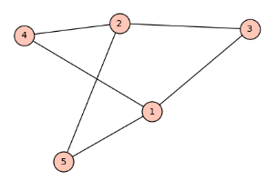

- #[[MA284 - Discrete Mathematics]]
- **Previous Topic:** [[Advanced PIE, Derangements, & Counting Functions]]
- **Next Topic:** [[Definitions & Planar Graphs]]
- **Relevant Slides:** 
-
- # Introduction to Graph Theory
	- What is a **graph**? #card
	  card-last-interval:: 4
	  card-repeats:: 2
	  card-ease-factor:: 2.7
	  card-next-schedule:: 2022-11-18T20:20:08.384Z
	  card-last-reviewed:: 2022-11-14T20:20:08.384Z
	  card-last-score:: 5
		- A **graph** is a collection of:
			- **vertices** (or "nodes"), which are the "dots" in the belong diagram.
			- **edges** joining a pair of vertices.
			- 
		- If the graph is called $G$, we often define it in terms of its **edge set** $E$, and **vertex set** $V$ as
			- $$G = (V,E)$$
	- What are **adjacent** vertices? #card
	  card-last-interval:: 4
	  card-repeats:: 2
	  card-ease-factor:: 2.7
	  card-next-schedule:: 2022-11-18T20:19:56.959Z
	  card-last-reviewed:: 2022-11-14T20:19:56.959Z
	  card-last-score:: 5
		- If two vertices are connected by an edge, we say that they are **adjacent**.
	- ## Example
		- **Aoife, Brian, Conor, David, * Edel are students in an *Indescrete Mathematics* module.**
			- **Aoife & Conor worked together on the assignment.**
			- **Brian & David also worked together on their assignment.**
			- **Edel helped everyone with their assignments.**
		- **Represent this situation with a graph.**
			- Let the students be vertices $A$, $B$, $C$, $D$, $E$. An edge represents collaboration between students.
			- $$V = \{A,B,C,D,E\}$$
			- $$ E = \{\{A,C\}, \{B,D\}, \{E,A\}, \{E,B\}, \{E,C\}, \{E,D\}\}$$
			- 
			  {{renderer :mermaid_fzjdzhfgs}}
				- ```mermaid 
				  flowchart RL
				  A((A)) --- C((C))
				  B((B)) --- D((D))
				  E((E)) --- A
				  E --- B
				  E --- C
				  E --- D
				  ```
-
- # Graph Theory - The Basics
	- What is the **order** of a graph? #card
	  card-last-interval:: 4
	  card-repeats:: 2
	  card-ease-factor:: 2.7
	  card-next-schedule:: 2022-11-18T20:20:23.073Z
	  card-last-reviewed:: 2022-11-14T20:20:23.074Z
	  card-last-score:: 5
		- The **order** of a graph $G = (V,E)$ is the size of its vertex set, $|V|$.
	- ## Equality & Isomorphism
		- What makes two graphs **equal**? #card
		  card-last-interval:: 4
		  card-repeats:: 2
		  card-ease-factor:: 2.7
		  card-next-schedule:: 2022-11-18T20:20:18.088Z
		  card-last-reviewed:: 2022-11-14T20:20:18.088Z
		  card-last-score:: 5
			- Two graphs are **equal** if they have exactly the same Edge & Vertex sets.
				- That is, ^^it is not important how we draw them^^.
		- What is an **Isomorphism**? #card
		  card-last-interval:: 4
		  card-repeats:: 2
		  card-ease-factor:: 2.22
		  card-next-schedule:: 2022-11-18T20:17:59.530Z
		  card-last-reviewed:: 2022-11-14T20:17:59.530Z
		  card-last-score:: 3
			- An **isomorphism** between two graphs, $G_1 = (V_1, E_1)$ & $G_2 = (V_2, E_2)$, is a **bijection** $f: V_1 \rightarrow V_2$ between the vertices in the graph such that, if $\{a, b\}$ is an edge in $G_1$, then $\{f(a), f(b)\}$ is an edge in $G_2$
			- Two graphs are **isomorphic** if there is an isomorphism between them.
				- In that case, we write:
					- $$G_1 \cong G_2$$
	- ### Example
		- **Show that the graphs**
			- $$G_1 = \{V_1, E_1\}, \text{ where } V_1 = \{a,b,c\} \text{, and } E_1 = \{\{a,n\}, \{a,c\}, \{b,c\}\};$$
			- $$G_2 = \{V_2, E_2\}, \text{ where } V_2 = \{u,v,w\} \text{, and } E_2 = \{\{u,v\}, \{u,w\}, \{v,w\}\};$$
			- **are not *equal* but are *isomorphic*. **
				- $V_1 \neq V_2$ so graphs are not equal.
				- 
				  {{renderer :mermaid_sewggjymkp}}
					- ```mermaid 
					  flowchart TB
					  
					  subgraph G2
					  u((u)) --- v((v)) --- w((w))
					  end
					  subgraph G1
					  a((a)) --- b((b)) --- c((c))
					  end
					  
					  ```
				- $f: V_1 \rightarrow V_2$ given by $f(a) = u$, $f(b) = v$, $f(c) = w$ is an isomorphism.
					- e.g., $\{a,c\} \in E_1$, and $\{f(a), f(c)\} = \{u, w\} \in E_2$.
					-
	- What is a **simple graph**? #card
	  card-last-interval:: 2.97
	  card-repeats:: 2
	  card-ease-factor:: 2.6
	  card-next-schedule:: 2022-11-17T19:16:42.421Z
	  card-last-reviewed:: 2022-11-14T20:16:42.421Z
	  card-last-score:: 5
		- A **simple graph** is one that:
			- 1. has no **loops** (i.e., no edge from a vertex to itself).
			  2. have no repeated edges (i.e., there is at most one edge between each pair of vertices).
		- Because simple graphs are so common, usually when we say "graph" we mean "simple graph", unless otherwise stated.
	- What is a **multigraph**? #card
	  card-last-interval:: -1
	  card-repeats:: 1
	  card-ease-factor:: 2.5
	  card-next-schedule:: 2022-11-15T00:00:00.000Z
	  card-last-reviewed:: 2022-11-14T20:14:08.619Z
	  card-last-score:: 1
		- A **multigraph** is a graph that does have repeated edges.
			- In a **multirgraph**, the list of edges is not a set, as some elements are repeated. It is a **multiset**.
	-