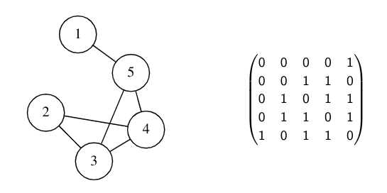

- #[[MA284 - Discrete Mathematics]]
- **Previous Topic:** [[Trees]]
- **Next Topic:**
- **Relevant Slides:** 
-
- In a practical setting, a graph must be stored in some computer-readable format.
	- One of the most common is an **adjacency matrix**.
-
- # Adjacency Matrices
	- What is an **adjacency matrix**? #card
	  card-last-interval:: -1
	  card-repeats:: 1
	  card-ease-factor:: 2.5
	  card-next-schedule:: 2024-05-30T23:00:00.000Z
	  card-last-reviewed:: 2024-05-30T00:17:42.413Z
	  card-last-score:: 1
		- If the graph has $n$ vertices, labelled $\{1,2,\cdots, n\}$, then the **adjacency matrix** is an $m \times n$ **binary** matrix, $A$, with entries
			- $$a_{i,j} = 
			  \begin{cases}
			  1 & \text{vertex } i \text{ is adjacent to } j\\
			  0 & \text{otherwise.}
			  \end{cases}$$
			- 
	- ## Properties of the Adjacency Matrix #card
	  card-last-interval:: -1
	  card-repeats:: 1
	  card-ease-factor:: 2.5
	  card-next-schedule:: 2024-05-30T23:00:00.000Z
	  card-last-reviewed:: 2024-05-30T00:17:59.125Z
	  card-last-score:: 1
		- The adjacency matrix of a graph is **symmetric**.
		- If $B = A^k$, then $b_{i,j}$ is the number of paths of length $k$ from vertex $i$ to vertex $j$.
		- We can work out if a graph is connected by looking at the eigenvalues of $A$.
		- If the graphs $G$ & $H$ are isomorphic, and have adjacency matrices $A_G$ & $A_H$, then there is a permutation matrix $P$, such that $PA_GP^{-1}=A_H$.
	- The adjacency matrix idea is easily extended to allow for multigraphs and pseudographs (graphs with loops).
		- For a multigraph, $a_{i,j}$ is the number of edges joining vertices $i$ & $j$.
		- For a pseudograph, $a_{i,i}$ means that there is an edge from the vertex $i$ to itself.
- # Instance Matrices
	- Graphs can also be represented by an **Incidence Matrix**.
		- If the graph has $v$ vertices, and $e$ edges, then it is an $v \times e$ binary matrix.
		- The rows represent vertices.
		- The columns represent edges.
		- If the matrix is $B = (b_{i,j})$ then $b_{ik} = 1$ means that the vertex $i$ is incident to edge $j$.
-
- # Distance Matrices
	- What is the **eccentricity of a vertex**?
		- The **eccentricity of a vertex** is the greatest distance between that vertex & any other vertex in the graph.
	- What is the **radius of a graph**? #card
	  card-last-interval:: -1
	  card-repeats:: 1
	  card-ease-factor:: 2.5
	  card-next-schedule:: 2024-05-30T23:00:00.000Z
	  card-last-reviewed:: 2024-05-30T00:18:05.726Z
	  card-last-score:: 1
		- The **radius of a graph** is the minimum eccentricity of any vertex.
	- What is the **diameter of a graph**?
		- The **diameter of a graph** is the maximum eccentricity of any vertex.
			- This is also the maximum entry in the distance matrix.
	-
-