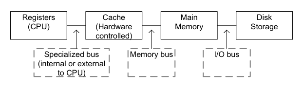
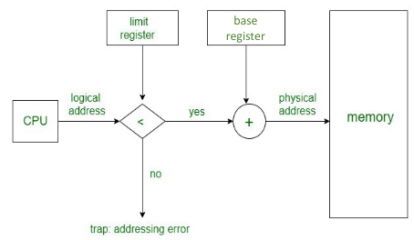
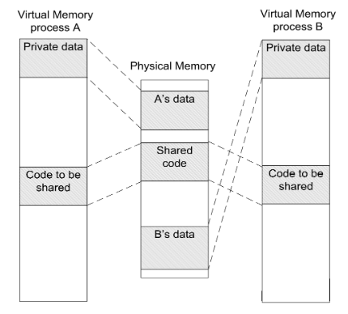
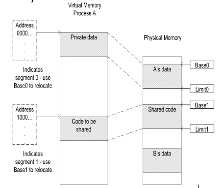
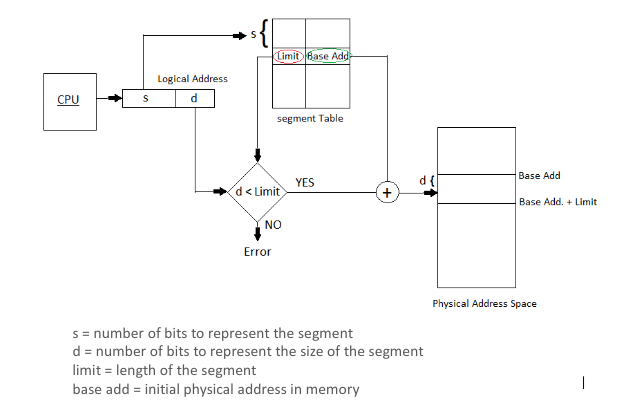
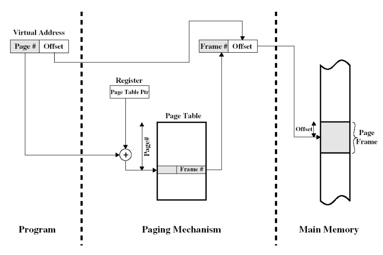

- #[[CT213 - Computer Systems & Organisation]]
- **Previous Topic:** [[Process Synchronisation]]
- **Next Topic:** [[Device Management]]
- **Relevant Slides:** 
-
- # Memory Management
	- In a multiprogramming system, the user part of memory is subdivided to accommodate multiple processes.
		- The task of subdivision is carried out by the OS and is known as **memory management**.
	- Memory needs to be allocated efficiently to pack as many processes into memory as possible.
	- ## Memory Management Requirements #card
	  card-last-interval:: -1
	  card-repeats:: 1
	  card-ease-factor:: 2.5
	  card-next-schedule:: 2022-11-15T00:00:00.000Z
	  card-last-reviewed:: 2022-11-14T20:15:43.843Z
	  card-last-score:: 1
		- **Relocation -** dynamically loading the program into an arbitrary memory space, whose address limits are known only at execution time.
		- **Protection -** Each process should be protected against unwanted interference from other processes.
		- **Sharing -** Any protection mechanism should be flexible enough to allow several processes to access the same portion in main memory.
	- ## Memory Organisation #card
	  card-last-interval:: -1
	  card-repeats:: 1
	  card-ease-factor:: 2.5
	  card-next-schedule:: 2022-11-15T00:00:00.000Z
	  card-last-reviewed:: 2022-11-14T20:16:25.464Z
	  card-last-score:: 1
		- ### Logical Organisation #card
		  card-last-interval:: -1
		  card-repeats:: 1
		  card-ease-factor:: 2.5
		  card-next-schedule:: 2022-11-15T00:00:00.000Z
		  card-last-reviewed:: 2022-11-14T20:16:46.268Z
		  card-last-score:: 1
			- Most programs are organised in modules.
				- Some modules are un-modifiable (read only and/or execute only).
				- Others contain data that can be modified.
			- The OS must take care of the possibility of sharing modules across processes.
		- ### Physical Organisation #card
		  card-last-interval:: 0.97
		  card-repeats:: 2
		  card-ease-factor:: 2.36
		  card-next-schedule:: 2022-11-15T19:16:34.722Z
		  card-last-reviewed:: 2022-11-14T20:16:34.722Z
		  card-last-score:: 3
			- Memory is organised as at least a two-level hierarchy.
			- The OS should hide this fact and should perform the data movement between the main memory & secondary memory without the programmer's concern.
	- ## Memory Hierarchy Review
		- 
		- Tradeoff between size, speed, & cost.
		- What is a **register**? #card
		  card-last-interval:: 3.45
		  card-repeats:: 2
		  card-ease-factor:: 2.46
		  card-next-schedule:: 2022-11-18T06:17:44.069Z
		  card-last-reviewed:: 2022-11-14T20:17:44.069Z
		  card-last-score:: 5
			- Fastest memory element, but small storage.
			- Very expensive.
		- What is the **cache**? #card
		  card-last-interval:: 0.97
		  card-repeats:: 2
		  card-ease-factor:: 2.36
		  card-next-schedule:: 2022-11-15T19:15:19.026Z
		  card-last-reviewed:: 2022-11-14T20:15:19.026Z
		  card-last-score:: 3
			- Fast & small compared to main memory.
			- Acts as a buffer between the CPU & the main memory - it contains the most recent used memory locations (*address* & *contents* are recorded).
		- What is **main memory**? #card
		  card-last-interval:: 3.32
		  card-repeats:: 2
		  card-ease-factor:: 2.6
		  card-next-schedule:: 2022-11-18T03:13:53.945Z
		  card-last-reviewed:: 2022-11-14T20:13:53.945Z
		  card-last-score:: 5
			- **Main memory** is the RAM of the system.
		- The disk storage is the HDD or SSD.
	- ## Caching #card
	  card-last-interval:: 2.97
	  card-repeats:: 2
	  card-ease-factor:: 2.6
	  card-next-schedule:: 2022-11-17T19:15:15.143Z
	  card-last-reviewed:: 2022-11-14T20:15:15.143Z
	  card-last-score:: 5
		- Reading from the cache is faster than recomputing a result or reading from a slower data store.
			- Thus, the more requests that can be served from the cache, the faster the system performs.
		- When reading data from a lower memory, we also store a copy in the cache.
			- Further requests for that data can be served faster.
		- A **cache hit** occurs when the requested data can be found in a cache, while a **cache miss** occurs when it does not.
		- ### Cache Review
			- Typical computer applications access data with a high degree of locality of reference.
				- **Temporal Locality:** Data is requested that has been recently requested already.
				- **Spatial Locality:** Data is requested that is stored physically close to data that has already been requested.
			- When a system writes data to the cache, it must at some point write that data to the main memory as well as follow the **Write Policies**.
				- **Write-through:** Write is done synchronously both to the cache & to main memory.
				- **Write-back:** Initially, writing is done only to the cache. The write to amin memory is postponed until the modified content is about to be replaced by another cache block.
				-
- # Process Address Space
  collapsed:: true
	- When accessing memory, a process is said to operate within an **address space**.
		- Data items are accessible within the range of addresses available to the process.
	- The number of bits allocated to specify the address is an **architectural decision**.
		- Now, most computers use 64 bits for addresses.
			- We say that such a system gives a **virtual address space** of 16 ExaBytes (16 billion gigabytes), although the amount of **physical** memory in such a system is most likely less than this.
	- ## Address Binding
		- An address used in an instruction can point **anywhere** in the virtual address space of the process.
			- It still must be bound to a physical memory address.
		- Programs are made of modules.
		- Compilers or assemblers do not know where the module will be loaded in the physical memory.
			- Virtual addresses must be translated to physical addresses.
		- Address translation can be **dynamic** or **static**.
		- ### Static Address Binding #card
		  card-last-interval:: 0.97
		  card-repeats:: 2
		  card-ease-factor:: 2.36
		  card-next-schedule:: 2022-11-15T19:17:04.679Z
		  card-last-reviewed:: 2022-11-14T20:17:04.680Z
		  card-last-score:: 3
			- The OS is responsible for managing the memory, so it will give the loader a **base address** where it should load the module.
				- The loader converts each virtual address in the module to absolute physical addresses by adding the base address.
			- Simple / easy to implement.
			- But, once loaded, the code or data of the program cannot be moved into another part of memory without a change in the static binding.
				- All the processes executing in such a system would share the same physical address space.
					- No protection from one another if addressing errors occur.
					- Even the OS code is exposed to addressing errors.
		- ### Dynamic Address Binding
		  card-last-score:: 1
		  card-repeats:: 1
		  card-next-schedule:: 2022-10-26T23:00:00.000Z
		  card-last-interval:: -1
		  card-ease-factor:: 2.5
		  card-last-reviewed:: 2022-10-26T11:42:36.358Z
			- What is **Dynamic Address Binding**? #card
			  card-last-interval:: -1
			  card-repeats:: 1
			  card-ease-factor:: 2.5
			  card-next-schedule:: 2022-11-15T00:00:00.000Z
			  card-last-reviewed:: 2022-11-14T16:13:55.843Z
			  card-last-score:: 1
				- **Dynamic Address Binding** keeps loaded addresses **relative** to the start of a process.
			- #### Advantages of Dynamic Address Binding #card
			  card-last-interval:: 0.98
			  card-repeats:: 1
			  card-ease-factor:: 2.36
			  card-next-schedule:: 2022-11-15T14:53:28.457Z
			  card-last-reviewed:: 2022-11-14T15:53:28.457Z
			  card-last-score:: 3
				- A given program can run anywhere in the physical memory and can be moved around by the operating system.
				- All of the addresses that a program is using are relative to the program's own virtual address space, so the program is ^^unaware of the physical locations^^ at which it happens to have been placed.
				- It is possible to protect processes from each other and to protect the OS from application processes by a mechanism which we employ for isolating the addresses seen by the process.
			- #### Disadvantages of Dynamic Address Binding #card
			  card-last-interval:: -1
			  card-repeats:: 1
			  card-ease-factor:: 2.5
			  card-next-schedule:: 2022-11-15T00:00:00.000Z
			  card-last-reviewed:: 2022-11-14T16:21:35.955Z
			  card-last-score:: 1
				- A mechanism is needed to bind the virtual addresses within the loaded instructions to physical addresses when the instructions are executed.
			- #### Hardware-Assisted Relocation & Protection #card
			  card-last-interval:: -1
			  card-repeats:: 1
			  card-ease-factor:: 2.5
			  card-next-schedule:: 2022-11-15T00:00:00.000Z
			  card-last-reviewed:: 2022-11-14T16:23:58.260Z
			  card-last-score:: 1
				- Dynamic binding must be ^^implemented in hardware^^, as it introduces **translation** as part of every memory process.
				- If the basic requirement for modules is to be held **contiguously** in physical memory and contain addresses relative to their first location, the first location is called the **base** of the process.
				- Suppose that an instruction is fetched & decoded and contains an **address reference**:
				  background-color:: green
					- This address reference is relative to the **base** of the process, so the value of the base must be added to it (*base + address reference*) in order to obtain the correct physical address to be sent to the memory controller.
				- The simplest form of dynamic binding hardware is a **base register** and a Memory Management Unit (MMU) to perform the translation.
					- The OS must load the base register as part of setting up the state of a process before passing control to it.
					- However, this approach does not provide any protection between processes - We cannot be sure that a process does not use an address that is not in its address space.
						- The solution to this problem is to ^^combine the relocation & protection functions in one unit^^ - By adding a second register (the **limit register**) that delimits the upper bound of the program in the physical memory.
						- 
- # Segmentation
  collapsed:: true
	- ## Segmented Virtual Memory
	  collapsed:: true
		- In practice, it is not very useful for a program to occupy a single **contiguous** range of physical addresses.
			- Such a scheme would prevent two processes from sharing the code, i.e., using this scheme, it is difficult to arrange two executions of the same program (two processes) to access different data while still being able to share code.
				- However, this can be achieved if the system has ^^**two** base registers^^ and ^^**two** limit registers^^, thus allowing two separate memory ranges or **segments** per process.
		- Two processes sharing a code segment but having private data segments.
			- 
		- The most significant bit of the virtual address is taken as a **segment identifier**, with `0` for a data segment and `1` for a code segment.
			- 
		- Within a single program, it is common to have separate areas for **code**, **stack**, & **heap**.
		- Language systems have conventions on how the virtual address space is arranged:
			- The code segment will not grow in size.
			- Heap (may be growing).
			- Stack at the top of the virtual memory, growing in the opposite direction to the Heap.
		- In order to realise relocation (& protection), three segments would be preferable.
		- The segment is the unit of protection & sharing - the more we have, the more flexible.
		- There are two ways to organise segmented addresses:
			- 1. Virtual Address Space is split into a **segment number** & a **byte number** within a segment.
				- The number of bits used for segment addressing is usually fixed by the CPU designer.
			- 2. The segment number is supplied separated from the offset portion of the address.
				- This is done in x86 processors.
			-
	- ## Segmented Address Translation
	  collapsed:: true
		- For dynamic address translation in the OS, the hardware must keep a **segment table** for each process in which the location of each segment is recorded.
		- A process can have many segments, only those currently being used for instruction fetch & operand access need to be in main memory.
			- Other segments could be held on backing store until they are needed.
		- If an address is presented for a segment that is not present in main memory, then the address translation hardware generates an **addressing exception**.
			- This is handled by the OS, causing the segment to be fetched into main memory and the mechanism restarted.
		- 
	- ## Segmentation Summary #card
	  card-last-interval:: 0.82
	  card-repeats:: 2
	  card-ease-factor:: 2.36
	  card-next-schedule:: 2022-11-22T08:10:34.920Z
	  card-last-reviewed:: 2022-11-21T13:10:34.920Z
	  card-last-score:: 3
		- A process is divided into a **number of segments** that do not need to be equal in size.
		- When a process is brought into the main memory, all of its segments are usually brought into the main memory and a **process segment table** is set up.
		- ### Advantages
			- The virtual address space of a process is divided into logically distinct units which correspond to constituent parts of a process.
			- Segments are the natural units of access control.
				- Processes may have different access rights for different segments and sharing code / data with other processes.
		- ### Disadvantages
			- Inconvenient for OS to manage storage allocation for variable-sized segments.
			- After the system has been running for a while, the free memory available can be fragmented.
			- **External Fragmentation:** Sometimes, even though the total free memory might be far greater than the size of some segment that must be loaded, there is no single area large enough to load it
		-
- # Paging
	- What is **paging**? Why use it? #card
	  card-last-interval:: -1
	  card-repeats:: 1
	  card-ease-factor:: 2.5
	  card-next-schedule:: 2022-11-24T00:00:00.000Z
	  card-last-reviewed:: 2022-11-23T12:19:09.532Z
	  card-last-score:: 1
		- The need to keep each loaded segment contiguous in the physical memory poses a significant disadvantage:
			- It leads to **fragmentation**.
			- It complicates the physical storage allocation problem.
		- Solution: **paging**, where blocks of a fixed size are used for memory allocation (so that if there is any free space, it is of the right size).
		- Memory is divided into page **frames**, and the user program is divided into **pages** of the same size.
	- ## Paged Virtual Memory #card
	  card-last-interval:: -1
	  card-repeats:: 1
	  card-ease-factor:: 2.5
	  card-next-schedule:: 2022-11-15T00:00:00.000Z
	  card-last-reviewed:: 2022-11-14T15:54:31.233Z
	  card-last-score:: 1
		- Typical page size is small (1 to 4kB).
			- In paged systems, a process would require many pages.
		- The limited size of physical memory can cause problems. Therefore:
			- A portion of the disk storage could be used as extension to the main memory (backing store).
			- The pages of a process may be in the main memory and / or in this backing store.
		- The OS must manage two levels of storage and the transfer of pages between them.
		- The OS must keep a **page table** for each process to record information about the pages.
			- A **present bit** is needed to indicate whether the page is in the main memory or not.
			- A **modify bit** indicates if the page has been altered since last loaded into main memory.
				- If not modified, the page does not have to be written to the disk when swapped out.
		- ### Paged Virtual Memory Address Translation #card
		  card-last-interval:: -1
		  card-repeats:: 1
		  card-ease-factor:: 2.5
		  card-next-schedule:: 2022-11-15T00:00:00.000Z
		  card-last-reviewed:: 2022-11-14T16:15:43.967Z
		  card-last-score:: 1
			- Translation of a virtual address (**page** + offset) into a physical address (**frame** + offset) using a page table.
			- The page table is stored in the main memory.
				- Each process maintains a pointer in one of its registers, to the page table.
			- The page number is used to index that table & lookup the corresponding frame number.
			- Combining the frame number with the offset from the virtual address gives the real physical address.
			- 
			- #### Two-Level Scheme to Organise Large Page Tables #card
			  card-last-interval:: -1
			  card-repeats:: 1
			  card-ease-factor:: 2.5
			  card-next-schedule:: 2022-11-15T00:00:00.000Z
			  card-last-reviewed:: 2022-11-14T16:15:49.987Z
			  card-last-score:: 1
				- Processes could occupy huge amounts of virtual memory.
					- E.g., in a 32-bit addressing system with pages of size 4KB:
						- 12 bits for offset.
						- 20 bits for number of pages.
						- This means 2^{20} entries could be in each page table.
							- If each entry occupies 4 Bytes (32-bit addresses), then each page would take 4MB - this is unacceptable.
				- The solution is a **two-level scheme** to organise large page tables. #card
				  card-last-interval:: -1
				  card-repeats:: 1
				  card-ease-factor:: 2.5
				  card-next-schedule:: 2022-11-15T00:00:00.000Z
				  card-last-reviewed:: 2022-11-14T15:53:03.965Z
				  card-last-score:: 1
					- **Root Page Table** with 2^{10} (1024 entries, 4 Bytes each) entries occupying 4KB of main memory that always remains in the main memory.
					- **User Page Tables** can reside in either the main memory or in disk.
					- The first 10 bits of a virtual address are used to find a PTE to the user page table.
						- The next 10 bits of virtual memory addresses are used to find the PTE for the page that is referenced by the virtual address.
					- Every virtual memory reference causes two physical memory accesses: one to fetch the appropriate User Page Table entry, the other to fetch the desired page.
					- To overcome this, most virtual memory schemas make use of a special **high-speed cache** for page entries.
			- ### Translation Lookaside Buffer #card
			  card-last-interval:: -1
			  card-repeats:: 1
			  card-ease-factor:: 2.5
			  card-next-schedule:: 2022-11-15T00:00:00.000Z
			  card-last-reviewed:: 2022-11-14T16:16:29.026Z
			  card-last-score:: 1
				- The **Translation Lookaside Buffer (TLB)** is a kind of cache memory.
					- It contains the page entries that have been most recently used.
				- TLB is searched for each address reference.
				- The TLB is nearly always present in any processor that utilises paged or segmented virtual memory.
				- The virtual page number is extracted from the virtual address and a lookup is initiated.
					- If there are multiple processes, then special care must be taken so that a page from one process would not be confused with another's.
					- If a match is found, (TLB hit), then an access check is made, based on the information stored in the flags.
						- The physical page base, taken form TLB is appended to the offset from the virtual address to form the complete physical address.
						- The flags field will indicate the access rights and other information (i.e.m if a write is being attempted to a page that is read only etc.).
					- If an address reference is made to a page that is in in the main memory but not in the TLB, then the address translation fails (TLB miss) and new entry in the TLB needs to be created for that page.
					- If an address reference is made to a page that is not in the main memory, the address translation will fail again. No match will be found in the address table and the addressing hardware will raise an exception called **page fault**.
						- The OS will handle this exception.
		- ## Paging Summary #card
		  card-last-interval:: 0.98
		  card-repeats:: 1
		  card-ease-factor:: 2.36
		  card-next-schedule:: 2022-11-15T15:25:33.519Z
		  card-last-reviewed:: 2022-11-14T16:25:33.519Z
		  card-last-score:: 3
			- ### Advantages
				- By using fixed sized pages in virtual address space & fixed sized pages in physical address space, it addresses some of the problems with segmentation.
				- **External fragmentation** is no longer a problem (all frames in physical memory are the same size).
				- Transfers to/from disks can be performed at granularity of individual pages.
			- ### Disadvantages
				- The page size is a choice made by the CPU or OS designer.
					- It may not fit the size of program data structures and lead to internal fragmentation in which storage allocation request be rounded to an integral number of pages.
				- There may be no correspondence between **page protection settings** & **application data structures**.
					- If two processes are to share data structures, they may do so at the level of sharing entire pages.
				- Requiring a page table per process means it's likely that the OS will require **more storage** for its internal data structures.
			-
	-