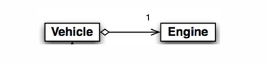

- #[[CT2106 - Object-Oriented Programming]]
- **Previous Topic:** [[First Java Code]]
- **Next Topic:** [[Variables & Types]]
- **Relevant Slides:** 
-
- # Composition & Inheritance
	- ## Composition
		- What is **Composition**? #card
		  card-last-interval:: 28.3
		  card-repeats:: 4
		  card-ease-factor:: 2.66
		  card-next-schedule:: 2022-12-09T18:41:43.657Z
		  card-last-reviewed:: 2022-11-11T11:41:43.658Z
		  card-last-score:: 5
			- **Composition** is a type of "has-a" relationship. One object is **composed** of another and relies upon its services for its own functionality.
			- It is one of the fundamental relationships between classes in OOP.
			- For example:
				- The class `RacingBike` **has-a** `Wheel` - **Composition**.
		- How do you represent **Composition** in OOP class diagrams? #card
		  card-last-interval:: 31.36
		  card-repeats:: 4
		  card-ease-factor:: 2.8
		  card-next-schedule:: 2022-12-16T04:00:44.435Z
		  card-last-reviewed:: 2022-11-14T20:00:44.435Z
		  card-last-score:: 5
			- In OOP class diagrams, a **diamond shape** indicates **composition** or a "has-a" relationship.
			- 
				- This class diagram tells us that a `Vehicle` object is composed of a single `Engine` object.
		- How do you realise **Composition** in Java? #card
		  card-last-interval:: 9.28
		  card-repeats:: 3
		  card-ease-factor:: 2.32
		  card-next-schedule:: 2022-11-23T22:28:13.350Z
		  card-last-reviewed:: 2022-11-14T16:28:13.350Z
		  card-last-score:: 3
			- To realise a "has-a" relationship in Java, you must ^^create a link between the **participant classes** using a **reference type variable**.^^
				- The reference declaration is in the **owner** class.
		-
	- # Inheritance
		- What is **Inheritance**? #card
		  card-last-interval:: 21.53
		  card-repeats:: 4
		  card-ease-factor:: 2.32
		  card-next-schedule:: 2022-12-06T08:00:59.616Z
		  card-last-reviewed:: 2022-11-14T20:00:59.616Z
		  card-last-score:: 5
			- **Inheritance** is a type of "is-a" relationship.
			- It is one of the fundamental relationships between classes in OOP.
			- For example:
				- A `RacingBike` **is-a** type of `Bicycle` - **Inheritance**.
	-
-