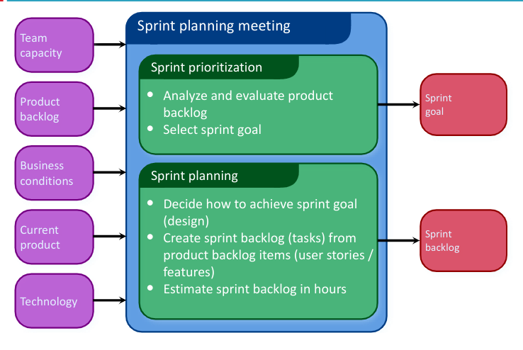

- #[[CT216 - Software Engineering I]]
- **Previous Topic:** [[Introduction to Agile Methods]]
- **Next Topic:** [[Agile Methods - Extreme Programming]]
- **Relevant Slides:** 
-
- # Scrum Framework
	- ## Roles
	  collapsed:: true
		- Product Owner
		- ScrumMaster
		- Team
		-
		- ### Product Owner #card
		  card-last-interval:: 31.36
		  card-repeats:: 4
		  card-ease-factor:: 2.8
		  card-next-schedule:: 2022-12-16T04:11:05.335Z
		  card-last-reviewed:: 2022-11-14T20:11:05.336Z
		  card-last-score:: 5
			- Define the features of the product.
				- Tries to remove conjecture - "I know the customer wants this" as opposed to "I believe this would be a good feature".
			- Decide on release date and content.
				- Usually responsible for press release.
			- Be responsible for the profitability of the product (ROI).
			- Prioritise features according to market value.
				- Conduct market research, feasibility studies.
			- Adjust features & priority every iteration, as needed.
			- Accept or reject work results.
		- ### Scrum Master #card
		  card-last-interval:: -1
		  card-repeats:: 1
		  card-ease-factor:: 2.22
		  card-next-schedule:: 2022-11-15T00:00:00.000Z
		  card-last-reviewed:: 2022-11-14T16:42:56.790Z
		  card-last-score:: 1
			- Represents management to the project.
				- Often one of the engineers.
			- Responsible for enacting Scrum values & practices.
			- Removes impediments.
			- Ensure that the team is fully functional & productive.
			- Enable close cooperation across all roles & functions.
			- Shield the team from external interfaces.
		- ### Scrum Team #card
		  card-last-interval:: 9.28
		  card-repeats:: 3
		  card-ease-factor:: 2.32
		  card-next-schedule:: 2022-11-23T22:36:47.636Z
		  card-last-reviewed:: 2022-11-14T16:36:47.637Z
		  card-last-score:: 5
			- Typically 5-10 people.
			- Cross-functional.
			- QA, Programmers, UI Designers, etc.
			- Members should be full-time.
			- May be exceptions (e.g., System Admin, etc.).
			- Teams are self-organising.
			- Membership can change only between sprints.
			-
	- ## Ceremonies
	  collapsed:: true
		- Sprints
		- Sprint Planning
		- Sprint Review
		- Sprint Retrospective
		- Daily Scrum Meeting
		-
		- ### Sprints #card
		  card-last-interval:: 23.43
		  card-repeats:: 4
		  card-ease-factor:: 2.42
		  card-next-schedule:: 2022-12-08T06:05:48.351Z
		  card-last-reviewed:: 2022-11-14T20:05:48.351Z
		  card-last-score:: 5
		  collapsed:: true
			- Scrum projects make progress in a series of **sprints**.
			- Target duration is one month.
				- + / - a week or two (2 - 6 weeks max).
			- Product is designed, coded, and tested during the sprint.
				- The output is a built which may or may not be a release.
			- Move onto the next sprint.
			-
			- #### No changes during Sprint
				- Plan sprint durations around how long you can commit to keeping the change out of the Sprint.
		- ### Sprint Planning #card
		  card-last-interval:: 11.34
		  card-repeats:: 3
		  card-ease-factor:: 2.56
		  card-next-schedule:: 2022-11-26T00:48:37.703Z
		  card-last-reviewed:: 2022-11-14T16:48:37.703Z
		  card-last-score:: 5
		  collapsed:: true
			- The Team selects items from the **product backlog** that they can commit to completing.
			- The **Sprint Backlog** is created.
				- Tasks are identified & the length of each is estimated (1-16 hours).
				- This is done collaboratively by the team.
			- 
			- #### Sprint Backlog
				- What is the **Product Backlog**? #card
				  card-last-interval:: 31.36
				  card-repeats:: 4
				  card-ease-factor:: 2.8
				  card-next-schedule:: 2022-12-16T04:11:04.051Z
				  card-last-reviewed:: 2022-11-14T20:11:04.052Z
				  card-last-score:: 5
					- The **Product Backlog** is a list of desired work on the project (the requirements).
					- It's usually a combination of:
						- **story-based work** - "let user search & replace".
						- **task-based work** - "improve exception handling".
					- The list is prioritised by the **Product Owner**.
						- The **Product Owner** is typically a Product Manager, Marketing, Internal Customer, etc.
						- Priority groupings (high, medium, low, etc.).
						- Re-prioritised at the start of each sprint.
						- Spreadsheet (usually).
				- To create a Sprint Backlog, you must have a Sprint goal.
				- The Scrum team takes the Sprint Goal and decides what tasks are necessary.
				- The Team self-organises around how they will meet the Sprint Goal.
					- Manager does not assign tasks to individuals.
				- Managers don't make decisions for the team.
				- A Sprint Backlog is created.
				- #### Sprint Backlogs during the Sprint
					- Changes
						- The Team adds new tasks whenever they need to, in order to meet the Sprint Goal.
						- The Team can remove unnecessary tasks.
						- But, the Sprint Backlog can only be updated by the team.
					- Estimates are updated whenever there's new information.
					-
		- ### Sprint Review Meeting #card
		  card-last-interval:: 23.43
		  card-repeats:: 4
		  card-ease-factor:: 2.42
		  card-next-schedule:: 2022-12-08T06:05:33.096Z
		  card-last-reviewed:: 2022-11-14T20:05:33.096Z
		  card-last-score:: 5
			- The Team presents what it accomplished during the sprint.
			- It typically takes the form of a demo of new features or underlying architecture.
			- Informal.
				- 2 hour prep time.
				- No slides.
			- Participants.
				- Customers.
				- Management.
				- Product Owners.
				- Engineering Team.
		- ### Sprint Retrospective Meeting #card
		  card-last-interval:: 29.04
		  card-repeats:: 4
		  card-ease-factor:: 2.56
		  card-next-schedule:: 2022-12-13T20:03:02.515Z
		  card-last-reviewed:: 2022-11-14T20:03:02.515Z
		  card-last-score:: 5
			- Typically 15-30 mintues.
			- Done after every sprint.
			- Feedback meeting - time to reflect on how things are going...
			- Many participants.
				- Scrum Master
				- Product Owner
				- Team
				- Possibly customers & others
			- The whole team gathers & discusses what they'd like to:
				- Start doing.
				- Stop doing.
				- Continue doing,
			-
-
- ## Pros / Cons of Agile Methods #card
  card-last-interval:: 23.43
  card-repeats:: 4
  card-ease-factor:: 2.42
  card-next-schedule:: 2022-12-08T06:05:31.402Z
  card-last-reviewed:: 2022-11-14T20:05:31.402Z
  card-last-score:: 5
	- ### Advantages
		- Completely developed & tested features in short iterations.
		- Simplicity of the process.
		- Clearly defined rules.
		- Increasing productivity.
		- Self-organising.
		- Each team member carries a lot of responsibility.
		- Improved communication.
		- Combination with Extreme Programming.
	- ### Disadvantages
		- "Undisciplined hacking" (no written documentation).
		- Violation of responsibility.
		- Current mainly carried by the inventors.
		- Employee burnout & fatigue.