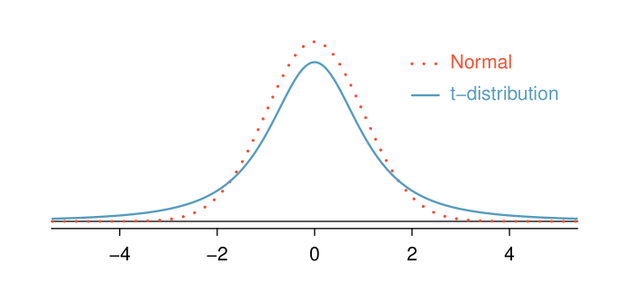

- #[[ST2001 - Statistics in Data Science I]]
- **Previous Topic:** [[The Normal Distribution]]
- **Next Topic:** [[Hypothesis Testing]]
- **Relevant Slides:** _1666624233800_0.pdf)
-
- # Probability & Statistics
	- In Probability theory, we consider some **known process** which has some randomness or uncertainty.
		- We model the outcomes by random variables, and we figure out the probabilities of what will happen.
		- There is one correct answer to any probability question.
	- In Statistical Inference, we observe something that has happened, and try to figure out what underlying process would explain those observations.
		- The basic aim behind all statistical methods is to make inferences about a population by studying a relatively small sample from it.
	- Probability is the engine that drives all statistical modelling, data analysis, & inference.
- # Sampling Distributions
	- The probability distribution of a **statistic** is called a **sampling** distribution.
	- Sampling distributions arise because samples vary.
		- Each random sample will have a different value of the statistic.
- # The Central Limit Theorem #card
  card-last-interval:: -1
  card-repeats:: 1
  card-ease-factor:: 2.5
  card-next-schedule:: 2022-11-15T00:00:00.000Z
  card-last-reviewed:: 2022-11-14T20:14:02.517Z
  card-last-score:: 1
  id:: 6356abee-cb6a-48c5-8f8b-72122b6099eb
	- The sampling distribution of *any* mean becomes more nearly Normal as the sample size grows.
		- Observations must be independent.
		- The shape of the population distribution doesn't matter.
	- What is the **Central Limit Theorem**? #card
	  card-last-interval:: -1
	  card-repeats:: 1
	  card-ease-factor:: 2.5
	  card-next-schedule:: 2022-11-22T00:00:00.000Z
	  card-last-reviewed:: 2022-11-21T13:06:03.899Z
	  card-last-score:: 1
		- The **Central Limit Theorem** states that ==a sample means follow a Normal distribution centred on the population mean== with a standard deviation divided by the square root of the sample size.
			- $$\bar X \sim N (\mu, \frac{\sigma^2}{n})$$
	- The CLT depends crucially on the **assumption of independence**.
	- ## The Standard Error
		- The **Standard Error** is a measure of the variability in the sampling distribution (i.e., how do sample statistics vary about the unknown population parameter they are trying to estimate).
		- It describes the typical "error" or "uncertainty" associated with the estimate.
			- $$SE = \frac{\sigma}{\sqrt{n}}$$
		- ### Interval Estimation for $\mu$
			- Use the CLT to provide a range of values that will capture 95% of sample means.
			- In repeated sampling, 95% of intervals calculated in this manner will contain the true mean $\mu$.
				- $$\bar{x} \pm 1.96 \times \frac{\sigma}{\sqrt{n}}$$
- # Confidence Intervals
	- The population mean $\mu$ is **fixed**.
	- The intervals from different samples are **random**.
	- From our single sample, we only observe one of the intervals.
		- Our interval may or may not contain the true mean.
	- If we had taken many samples, and calculated the 95% CI for each, 95% of them would include the true mean.
	- We say that we are "95% confident" that the interval contains the true mean.
	- A **point estimate** (i.e., a statistic) is a single plausible value for a parameter.
		- A point estimate is rarely perfect, usually there is some error in the estimate.
		- Instead of supplying just a point estimate of a parameter, a next logical step would be to provide a plausible range of values for the parameter.
			- To do this, an estimate of the precision of the sample statistic (i.e., the estimate) is needed.
- # The t-distribution
	- In practice, we cannot directly calculate the standard error for $\bar x$ since we do not know the population standard deviation, $\sigma$.
		- We can use the sample standard deviation $s$ in place of $\sigma$ for computing the standard error of $\bar x$:
			- $$SE = \frac{\sigma}{\sqrt{n}} \approx \frac{s}{\sqrt{n}}$$
		- This strategy tends to work well when we have a lot of data and can estimate $\sigma$ using $s$ accurately. However, this estimate is less precise with smaller samples, and this leads to problems when using the normal distribution to model $\bar x$.
	- Enter a new distribution for inference calculations called the **t-distribution**.
		- A **t-distribution** has a bell shape, but its tails are thicker than the Normal Distribution's, meaning that observations are more likely to fall beyond two standard deviations from the mean than under the Normal Distribution.
		- The extra-thick tails of the t-distribution are exactly the correction needed to resolve the problem of using $s$ in place of $\sigma$ in the $SE$ calculation.
	- 
	- The t-distribution is always centred at zero and has a single parameter: **degrees of freedom**.
		- What are **degrees of freedom**? #card
		  card-last-interval:: -1
		  card-repeats:: 1
		  card-ease-factor:: 2.5
		  card-next-schedule:: 2022-11-15T00:00:00.000Z
		  card-last-reviewed:: 2022-11-14T16:21:05.697Z
		  card-last-score:: 1
			- The **degrees of freedom** ($df$) describes the precise form of the bell-shaped t-distribution.
			- In general, $df = n -1$ where $n$ is the sample size.
				- That is, when we have more observation, the degrees of freedom will be larger and the t-distribution will look more the standard normal distribution.
					- When $df \geq 30$, the t-distribution is nearly indistinguishable from the normal distribution.
- # The Bootstrap
	- We can quantify the variability of sample statistics using theory, e.g. ((6356abee-cb6a-48c5-8f8b-72122b6099eb)), or by **simulation** via **bootstrapping**.
	- ## Bootstrapping Scheme #card
	  card-last-interval:: -1
	  card-repeats:: 1
	  card-ease-factor:: 2.5
	  card-next-schedule:: 2022-11-22T00:00:00.000Z
	  card-last-reviewed:: 2022-11-21T13:10:41.508Z
	  card-last-score:: 1
		- 1. Take a **bootstrap sample** - a random sample taken **with replacement** from the original sample, of the same size as the original sample.
		  2. Calculate the bootstrap statistic - a statistic such as mean, median, proportiion, etc., computed on the bootstrap samples.
		  3. Repeat steps 1. & 2. many times to create a bootstrap distribution - a distribution of bootstrap statistics.
		  4. Calculate the bounds of the XX% confidence interval as the middle of the XX% of the bootstrap distribution.
- # Theorem 9.2
	- If $\bar x$ is used as an estimate of $\mu$, we can be $100(1 - \alpha)%$ confident that the error will not exceed a specified amount $e$ when the sample size is
		- $$n = \left(\frac{z_\alpha / 2^\sigma}{e} \right)^2$$
-